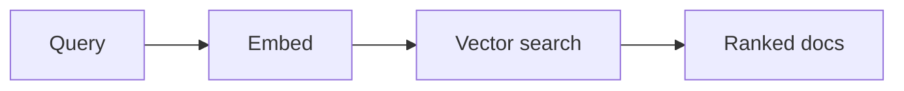

# 语义搜索

## 定义

Semantic search retrieves items by meaning rather than exact keywords. Query and documents are embedded; 检索 returns the most similar vectors (例如 cosine similarity or ANN search).

它是 the 检索 backbone of [RAG](/docs/rag): see [embeddings](/docs/rag/embeddings) and [vector databases](/docs/rag/vector-databases) for how vectors are produced and stored. 当…时使用 users express intent in natural language and you want “similar meaning” rather than literal keyword match. Combines well with keyword (hybrid search) when exact terms matter.

## 工作原理

The **query** (and optionally filters) is sent to an **embedding** model 输出 a vector. **Vector search** (例如 k-NN or approximate k-NN over an index of document vectors) returns the **ranked docs** (or chunk IDs) with highest similarity (例如 cosine or dot product). Embedding models are trained so that semantically similar text maps to nearby vectors; the same model is used for queries and documents. Indexing can be offline (batch) or incremental; scale and latency determine whether you need an approximate index (HNSW, IVF) and a dedicated [vector database](/docs/rag/vector-databases).

## 应用场景

Semantic search is used whenever you need to find items by meaning rather than exact keywords (RAG, recommendations, dedup).

- RAG 检索: finding relevant chunks for a user query
- Recommendation and “similar item” search
- Duplicate or near-duplicate detection in document sets

## 外部文档

- [Sentence-BERT](https://www.sbert.net/) — Dense 检索 models
- [LangChain – Vector stores](https://python.langchain.com/docs/concepts/vectorstores/)

## 另请参阅

- [Embeddings](/docs/rag/embeddings)
- [Vector databases](/docs/rag/vector-databases)
- [RAG](/docs/rag)
