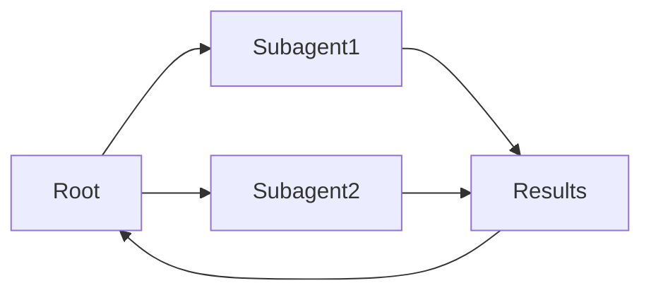

# 子智能体

## 定义

**子智能体**是位于层次结构中的智能体: a parent agent delegates sub-tasks to child agents (子代理），它们反过来可以委派给更多子代理。这结构化了复杂x work and keeps each agent focused.

它们是实现具有清晰责任链的[多代理](/docs/agents/multi-agent-systems)系统的一种方式ty. The root [agent](/docs/agents) owns the user-facing goal; subagents handle focused sub-tasks (例如 [检索](/docs/rag), code execution, validation). Often used with [spec-driven development](/docs/spec-driven-development) or [RDD](/docs/reasoning-patterns/rdd) so subagents receive and follow specs.

## 工作原理

**根**代理接收任务，将其分解为子任务，并分配给 **Subagent1**、**Subagent2** 等（按角色或能力）。每个子代理运行自己的循环（可能使用工具和 LLM） and returns **results** to the root. The root **aggregates** results (例如 merges, selects, or passes to another subagent) and either continues the loop or returns to the user. Subagents can be specialized (例如 检索, code, critique) and use the same or different models. Clear contracts (inputs/outputs or tools) and error handling make the hierarchy debuggable and reusable.

## 应用场景

Subagents 当任务自然地分解为可以委派和聚合的专注子任务时很有帮助.

- Root agent delegating 检索, generation, and validation to subagents
- Complex workflows (例如 research, code review) with focused sub-tasks
- Reusing the same subagent in different parent workflows

## 外部文档

- [From Prototypes to Agents with ADK – Google Codelabs](https://codelabs.developers.google.com/your-first-agent-with-adk#0) — ADK multi-agent systems with hierarchy
- [LangChain – Multi-agent workflows](https://python.langchain.com/docs/concepts/multi_agent/) — Workflow and subagent patterns

## 优缺点

| Pros | Cons |
|------|------|
| Clear separation of concerns | Coordination and latency |
| Scalable to complex tasks | Need clear contracts and error handling |
| Reusable subagent capabilities | Debugging across hierarchy can be hard |

## 另请参阅

- [Agents](/docs/agents)
- [Multi-agent systems](/docs/agents/multi-agent-systems)
- [RDD](/docs/reasoning-patterns/rdd)
- [Spec-driven development](/docs/spec-driven-development)
