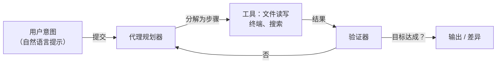

# Antigravity

## 定义

Antigravity 是一款以代理为先的集成开发环境，专为**氛围编程**而设计——这是一种你用自然语言描述意图，AI 代理就能自主编写、重构和执行代码以实现目标的方式。与逐行补全不同，Antigravity 以完整任务循环的方式运作：读取你的代码库、规划变更、应用变更并验证结果。

该编辑器旨在最大程度降低从想法到可运行代码之间的摩擦。代理指令（类似于 [Claude Code](/docs/tools/claude-code) 的 `CLAUDE.md`）让你可以为代码风格、技术栈和安全约束定义持久规则。Antigravity 可以链式调用多个工具动作——读取文件、写入、执行终端命令、网页搜索——以完成原本需要多个手动步骤才能完成的目标。

## 工作原理

### 代理指令

持久代理指令（`.agentrc` 文件或设置面板）为代理提供你的代码库背景：首选架构、命名约定、哪些文件绝不能修改以及如何运行测试。这样就无需在每次会话中重新说明上下文。

### 任务循环

代理持续迭代——读取输出、调整计划、重新执行——直到完成条件满足（测试通过、代码检查干净、端点响应）。你可以随时观察、暂停和重定向。

## 何时使用 / 何时不使用

| 场景 | 使用 Antigravity | 不使用 Antigravity |
|------|----------------|------------------|
| 从零开始快速原型开发一个功能 | 是——非常适合意图驱动的氛围编程 | |
| 带测试的遗留代码重构 | 是——代理可以循环应用和验证变更 | |
| 探索陌生代码库 | 是——代理在操作前先读取和解释 | |
| 关键代码的详细安全审查 | | 首选手动审查或专业审计工具 |
| 当你想通过写代码来学习时 | | 自主执行可能绕过学习过程 |

## 优缺点

| 优点 | 缺点 |
|------|------|
| 自然语言输入减少认知负担 | 自主迭代可能悄悄引入 bug |
| 持久指令消除重复上下文说明 | 比逐行编辑粒度控制更少 |
| 完整任务循环减少手动上下文切换 | 需要仔细审查生成的差异 |
| 非常适合快速探索和原型开发 | 较新的产品，生态系统和插件有限 |

## 实用资源

- [Antigravity 官方网站](https://antigravity.sh/) — 文档、下载和示例

## 另请参阅

- [Claude Code](/docs/tools/claude-code)
- [Cursor](/docs/tools/cursor)
- [GitHub Copilot](/docs/tools/github-copilot)
- [Kiro](/docs/tools/kiro)
