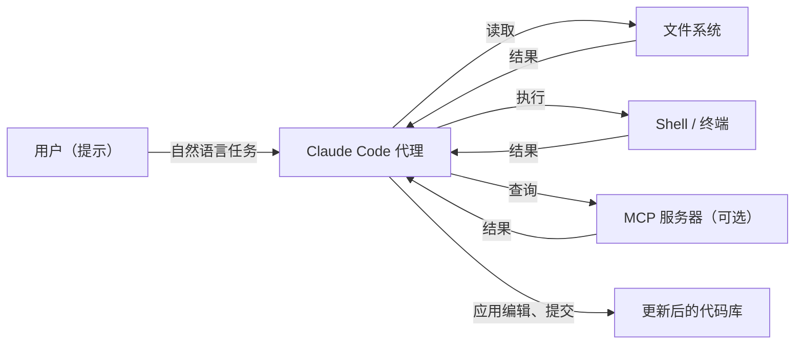

# Claude Code

## 定义

Claude Code 是 Anthropic 的官方编码代理。它在终端中运行，通过扩展与 IDE（VS Code、JetBrains）集成，并拥有 Web 界面。你用自然语言描述任务，Claude 就会读取文件、编辑代码、执行 shell 命令并提交变更来完成任务。

Claude Code 使用 Anthropic 的 Claude 模型，可以在长任务中完全自主运行（"无监督"模式），也可以与你循环交互，逐个审查变更。它对 [MCP（模型上下文协议）](/docs/mcp)提供一流支持——你可以连接 MCP 服务器，让 Claude 访问外部工具，如数据库、API 或自定义工具。仓库根目录中的 `CLAUDE.md` 文件提供项目特定的持久指令。

## 工作原理

### CLAUDE.md

在仓库根目录放置 `CLAUDE.md` 文件，为 Claude 提供持久指令：首选技术栈、代码约定、哪些文件绝不能修改、如何运行测试。Claude 在每次会话开始时都会读取它。

### MCP 服务器

连接 MCP 服务器来扩展 Claude 的工具：PostgreSQL 数据库、GitHub API、Sentry、内部工具。Claude 在执行任务时可以直接查询这些服务，无需你复制粘贴输出。

### 操作模式

**交互模式**——Claude 建议每个变更，你批准。**自主模式**——Claude 完成整个任务，你审查差异。**无头模式**——Claude 通过脚本调用，用于 CI 自动化。

## 何时使用 / 何时不使用

| 场景 | 使用 Claude Code | 不使用 Claude Code |
|------|----------------|------------------|
| 跨多个文件实现一个功能 | 是——代理管理跨文件的上下文 | |
| 带测试的遗留代码重构 | 是——循环运行测试直到通过 | |
| 搭建带样板代码的新项目 | 是——写入文件、安装依赖 | |
| 输入时的快速内联补全 | | 内联建议首选 GitHub Copilot / Cursor |
| 关键代码的安全审查 | | 人工审查仍不可缺少 |

## 优缺点

| 优点 | 缺点 |
|------|------|
| 深度访问文件系统和 shell | 无监督时可能进行破坏性变更 |
| 支持 MCP 丰富的外部工具 | 需要仔细审查差异 |
| CLAUDE.md 提供持久项目上下文 | 每个任务成本高于小型模型 |
| 长任务的自主操作 | 迭代速度取决于 API 速度 |

## 实用资源

- [Claude Code 文档](https://docs.anthropic.com/claude-code) — 入门指南、命令参考和 MCP 集成
- [Claude Code VS Code 扩展](https://marketplace.visualstudio.com/items?itemName=anthropic.claude-code) — IDE 集成，支持内联补全和代理面板

## 另请参阅

- [MCP](/docs/mcp)
- [Cursor](/docs/tools/cursor)
- [GitHub Copilot](/docs/tools/github-copilot)
- [Kiro](/docs/tools/kiro)
- [Antigravity](/docs/tools/antigravity)
