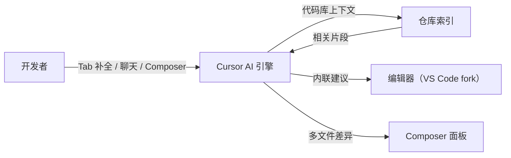

# Cursor

## 定义

Cursor 是一款基于 VS Code 构建的 AI 驱动代码编辑器。它保留了 VS Code 所有熟悉的用户体验——扩展、键盘快捷键、设置——并增加了 AI 代码补全、具有代码库上下文的聊天面板，以及通过代理驱动的"Composer"模式进行多文件编辑。

Cursor 在本地对你的仓库建立索引，使 AI 建议具有你实际代码库的上下文，而不仅仅是当前文件。Composer 模式让你用自然语言描述多文件变更，Cursor 为你应用差异，并内置审查流程。它支持多个后端模型（GPT-4o、Claude、Gemini），可以指向自定义 API 端点。

## 工作原理

### Tab 补全

输入时的多行预测补全。Cursor 观察当前文件和相关文件中的模式，提供比单 token 补全更大的代码块。

### 具有代码库上下文的聊天

聊天面板理解符号、文件和 git 历史。可以询问"这个函数在哪里被调用？"或"解释这个类"，无需手动复制代码。

### Composer（代理模式）

描述一个功能或重构。Cursor 编写多个文件，显示统一差异，并允许按块应用或拒绝。

## 何时使用 / 何时不使用

| 场景 | 使用 Cursor | 不使用 Cursor |
|------|-----------|-------------|
| 日常开发中需要智能补全 | 是——多行补全和代码库聊天 | |
| 多文件重构 | 是——Composer 应用协调的差异 | |
| 现有 VS Code 用户 | 是——相同的扩展和快捷键 | |
| 在受限/隔离网络上工作 | | AI 模型需要外部连接 |
| 当你已经偏好其他 IDE（JetBrains、Neovim）时 | | 深度集成在 VS Code 中 |

## 对比

| 功能 | Cursor | GitHub Copilot |
|------|--------|----------------|
| 基础 | VS Code fork | 任何 IDE 的扩展 |
| 代码库上下文 | 完整仓库索引 | 当前文件 + 已打开的文件 |
| 多文件编辑 | 是（Composer） | 有限（Copilot Workspace） |
| 后端模型 | GPT-4o、Claude、Gemini | 主要是 OpenAI/GitHub 模型 |
| 价格 | 订阅（免费版有限制） | 订阅（学生/开源免费） |

## 优缺点

| 优点 | 缺点 |
|------|------|
| 与 VS Code 兼容——无需新的学习曲线 | Fork 而非扩展：VS Code 更新有延迟 |
| 仓库索引提供上下文感知建议 | 仓库数据发送至 Cursor 服务器 |
| Composer 简化多文件变更 | 完整使用需要付费订阅 |
| 支持多个后端模型 | 不同模型间补全体验不一致 |

## 实用资源

- [Cursor 官方网站](https://cursor.sh/) — 下载、文档和更新日志
- [Cursor 文档](https://docs.cursor.sh/) — 功能参考、模型配置和故障排除指南

## 另请参阅

- [GitHub Copilot](/docs/tools/github-copilot)
- [Claude Code](/docs/tools/claude-code)
- [Kiro](/docs/tools/kiro)
