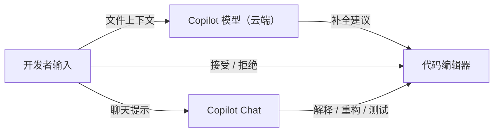

# GitHub Copilot

## 定义

GitHub Copilot 是由 GitHub 和 OpenAI 共同开发的 AI 编码助手。它直接集成到你的代码编辑器（VS Code、JetBrains、Neovim 等）中，在你输入时实时提供内联代码建议，并提供聊天功能用于代码解释、测试生成和 bug 修复。

Copilot 使用在 GitHub 公开代码上训练的大型语言模型。它根据当前文件、注释和其他标签页中打开的代码来生成补全建议。Copilot Chat（在 VS Code 和 GitHub.com 中可用）支持更长的对话：解释这段代码的作用、为这个函数生成单元测试、重构为使用 async/await。Copilot Workspace 是一种类似代理系统的实验性更自主模式。

## 工作原理

### 内联补全

输入时，Copilot 以灰色显示建议。按 Tab 接受，按 Esc 拒绝，或按 Alt+] 查看备选建议。支持 20 多种编程语言。

### Copilot Chat

编辑器内的聊天面板，可以用自然语言询问关于所选代码的问题、请求解释或要求特定的代码生成。使用当前整个文件和已打开文件的上下文。

## 何时使用 / 何时不使用

| 场景 | 使用 Copilot | 不使用 Copilot |
|------|------------|--------------|
| 在任何 IDE 中进行日常代码补全 | 是——支持 VS Code、JetBrains、Neovim | |
| 生成样板测试 | 是——快速搭建测试框架 | |
| 通过示例学习新库 | 是——自动补全 API 模式很有帮助 | |
| 高度专有/敏感的代码 | | 提示会发送到 GitHub 服务器 |
| 不经审查就需要高精确度时 | | 建议必须始终经过审查 |

## 对比

| 功能 | GitHub Copilot | Cursor |
|------|----------------|--------|
| 编辑器集成 | 多个 IDE 的扩展 | VS Code fork |
| 代码库上下文 | 当前文件 + 已打开的文件 | 完整仓库索引 |
| 代理模式 | Copilot Workspace（测试版） | Composer |
| 后端模型 | OpenAI/GitHub 模型 | GPT-4o、Claude、Gemini（可配置） |
| 适合 | 任何 IDE 用户 | 想要深度 AI 的 VS Code 用户 |

## 优缺点

| 优点 | 缺点 |
|------|------|
| 广泛的 IDE 支持——无需更换编辑器 | 默认上下文仅限已打开的文件 |
| 出色的内联补全和样板代码生成 | 代码提示发送至 GitHub 云端 |
| 学生、开源维护者免费 | 专业使用需要付费订阅 |
| 深度集成到 GitHub 工作流 | Workspace 仍处于早期访问阶段 |

## 实用资源

- [GitHub Copilot](https://github.com/features/copilot) — 官方功能页面、定价和快速入门
- [GitHub Copilot 文档](https://docs.github.com/copilot) — 安装指南、聊天使用和策略选项

## 另请参阅

- [Cursor](/docs/tools/cursor)
- [Claude Code](/docs/tools/claude-code)
- [Kiro](/docs/tools/kiro)
