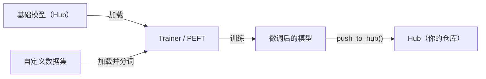

# Hugging Face

## 定义

Hugging Face 是机器学习领域的核心开源平台：托管 **Hub**（超过 50 万个公开模型和 5 万个数据集），提供用于加载和运行预训练模型的 `transformers` 库，并提供[微调](/docs/llms/fine-tuning)、评估和部署工具。它通过统一 API 覆盖 [NLP](/docs/nlp)、计算机视觉、语音和[多模态](/docs/multimodal-ai)模型，让在任务和架构之间切换变得便捷，无需学习新接口。

`transformers` 库在 [PyTorch](/docs/frameworks/pytorch)、TensorFlow 和 JAX 上运行。一次 `from_pretrained("模型名称")` 调用会自动从 Hub 下载模型权重、分词器和配置。相同的抽象适用于 [BERT](/docs/transformers/bert)、[GPT](/docs/transformers/gpt) 风格的解码器、扩散模型、视觉 transformer 和 whisper 级别的语音模型。`datasets` 提供高效的大数据集流式加载和预处理，`accelerate` 以最少的代码改动增加分布式和混合精度训练。

Hugging Face 还与更广泛的 AI 生态系统集成：Hub 上托管的模型可以在 [LangChain](/docs/tools/langchain) 和 [LlamaIndex](/docs/tools/llamaindex) 中直接用作推理后端，`peft` 库支持参数高效[微调](/docs/llms/fine-tuning)（LoRA、QLoRA），使 [LLM](/docs/llms) 能够在消费级硬件上进行适配。Spaces 使用 Gradio 或 Streamlit 提供零配置演示托管，弥合研究与公众访问之间的差距。

## 工作原理

### 加载与推理


### 微调工作流



### 核心库

**`transformers`** — 模型加载、推理、分词。**`datasets`** — 高效的数据加载和预处理。**`accelerate`** — 分布式训练和混合精度。**`peft`** — LoRA 和 QLoRA 参数高效微调。**`evaluate`** — 指标（BLEU、ROUGE、准确率）。**`diffusers`** — 扩散模型管道。

## 何时使用 / 何时不使用

| 场景 | 使用 Hugging Face | 不使用 Hugging Face |
|------|-----------------|-------------------|
| 加载并运行预训练的 NLP 或视觉模型 | 是——`from_pretrained` 提供统一 API | |
| 在自定义数据集上微调 LLM | 是——Trainer + PEFT（LoRA/QLoRA） | |
| 与社区分享模型和数据集 | 是——Hub 提供模型卡片和版本控制 | |
| 高吞吐量生产服务 | | 使用 vLLM、TGI 或 TorchServe 进行优化推理 |
| 实时边缘部署 | | TFLite 或 ONNX Runtime 更为合适 |
| 从头训练大型专有模型 | | 云服务商工具（TPU pods、SLURM）可能更优 |

## 优缺点

| 优点 | 缺点 |
|------|------|
| 数百种架构的统一 API | 简单用例的依赖占用大 |
| Hub 提供模型卡片、版本控制和可发现性 | 部分模型质量属于研究级，支持有限 |
| PEFT 使有限硬件下的微调成为可能 | 推理吞吐量不如专业服务器优化 |
| 活跃社区和频繁更新 | 频繁的 API 变更可能破坏现有代码 |

## 代码示例

```python
# Load a pretrained text-classification model and run inference
from transformers import pipeline

classifier = pipeline("sentiment-analysis", model="distilbert-base-uncased-finetuned-sst-2-english")
result = classifier("Hugging Face makes NLP accessible to everyone.")
print(result)  # [{'label': 'POSITIVE', 'score': 0.9998}]

# Fine-tune with PEFT (LoRA) on a custom dataset
from transformers import AutoModelForCausalLM, AutoTokenizer, TrainingArguments, Trainer
from peft import get_peft_model, LoraConfig, TaskType
import datasets

model_name = "meta-llama/Llama-3.2-1B"
tokenizer = AutoTokenizer.from_pretrained(model_name)
base_model = AutoModelForCausalLM.from_pretrained(model_name)

lora_config = LoraConfig(task_type=TaskType.CAUSAL_LM, r=8, lora_alpha=32)
model = get_peft_model(base_model, lora_config)
model.print_trainable_parameters()  # shows only ~0.1% of params are trainable
```

## 对比

| 功能 | Hugging Face Transformers | 直接 API（OpenAI、Anthropic） |
|------|--------------------------|-------------------------------|
| 模型访问 | Hub 的开源模型 | 专有前沿模型 |
| 成本 | 免费运行（你支付硬件费用） | 按 token 计费的 API 费用 |
| 控制 | 完全访问权重和内部参数 | 黑盒，控制有限 |
| 微调 | 一流支持（Trainer、PEFT） | 有限（OpenAI 微调 API） |
| 部署 | 自管理（vLLM、TGI、TFLite） | 供应商管理 |
| 最适合 | 研究、自定义微调、数据隐私 | 快速生产集成 |

## 实用资源

- [Hugging Face 文档](https://huggingface.co/docs) — 包括 Hub、Transformers 和 Spaces 的完整平台文档
- [Transformers 库](https://huggingface.co/docs/transformers) — API 参考、管道和模型卡片
- [Hugging Face NLP 课程](https://huggingface.co/learn/nlp-course/) — 覆盖 Transformers 和微调的免费端到端课程
- [PEFT 文档](https://huggingface.co/docs/peft) — LoRA、QLoRA 和其他参数高效方法
- [Hugging Face Hub](https://huggingface.co/models) — 按任务、语言和许可证浏览筛选超过 50 万个模型

## 另请参阅

- [Transformers](/docs/transformers)
- [LLMs](/docs/llms)
- [微调](/docs/llms/fine-tuning)
- [RAG](/docs/rag)
- [框架](/docs/frameworks/pytorch)
