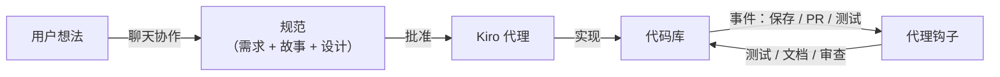

# Kiro

## 定义

Kiro 是 AWS 开发的 AI IDE，引入了**规范驱动开发**：在编写代码之前，你与 AI 代理协作，产出需求、用户故事和技术设计。一旦规范获得批准，代理就会实现它们，并在整个项目生命周期内保持代码库与文档意图同步。

Kiro 还具有**代理钩子**——自动触发器，响应开发事件（文件保存、PR 打开、测试运行）来执行 AI 任务。例如，每当创建新函数文件时，钩子可以自动生成单元测试；或者当 API 更改时更新文档。这种方法旨在弥合 AI 快速原型开发与生产质量代码之间的差距：规范捕获"为什么"和"是什么"，而钩子则持续执行质量保证。

## 工作原理

### 规范流程

Kiro 不是从空白提示开始，而是引导你完成一个结构化过程：定义问题、阐明用例、选择技术方法。生成的规范作为代理在实现或重构时参考的真实来源。

### 代理钩子

钩子是在配置文件中定义的事件驱动规则。它们在后台执行 AI 任务：审查变更中的安全问题、生成文档字符串、验证架构模式合规性。钩子使开发过程主动而非被动。

## 何时使用 / 何时不使用

| 场景 | 使用 Kiro | 不使用 Kiro |
|------|----------|-----------|
| 构建需要设计文档的复杂功能 | 是——规范流程在代码之前捕获决策 | |
| 需要可追溯意图的团队项目 | 是——规范充当活文档 | |
| 在大型代码库中一致应用质量标准 | 是——钩子自动化质量检查 | |
| 一次性小脚本 | | 规范流程增加不必要的开销 |
| 需要最小快速内联补全时 | | 直接代码插入首选 Cursor 或 Copilot |

## 对比

| 功能 | Kiro | Cursor | Claude Code |
|------|------|--------|-------------|
| 规范优先流程 | 是 | 否 | 否 |
| 事件驱动代理钩子 | 是 | 否 | 部分（通过 MCP） |
| 内联补全 | 是 | 是 | 否 |
| 自主代理模式 | 是 | 是（Composer） | 是 |
| 最适合 | 规范驱动设计 | 日常开发 | 多文件任务 |

## 优缺点

| 优点 | 缺点 |
|------|------|
| 规范减少实现漂移 | 对于快速一次性任务，工作流程较慢 |
| 钩子自动执行质量标准 | 仍处于早期访问——功能可能变化 |
| 弥合快速原型和生产质量之间的差距 | 生态系统比 VS Code / JetBrains 小 |
| 由 AWS 构建，具有云原生集成 | 依赖 AWS 服务的供应商锁定 |

## 实用资源

- [Kiro 官方网站](https://kiro.dev/) — 早期访问等待列表、文档和示例

## 另请参阅

- [Claude Code](/docs/tools/claude-code)
- [Cursor](/docs/tools/cursor)
- [GitHub Copilot](/docs/tools/github-copilot)
- [Antigravity](/docs/tools/antigravity)
