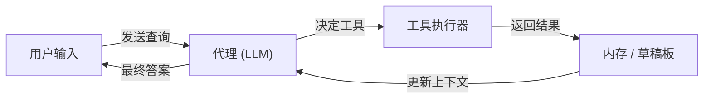

# LangChain

## 定义

LangChain 是一个用于构建由[大型语言模型](/docs/llms)驱动的应用程序的开源框架。它为提示词、链、代理和检索提供可组合的抽象，使开发者能够以最少的样板代码将模型提供商、内存存储、工具和文档加载器连接在一起。该框架为数十个 LLM 提供商（OpenAI、Anthropic、Mistral、通过 Ollama 本地运行）和向量存储（Pinecone、Chroma、FAISS）提供预置集成。

LangChain 的核心围绕**链（chains）**的概念：步骤序列，其中一个步骤的输出作为下一个步骤的输入。**代理（Agents）**通过给予 LLM 一个推理循环来扩展链：它决定调用哪个工具，接收结果，并继续直到产生最终答案。LangSmith 作为配套的可观测性平台，为生产环境中的 LangChain 应用提供追踪、评估和数据集管理。

它通过专注于可组合的编排和代理循环来补充 [LlamaIndex](/docs/tools/llamaindex)（后者强调数据索引和检索质量）。当您需要灵活的链式操作、多步骤[提示工程](/docs/prompt-engineering)工作流或[带工具的代理](/docs/agents)，并希望拥有大型现成集成生态系统时，请使用 LangChain。

## 工作原理

### 组件

LangChain 将 LLM 应用程序分解为模块化组件：**LLM / 聊天模型**（推理后端）、**提示词模板**（结构化输入构建）、**输出解析器**（结构化提取）、**检索器**（从[向量数据库](/docs/rag/vector-databases)获取相关文档）和**工具**（外部 API、搜索、代码执行）。

### 链与 LCEL

**LangChain 表达式语言（LCEL）**使用管道语法（`prompt | llm | parser`）组合组件。生成的链是惰性的、可流式传输的和可批处理的。一个简单的 RAG 链：检索文档 → 格式化为提示词 → 调用 LLM → 解析答案。

### 代理



### 使用 LangSmith 的可观测性

LangSmith 为链和代理封装追踪日志，无需修改应用程序代码即可实现延迟分析、提示词测试和数据集驱动的评估。

## 何时使用 / 何时不使用

| 场景 | 使用 LangChain | 不使用 LangChain |
|----------|--------------|----------------------|
| 构建调用多个 API 和工具的代理 | 是 — 代理抽象和工具集成是一等公民 | |
| 快速设置对自有文档的 RAG | 是 — 大量加载器和检索器集成 | |
| 需要深度分块和检索调优的生产级 RAG | | 优先使用 [LlamaIndex](/docs/tools/llamaindex) 进行细粒度控制 |
| 无需检索或工具的单轮补全 | | 开销不必要；直接调用 API |
| 在生产环境中追踪和评估 LLM 调用 | 是 — LangSmith 集成 | |
| 严格的延迟预算和最小依赖 | | 框架开销可能增加延迟；考虑使用轻量客户端 |

## 比较

| 功能 | LangChain | LlamaIndex |
|---------|-----------|------------|
| 主要关注点 | 编排、链、代理 | 数据索引和检索 |
| 代理支持 | 一等公民（工具调用、LCEL） | 通过查询引擎作为工具 |
| RAG 控制 | 高层次，多种集成 | 细粒度分块、节点解析器 |
| 可观测性 | LangSmith（追踪、评估） | 通过集成 |
| 学习曲线 | 适中 | 适中 |
| 最适合 | 多步骤工作流、代理 | 对大型文档语料库的深度 RAG |

## 优缺点

| 优点 | 缺点 |
|------|------|
| 大型集成生态系统（100+ LLM、存储、工具） | 抽象可能掩盖错误并增加调试难度 |
| LCEL 使链可组合且可流式传输 | API 接口在版本间频繁变化 |
| LangSmith 提供生产级追踪和评估 | 对于简单用例可能增加延迟和依赖开销 |
| 强大的社区和文档 | 多种实现同一目标的方式可能令人困惑 |

## 代码示例

```python
# 使用 LangChain 表达式语言（LCEL）的最小 RAG 链
from langchain_openai import ChatOpenAI, OpenAIEmbeddings
from langchain_community.vectorstores import FAISS
from langchain_core.prompts import ChatPromptTemplate
from langchain_core.output_parsers import StrOutputParser
from langchain_core.runnables import RunnablePassthrough

# 1. 从文档构建向量存储
texts = ["LangChain composes LLM pipelines.", "LCEL uses pipe syntax."]
vectorstore = FAISS.from_texts(texts, embedding=OpenAIEmbeddings())
retriever = vectorstore.as_retriever()

# 2. 定义提示词
prompt = ChatPromptTemplate.from_template(
    "Answer based on context:\n{context}\n\nQuestion: {question}"
)

# 3. 使用 LCEL 组合链
chain = (
    {"context": retriever, "question": RunnablePassthrough()}
    | prompt
    | ChatOpenAI(model="gpt-4o-mini")
    | StrOutputParser()
)

print(chain.invoke("What does LCEL use?"))
# -> "LCEL uses pipe syntax."
```

## 有效使用技巧

- 对所有新代码使用 LCEL（管道语法）而非旧版 `LLMChain` — 它可流式传输、可批处理，且更易于调试。
- 从第一天起就使用 LangSmith 追踪对每个链和代理进行插桩；事后添加追踪更困难。
- 保持工具描述简短精确 — 代理选择正确工具的能力取决于描述质量。
- 使用 `RunnablePassthrough` 和 `RunnableParallel` 在不转换数据的情况下通过链传递数据。
- 对于生产级 RAG，在检索器和 LLM 之间添加重排序（例如 Cohere rerank）以提高答案质量。

## 实用资源

- [LangChain 文档](https://python.langchain.com/docs/) — 完整的 API 参考、指南和教程
- [LangChain — 代理](https://python.langchain.com/docs/concepts/agents/) — 代理概念及如何构建工具调用代理
- [LangChain — RAG](https://python.langchain.com/docs/use_cases/question_answering/) — 问答和检索用例
- [LangSmith](https://smith.langchain.com/) — 追踪、评估和数据集管理
- [LCEL 概述](https://python.langchain.com/docs/expression_language/) — 使用管道语法组合链

## 另请参阅

- [RAG](/docs/rag)
- [代理](/docs/agents)
- [LlamaIndex](/docs/tools/llamaindex)
