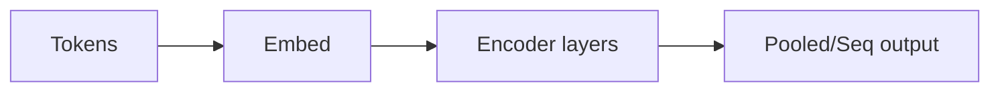

# BERT

## 定义

BERT 是一个使用掩码语言模型（MLM）和下一句预测进行预训练的 Transformer **编码器**模型。它生成上下文嵌入，用于下游 NLP 任务的微调。

与 [GPT](/docs/transformers/gpt) 风格的解码器不同，BERT 使用**双向**上下文（每个 token 的左右两侧），这有助于理解任务（如 [NLP](/docs/nlp) 分类、NER、QA），而非开放式生成。它常被用作 [RAG](/docs/rag) 和搜索管道中冻结或微调的编码器。

## 工作原理

**Token** 被分词并嵌入（token + 位置嵌入）。**编码器层**应用双向自注意力和 FFN；每个 token 的表示受到所有其他 token 的影响。输出可以是**池化的**（如 [CLS] 用于句子级任务）或**序列化的**（每个 token 一个向量，用于 NER、QA）。预训练：随机掩码 token 并预测它们（MLM），并预测两个句子是否连续（NSP）。**微调**添加任务头（如线性分类器），并在标注数据上更新模型（或仅更新头部）。

## 应用场景

当你需要丰富的上下文表示用于理解（分类、NER、QA）而非生成时，BERT 风格的模型表现出色。

- 命名实体识别和关系抽取
- 搜索和检索（语义匹配、相关性排名）
- 问答和自然语言推理

## 外部文档

- [BERT: Pre-training of Deep Bidirectional Transformers (Devlin et al.)](https://arxiv.org/abs/1810.04805)
- [Hugging Face – BERT](https://huggingface.co/docs/transformers/model_doc/bert)

## 另请参阅

- [Transformers](/docs/transformers)
- [GPT](/docs/transformers/gpt)
- [NLP](/docs/nlp)
