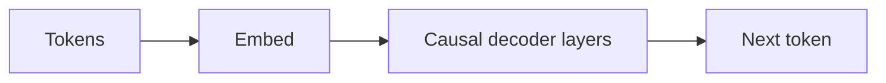

# GPT

## 定义

GPT 指的是训练来预测下一个 token（自回归）的仅解码器 Transformer 模型。扩展这些模型产生了当今能够执行少样本和零样本任务的大语言模型（LLM）。

仅解码器设计非常适合**生成**：每一步模型基于前面的 token 进行条件化并预测下一个。基于这一思想构建的 [LLM](/docs/llms) 随后经过指令微调和对齐（如 RLHF）用于对话和工具使用。对于仅理解任务，[BERT](/docs/transformers/bert) 风格的编码器可能参数效率更高。

## 工作原理

**Token** 被嵌入并送入**因果解码器层**：每个位置只能关注自身和之前的位置（掩码自注意力），因此模型无法"看到"未来。**下一个 token** 从最后一个位置的表示中预测（通常使用线性层和词汇表上的 softmax）。**训练**最大化给定前面上下文时下一个 token 的概率（teacher forcing）。**推理**自回归生成：采样或贪婪选择下一个 token，追加并重复直到停止条件。[提示工程](/docs/llms/prompt-engineering)和[微调](/docs/llms/fine-tuning)塑造模型如何使用这一机制完成任务。

## 应用场景

仅解码器模型是对话、代码以及任何受益于自回归生成或少样本提示的任务的基础。

- 文本和代码生成（补全、摘要、对话）
- 通过提示进行少样本和零样本分类
- 基于指令微调模型的助手和聊天机器人

## 外部文档

- [Improving Language Understanding by Generative Pre-Training (OpenAI)](https://cdn.openai.com/research-covers/language-unsupervised/language_understanding_paper.pdf)
- [Hugging Face – GPT-2](https://huggingface.co/docs/transformers/model_doc/gpt2)

## 另请参阅

- [Transformer](/docs/transformers)
- [LLM](/docs/llms)
- [提示工程](/docs/llms/prompt-engineering)
