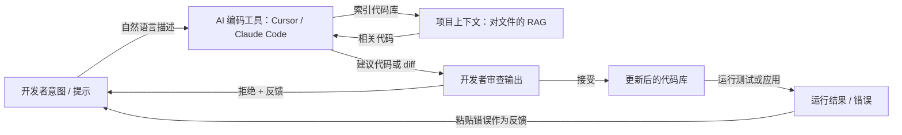

# Vibe Coding

## 定义

Vibe coding 是一种软件开发风格，通过 **AI 辅助进行迭代工作**：用自然语言描述意图，从 [LLM](/docs/llms) 或编码工具获取代码或编辑建议，然后通过反馈和上下文进行迭代，而不是从头编写每一行代码。"Vibe" 是那种松散的、探索性的流程 — 你靠意图和感觉来引导，模型填充实现细节。重点是减少摩擦：想法在几分钟而非几小时内变成可运行的代码，开发者扮演导演和评审的角色，而非打字员。

Vibe coding 与完全以规范为先或先计划后编码的方法形成对比（如[规范驱动开发](/docs/spec-driven-development)）：你通常从一个粗略的想法开始，让[提示工程](/docs/prompt-engineering)、[智能体](/docs/agents)和工具（如 [Cursor](/docs/tools/cursor)、[Claude Code](/docs/tools/claude-code)）来建议和编辑代码。开发者的角色从编写语法转变为描述目标、评估输出并引导走向正确。当开发者对代码库有足够的理解来发现错误时，这种方法最为高效 — vibe coding 并不消除对工程判断的需求，只是改变了判断发挥作用的地方。

这种实践得益于新一代 AI 编码工具，它们提供项目级别的上下文：索引的代码库、多文件编辑、终端访问以及可以自主编写、运行和修复代码的智能体循环。Cursor、Windsurf 和 Claude Code 等工具超越了自动补全，充当理解整个项目的协作智能体。[RAG](/docs/rag) 式的检索使建议保持在实际代码库中，而非通用示例。这对原型、脚本、样板代码、测试和重构特别有用 — 这些任务意图易于表达，但实现起来繁琐。

## 工作原理

### 意图-反馈循环

Vibe coding 的核心是一个快速循环：声明意图、审查输出、提供反馈、重复。与瀑布式开发不同，没有在开始前完整指定需求的要求。你可以通过要求模型"尝试几种方法"来探索，选择感觉最合适的。模型的建议成为你精炼的脚手架，而不是全盘接受的成品。

### 上下文与工具



### 智能体和自主模式

现代工具支持智能体式 vibe coding：AI 可以运行终端命令、读取错误输出，并在无需开发者干预的情况下多次迭代自我修正。这对重复性任务（生成测试套件、迁移 API）很有用，但需要开发者设定明确的边界并审查最终的 diff — 智能体循环可能会做出难以解开的级联更改。

## 何时使用 / 何时不使用

| 使用时机 | 避免时机 |
|---------|---------|
| 原型或脚本编写，速度比架构更重要 | 安全关键或高度受监管的系统，未审查的代码不可接受 |
| 生成样板代码、测试或迁移，意图易于表达 | 代码库过于复杂，模型缺乏足够上下文来避免细微错误 |
| 学习或探索不熟悉的代码库或库 | 需要完全理解生成的每行代码（如安全审查） |
| 快速迭代 UI 或 API 设计以验证想法 | 长期可维护性需要一致的模式和有意的架构决策 |

## 比较

| 方法 | 起点 | 是否需要规范 | 最适合 |
|------|------|------------|--------|
| Vibe coding | 粗略意图 | 否 | 原型、脚本、探索 |
| 规范驱动开发 | 明确规范 | 是 | 受监管系统、智能体、合规 |
| TDD（测试优先） | 测试用例 | 部分 | 具有明确验收标准的生产功能 |
| 结对编程（人 + 人） | 共享上下文 | 不定 | 需要深度推理的复杂问题 |

## 优缺点

| 优点 | 缺点 |
|------|------|
| 快速迭代，减少打字 | 如果从不阅读代码，可能会掩盖理解 |
| 适合探索和学习 | 未经审查可能产生脆弱或过拟合的代码 |
| 小任务和原型摩擦低 | 没有规范难以扩展到大型一致性系统 |
| 与[智能体](/docs/agents)和 IDE 集成配合良好 | 高度依赖模型质量、上下文窗口和工具集成 |
| 降低开始新任务的激活能量 | 智能体循环可能产生不必要的级联更改 |

## 代码示例

### 使用 Claude Code 的 Vibe Coding 示例会话（shell）

```bash
# 在您的项目目录中启动 Claude Code
claude

# 描述您想要的内容 — 无需指定确切实现
> 向 Express 应用添加一个速率限制中间件。
>  对每个 IP 使用每分钟 100 个请求的滑动窗口。
>  当超出限制时返回 429 和 Retry-After 标头。

# Claude Code 将会：
# 1. 读取现有的 Express 设置
# 2. 安装适当的库（如 express-rate-limit）
# 3. 编写并插入中间件
# 4. 更新导入

# 审查 diff，然后迭代
> 实际上使用 Redis 作为速率限制存储，这样它可以在多个实例之间工作。

# 接受最终 diff 并运行测试
> 运行现有的测试套件并修复任何失败。
```

## 实用资源

- [Claude Code 文档](https://docs.anthropic.com/en/docs/claude-code/overview) — Anthropic 基于终端的 AI 编码智能体
- [Cursor 文档](https://docs.cursor.com/) — AI 优先的 IDE，具有代码库感知建议和智能体编辑
- [Kiro – 规范驱动和自动驾驶](https://kiro.dev/) — 平衡结构化规范与 AI 驱动开发流程的工具
- [Andrej Karpathy – Vibe coding (Twitter/X)](https://x.com/karpathy/status/1886192184808149165) — 该术语的创造者对其的命名和描述
- [Windsurf (Codeium)](https://codeium.com/windsurf) — 带有 Cascade 的智能体 IDE，一个多文件智能体编码流程

## 另请参阅

- [规范驱动开发](/docs/spec-driven-development) — 更结构化的、规范优先的方法
- [智能体](/docs/agents) — 可以编写和编辑代码的 AI
- [Cursor](/docs/tools/cursor) — 为 AI 辅助编码而构建的 IDE
- [提示工程](/docs/prompt-engineering)
