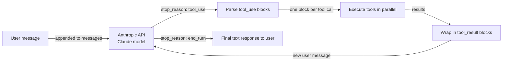

## Definition

**Anthropic Tool Use** (sometimes called "function calling") is Claude's native mechanism for interacting with external systems in a structured, reliable way. Instead of asking Claude to output text that you then parse to find a function name and arguments, you describe your tools as JSON schemas in the API request and Claude returns a structured `tool_use` block with the exact tool name and a JSON object of validated arguments. Your code executes the tool, wraps the result in a `tool_result` block, and sends it back to Claude as the next turn in the conversation — a loop that continues until Claude produces a final text response.

The design philosophy is intentional minimalism: Anthropic Tool Use is a capability of the model API, not a framework. There is no orchestration layer, no built-in memory, no agent loop — you write those yourself. This gives maximum control and minimum abstraction overhead. For simple to medium tool use cases, the result is clean, readable, and easy to debug. For complex multi-agent systems, you would typically combine Anthropic Tool Use with a framework like LangGraph or a custom orchestrator.

Claude models have been specifically trained on tool use, which means they exhibit strong performance on deciding *when* to call a tool (not calling unnecessarily), *how* to populate arguments correctly from natural language, and *how* to handle ambiguous or underspecified requests gracefully by asking for clarification rather than hallucinating arguments. Parallel tool calling (multiple `tool_use` blocks in a single response) and multi-turn tool use (several rounds of tool calls before a final answer) are both supported natively.

## How it works

### Tool definitions: JSON schema

Each tool is described as a JSON object with three required fields: `name` (a string identifier), `description` (a natural language explanation of what the tool does and when to use it — this is the most important field for steering Claude's decision), and `input_schema` (a JSON Schema object defining the expected arguments). The `input_schema` follows the standard JSON Schema draft, supporting string, number, boolean, array, object types, required fields, enum values, and nested schemas. Claude reads the tool descriptions to decide which tool to call; more precise descriptions lead to more accurate tool selection.

### tool_use and tool_result message types

When Claude decides to use a tool, it returns a response with `stop_reason: "tool_use"` and a `content` array that contains one or more `tool_use` blocks. Each block has an `id` (a unique string like `"toolu_01abc..."`), a `name` (matching one of your tool definitions), and an `input` (a JSON object with the validated arguments). Your application extracts these blocks, executes each tool call, and constructs a new message with `role: "user"` whose content is a list of `tool_result` blocks — one per tool call, matching by `tool_use_id`. The `tool_result` block carries the output as a string or a structured content array. This back-and-forth continues until Claude returns `stop_reason: "end_turn"` with a plain text response.

### Parallel tool calls

Claude can emit multiple `tool_use` blocks in a single response when it determines that several tools can be called simultaneously — for example, searching two different databases or fetching weather for three cities at once. Your application should detect multiple `tool_use` blocks and execute them in parallel (e.g. with `asyncio.gather` or a thread pool) before constructing the `tool_result` reply. Parallel calls reduce total latency significantly compared to sequential single-call rounds, and Claude has been trained to use this capability when it makes sense.

### Multi-turn tool use

Complex tasks often require several rounds of tool calls before Claude can produce a final answer: look up an entity, then fetch details about it, then compute something from those details. Each round adds one assistant message (with `tool_use` blocks) and one user message (with `tool_result` blocks) to the conversation history. The conversation history is always sent in full on each API call, giving Claude complete context about what was tried and what the results were. This stateless design means you are responsible for maintaining and trimming the message list — there is no built-in memory or state management.



## When to use / When NOT to use

| Use when | Avoid when |
|---|---|
| You want direct control over the tool-calling loop without framework overhead | You need a multi-agent coordination layer — Anthropic Tool Use is single-agent |
| You need the tightest integration with Claude-specific features (streaming, extended thinking) | You need framework conveniences like automatic memory, built-in tool libraries, or role management |
| Your use case has 1-10 tools and a well-defined conversation flow | Your tool set is very large and you need semantic tool selection at scale |
| You are building a production system and want minimal dependencies | You want rapid prototyping with pre-built integrations (use LangChain or CrewAI instead) |
| You need maximum portability — just the Anthropic SDK and your own code | Your team prefers declarative agent configuration over writing orchestration code |

## Comparisons

| Criterion | Anthropic Tool Use | OpenAI Function Calling |
|---|---|---|
| **Schema format** | JSON Schema with `name`, `description`, `input_schema` fields | JSON Schema with `name`, `description`, `parameters` fields — nearly identical structure |
| **Streaming tool calls** | Supported: `input_json_delta` events stream argument tokens in real time | Supported: `function_call` argument streaming via delta events |
| **Parallel tool calls** | Supported: multiple `tool_use` blocks in a single response | Supported: multiple `tool_calls` entries in a single response |
| **Reliability / argument accuracy** | Strong: Claude models are specifically trained for precise tool use | Strong: GPT-4 class models have robust function calling |
| **Model support** | Claude 3 family and above (Haiku, Sonnet, Opus) | GPT-3.5-turbo, GPT-4, GPT-4o and above |
| **Tool result format** | `tool_result` content block with `tool_use_id` reference | `tool` role message with `tool_call_id` reference |
| **Extended features** | Computer use tools (beta), document tools | Code interpreter, file search (Assistants API) |

## Code examples

```python
import anthropic
import json
from typing import Any

# Initialize the Anthropic client
client = anthropic.Anthropic()  # reads ANTHROPIC_API_KEY from environment

# --- Tool definitions using JSON Schema ---
# The 'description' field is critical: Claude uses it to decide when to call each tool.
# The 'input_schema' defines the expected arguments with types and required fields.

tools = [
    {
        "name": "get_weather",
        "description": (
            "Get current weather information for a specific city. "
            "Use this when the user asks about weather conditions, temperature, or forecasts."
        ),
        "input_schema": {
            "type": "object",
            "properties": {
                "city": {
                    "type": "string",
                    "description": "The city name, e.g. 'London' or 'New York'",
                },
                "units": {
                    "type": "string",
                    "enum": ["celsius", "fahrenheit"],
                    "description": "Temperature unit. Defaults to celsius.",
                },
            },
            "required": ["city"],
        },
    },
    {
        "name": "search_knowledge_base",
        "description": (
            "Search an internal knowledge base for information on AI topics. "
            "Use this when the user asks a factual question about AI frameworks, models, or concepts."
        ),
        "input_schema": {
            "type": "object",
            "properties": {
                "query": {
                    "type": "string",
                    "description": "The search query string",
                },
                "max_results": {
                    "type": "integer",
                    "description": "Maximum number of results to return. Default: 3.",
                    "minimum": 1,
                    "maximum": 10,
                },
            },
            "required": ["query"],
        },
    },
    {
        "name": "create_summary",
        "description": (
            "Create a structured summary of provided content. "
            "Use this to format research findings or information into a clean summary."
        ),
        "input_schema": {
            "type": "object",
            "properties": {
                "content": {
                    "type": "string",
                    "description": "The content to summarize",
                },
                "format": {
                    "type": "string",
                    "enum": ["bullet_points", "paragraph", "table"],
                    "description": "Output format for the summary",
                },
            },
            "required": ["content", "format"],
        },
    },
]

# --- Tool execution functions ---
# In production, these would call real APIs. Here they return simulated results.

def get_weather(city: str, units: str = "celsius") -> dict:
    """Simulated weather API call."""
    return {
        "city": city,
        "temperature": 22 if units == "celsius" else 72,
        "units": units,
        "condition": "partly cloudy",
        "humidity": "65%",
    }

def search_knowledge_base(query: str, max_results: int = 3) -> list[dict]:
    """Simulated knowledge base search."""
    return [
        {"title": f"Result {i+1} for '{query}'", "snippet": f"Relevant information about {query}..."}
        for i in range(min(max_results, 3))
    ]

def create_summary(content: str, format: str) -> str:
    """Simulated summary creation."""
    if format == "bullet_points":
        return f"• Key point from: {content[:50]}...\n• Additional insight\n• Conclusion"
    return f"Summary: {content[:100]}..."

def execute_tool(tool_name: str, tool_input: dict) -> Any:
    """Dispatch tool calls to the appropriate function."""
    if tool_name == "get_weather":
        return get_weather(**tool_input)
    elif tool_name == "search_knowledge_base":
        return search_knowledge_base(**tool_input)
    elif tool_name == "create_summary":
        return create_summary(**tool_input)
    else:
        return {"error": f"Unknown tool: {tool_name}"}

# --- Multi-turn tool use loop ---

def run_agent(user_message: str) -> str:
    """
    Run a multi-turn tool use loop until Claude produces a final answer.
    Returns the final text response.
    """
    messages = [{"role": "user", "content": user_message}]

    while True:
        response = client.messages.create(
            model="claude-opus-4-5",
            max_tokens=4096,
            tools=tools,
            messages=messages,
            system=(
                "You are a helpful AI assistant with access to weather data, "
                "a knowledge base, and a summary tool. "
                "Use tools when needed to answer questions accurately."
            ),
        )

        # Append the assistant's response to the conversation history
        messages.append({"role": "assistant", "content": response.content})

        # Check if we're done
        if response.stop_reason == "end_turn":
            # Extract the final text from the response content
            for block in response.content:
                if hasattr(block, "text"):
                    return block.text
            return "No text response found."

        # Handle tool use: execute all tool_use blocks
        if response.stop_reason == "tool_use":
            tool_results = []

            for block in response.content:
                if block.type == "tool_use":
                    print(f"  Calling tool: {block.name}({json.dumps(block.input)})")

                    # Execute the tool and get the result
                    result = execute_tool(block.name, block.input)

                    # Wrap result in a tool_result block
                    # The tool_use_id links this result to the specific tool call
                    tool_results.append({
                        "type": "tool_result",
                        "tool_use_id": block.id,
                        "content": json.dumps(result),  # serialize to string
                    })

            # Add tool results as a user message to continue the conversation
            messages.append({"role": "user", "content": tool_results})

        else:
            # Unexpected stop reason — return what we have
            break

    return "Agent loop ended unexpectedly."

# --- Run examples ---

print("Example 1: Weather + Knowledge base (potential parallel calls)")
answer = run_agent(
    "What is the weather in Paris right now, and also search for information about LangGraph?"
)
print("Answer:", answer)

print("\nExample 2: Multi-turn tool use")
answer = run_agent(
    "Search for information about CrewAI and then create a bullet-point summary of the results."
)
print("Answer:", answer)
```

## Practical resources

- [Anthropic Tool Use documentation](https://docs.anthropic.com/en/docs/build-with-claude/tool-use) — Official guide covering tool definitions, message flow, parallel calls, and best practices for tool descriptions.
- [Anthropic Python SDK reference](https://github.com/anthropics/anthropic-sdk-python) — Full SDK with typed response objects, async support, and streaming for tool use.
- [Anthropic cookbook: tool use examples](https://github.com/anthropics/anthropic-cookbook/tree/main/tool_use) — Practical notebooks demonstrating single and multi-tool patterns, parallel calls, and computer use.
- [OpenAI Function Calling documentation](https://platform.openai.com/docs/guides/function-calling) — Useful reference for comparing the two approaches; concepts map closely despite naming differences.

## See also

- [Agent frameworks overview](/docs/agents/frameworks-overview)
- [AI agents](/docs/agents)
- [Multi-agent systems](/docs/agents/multi-agent-systems)
- [ReAct](/docs/reasoning-patterns/react)
