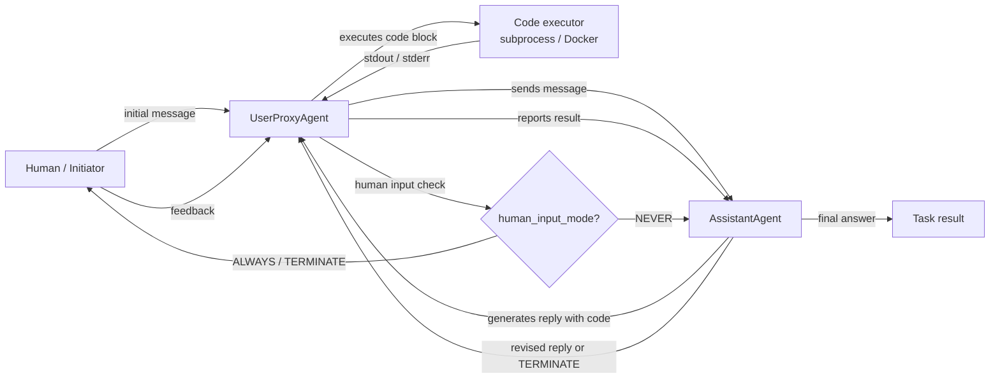

## Definition

AutoGen is an open-source framework developed by Microsoft Research for building **multi-agent conversational AI systems**. Its core idea is simple: agents communicate by exchanging messages in a structured conversation, and the framework handles the routing, turn-taking, and termination logic. Unlike role-based frameworks like CrewAI that define agents as personas with tasks, AutoGen agents are defined primarily by their **conversation behavior** — how they respond to messages, whether they can execute code, and when they hand control to another agent or a human.

The framework's most important primitive is the `ConversableAgent` — a base class that can play any role depending on its configuration. Two specializations cover the most common patterns: `AssistantAgent` (backed by an LLM, responds with plans and code) and `UserProxyAgent` (optionally backed by a human or code executor, runs code locally and feeds results back). This two-agent pattern is powerful out of the box: you get a code-writing loop where the assistant proposes solutions and the proxy executes and reports results, with no extra scaffolding required.

AutoGen also supports **group chats**, where three or more agents take turns contributing to a shared conversation managed by a `GroupChatManager`. This enables patterns like expert panels, debate loops, and modular pipelines where each agent handles a specific step. Human-in-the-loop is a first-class feature: the `UserProxyAgent` can pause and ask a human for input at any point, making it well-suited for research and experimentation workflows where you want to inspect or redirect the agent mid-run.

## How it works

### ConversableAgent: the universal building block

`ConversableAgent` is the base class for all AutoGen agents. It holds a system message, an optional LLM config, a list of registered functions (tools), and a set of rules for when to terminate a conversation (`is_termination_msg`). Every agent has a `generate_reply` method that decides what message to send next given the conversation history. Agents can be made human-proxy agents (they pause and ask for input), LLM agents (they generate replies with an LLM), or executor agents (they run code without LLM calls). This flexibility means a single base class covers the entire spectrum from fully automated to fully manual agents.

### AssistantAgent and UserProxyAgent

`AssistantAgent` is a `ConversableAgent` preconfigured as a helpful AI assistant: it has a default system message that encourages it to propose Python code blocks for tasks that require computation. `UserProxyAgent` is preconfigured to execute code blocks in a local Docker container or subprocess, report results, and optionally ask a human for input when it cannot proceed automatically. Together they form the canonical AutoGen two-agent loop: the assistant suggests code, the proxy runs it, the output feeds back to the assistant, and the loop continues until the task is done or a termination condition fires. This pattern is particularly powerful for data analysis, automation scripting, and ML experimentation.

### Group chats and GroupChatManager

For workflows with three or more agents, AutoGen provides `GroupChat` and `GroupChatManager`. `GroupChat` holds the list of participating agents and the shared message history. `GroupChatManager` is itself a `ConversableAgent` that acts as a moderator: after each message it selects the next speaker (either by a round-robin rule, a custom selector function, or an LLM-based selection strategy). Group chats enable expert panel patterns where a researcher, a coder, and a reviewer take turns, or multi-step pipelines where each agent handles one phase. The manager can also terminate the conversation when a global condition is met.

### Code execution and human-in-the-loop

AutoGen's code execution layer is configurable: agents can run code locally (subprocess), in a Docker container (isolated), or via a custom executor. The `UserProxyAgent` detects code blocks in the assistant's messages and executes them automatically when `human_input_mode="NEVER"`. Setting `human_input_mode="ALWAYS"` or `"TERMINATE"` gates execution behind human approval, enabling safe human-in-the-loop patterns for production or sensitive workflows. This makes AutoGen particularly well-suited for agentic coding tasks, data science automation, and research environments where you want a human to review outputs before they take effect.



## When to use / When NOT to use

| Use when | Avoid when |
|---|---|
| You need agents that write and execute code as part of the workflow | Code execution is not needed and conversation overhead is unwanted |
| You want human-in-the-loop at configurable checkpoints | Fully automated pipelines where human intervention is undesirable |
| Your workflow involves research, experimentation, or iterative refinement | You need a declarative, opinionated API — AutoGen requires more manual configuration |
| You want a multi-agent expert panel or debate pattern (group chat) | You need deterministic, testable pipelines — non-deterministic conversations are harder to unit test |
| You are prototyping agentic coding assistants or data science automation | Production latency is critical — multi-turn conversation loops add significant overhead |

## Comparisons

| Criterion | AutoGen | CrewAI | LangGraph |
|---|---|---|---|
| **Core metaphor** | Agents as conversational participants | Agents as role-playing crew members | Agent behavior as a stateful graph |
| **State management** | Implicit: shared message history in GroupChat | Implicit: task context and crew memory | Explicit: TypedDict state shared across nodes |
| **Code execution** | First-class: UserProxyAgent executes code blocks automatically | Via external tools only | Via tool nodes in the graph |
| **Human-in-the-loop** | First-class: `human_input_mode` on every agent | Limited: manual intervention only | First-class: `interrupt_before` / `interrupt_after` on graph nodes |
| **Learning curve** | Medium: intuitive for Python developers, but group chat routing can be complex | Low: declarative API is easy to learn | High: requires graph-based thinking |

## Code examples

```python
import os
import autogen

# --- LLM configuration ---
# AutoGen uses a list of configs for load balancing / fallback.
# Set your OPENAI_API_KEY or use an Anthropic-compatible config.
llm_config = {
    "config_list": [
        {
            "model": "gpt-4o",
            "api_key": os.environ.get("OPENAI_API_KEY"),
        }
    ],
    "temperature": 0.1,
    "timeout": 120,
}

# --- Two-agent pattern: AssistantAgent + UserProxyAgent ---
# The assistant writes code; the proxy executes it and reports results.

assistant = autogen.AssistantAgent(
    name="data_analyst",
    system_message=(
        "You are a data analysis expert. When given a task, write Python code to solve it. "
        "Always verify your results by printing them. "
        "Reply TERMINATE when the task is fully complete."
    ),
    llm_config=llm_config,
)

user_proxy = autogen.UserProxyAgent(
    name="user_proxy",
    human_input_mode="NEVER",       # fully automated; change to "ALWAYS" for human review
    max_consecutive_auto_reply=10,  # safety limit on auto-replies
    is_termination_msg=lambda msg: "TERMINATE" in msg.get("content", ""),
    code_execution_config={
        "work_dir": "/tmp/autogen_workspace",
        "use_docker": False,         # set True to execute in an isolated Docker container
    },
)

# Kick off the two-agent conversation
user_proxy.initiate_chat(
    assistant,
    message=(
        "Analyze the following data and compute the mean, median, and standard deviation. "
        "Data: [12, 45, 23, 67, 34, 89, 11, 56, 78, 42]"
    ),
)


# --- Group chat pattern: researcher, coder, reviewer ---
# Three specialized agents collaborate on a more complex task.

researcher = autogen.AssistantAgent(
    name="researcher",
    system_message=(
        "You are a research specialist. Find information and summarize findings. "
        "Do not write code — delegate code tasks to the coder."
    ),
    llm_config=llm_config,
)

coder = autogen.AssistantAgent(
    name="coder",
    system_message=(
        "You are a Python expert. Write clean, well-commented code when asked. "
        "Always include error handling and print results clearly."
    ),
    llm_config=llm_config,
)

reviewer = autogen.AssistantAgent(
    name="reviewer",
    system_message=(
        "You are a critical reviewer. After the researcher and coder have finished, "
        "review the outputs for accuracy and completeness. "
        "Reply TERMINATE when you are satisfied with the result."
    ),
    llm_config=llm_config,
)

group_proxy = autogen.UserProxyAgent(
    name="group_proxy",
    human_input_mode="NEVER",
    max_consecutive_auto_reply=15,
    is_termination_msg=lambda msg: "TERMINATE" in msg.get("content", ""),
    code_execution_config={"work_dir": "/tmp/autogen_group", "use_docker": False},
)

# GroupChat manages turn order and shared message history
group_chat = autogen.GroupChat(
    agents=[group_proxy, researcher, coder, reviewer],
    messages=[],
    max_round=12,
    speaker_selection_method="auto",  # LLM-based speaker selection
)

manager = autogen.GroupChatManager(
    groupchat=group_chat,
    llm_config=llm_config,
)

group_proxy.initiate_chat(
    manager,
    message=(
        "Research the top 3 Python libraries for data visualization in 2025. "
        "Then write a code example using the most popular one to plot a bar chart."
    ),
)
```

## Practical resources

- [AutoGen official documentation](https://microsoft.github.io/autogen/) — Full framework reference covering agents, group chat, code execution, and tool use.
- [AutoGen GitHub repository](https://github.com/microsoft/autogen) — Source code, issue tracker, and a rich set of example notebooks.
- [AutoGen paper: "AutoGen: Enabling Next-Gen LLM Applications via Multi-Agent Conversation" (Wu et al., 2023)](https://arxiv.org/abs/2308.08155) — Original research paper motivating the conversation-driven multi-agent design.
- [AutoGen Studio](https://microsoft.github.io/autogen/docs/autogen-studio/getting-started) — No-code UI for building and testing AutoGen workflows, useful for prototyping.

## See also

- [Agent frameworks overview](/docs/agents/frameworks-overview)
- [CrewAI](/docs/agents/crewai)
- [LangGraph](/docs/agents/langgraph)
- [Multi-agent systems](/docs/agents/multi-agent-systems)
- [AI agents](/docs/agents)
