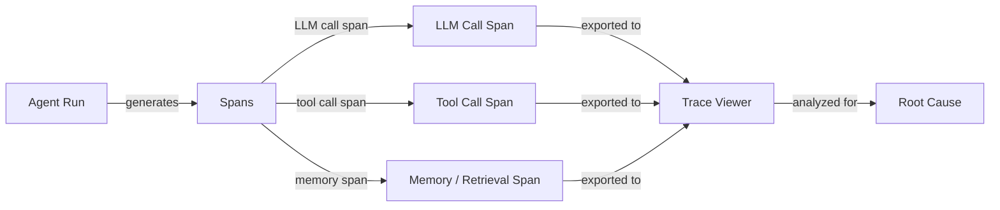

## Definition

Agent debugging and observability is the discipline of making AI agent systems transparent enough that failures, regressions, and inefficiencies can be identified, diagnosed, and fixed. Unlike traditional software debugging—where a stack trace points to an exact line—agent failures are often emergent: a correct LLM call produces plausible-but-wrong output that cascades through subsequent tool calls, corrupts agent state, and produces a wrong final answer with no exception raised. Observability gives you the data needed to reconstruct what happened.

The three pillars of observability—logs, metrics, and traces—apply to agents as they do to distributed systems, but with important adaptations. Logs must capture not just errors but the semantic content of LLM inputs and outputs. Metrics must include token counts, latency per span, and tool call frequencies alongside the usual system metrics. Traces must model the hierarchical structure of an agent run: a root span for the overall task, child spans for each LLM call, grandchild spans for each tool invocation, and so on. Together these give you a complete, replayable record of every agent execution.

Without good observability, debugging becomes guesswork: you re-run the agent, maybe get a different result due to non-determinism, and cannot be certain whether your fix addressed the root cause. With it, you can pinpoint the exact LLM call where reasoning went wrong, identify which tool returned unexpected data, measure the latency contribution of each step, and compare two runs side-by-side to understand what changed.

## How it works



### Structured logging

Structured logging means emitting machine-readable JSON logs rather than free-text strings. For agents, each log entry should include: run ID, step number, span type (llm/tool/memory), input payload, output payload, timestamps, token counts, and any error. Structured logs make it possible to filter, aggregate, and correlate events across a distributed run without manual string parsing. Libraries like Python's `structlog` or `loguru` make this straightforward.

### Distributed tracing and spans

A trace is a directed acyclic graph of spans representing a single agent execution. The root span covers the entire run; child spans cover LLM calls, tool invocations, and memory lookups. Each span carries a trace ID (shared across the run) and a span ID (unique per span), enabling full reconstruction. OpenTelemetry (OTel) is the open standard for emitting traces; it has exporters for Jaeger, Zipkin, Phoenix, and LangSmith. Instrumenting an agent with OTel spans requires wrapping LLM calls and tool calls with span context managers.

### Trace visualization

Trace viewers render the span tree visually, showing the timeline, duration, inputs, outputs, and errors for each span. LangSmith provides a purpose-built trace viewer for LangChain agents with token-level detail. Phoenix (Arize) is an open-source alternative that supports any OpenTelemetry-compatible source. Weights & Biases Traces integrates with W&B runs for teams already using it for experiment tracking. Good trace viewers let you compare two runs side-by-side, filter spans by type, and drill into the exact token-level input/output that caused a failure.

### Root cause analysis

With traces in hand, root cause analysis follows a systematic process: find the first span where the output deviated from expectation, inspect its inputs (were they correct?), and determine whether the failure was in the LLM reasoning, a tool returning bad data, or a memory/context issue. Non-determinism makes this harder—running the same input twice may produce different results—so capturing traces for every run (not just failures) and comparing against a known-good trace is essential. Tagging traces with metadata (user ID, task type, prompt version) enables cohort analysis to surface patterns across many runs.

### Common debugging challenges

Non-determinism means the same bug may not reproduce on the next run, requiring statistical analysis across many traces. Multi-step failures compound: an error in step 2 may not surface until step 7, so you must trace the error propagation backward. Tool errors—network timeouts, malformed API responses, permission errors—are often silent (the agent receives an error string as a tool result and continues). Prompt injection and context window limits can cause sudden behavioral shifts that appear random without trace context.

## When to use / When NOT to use

| Use when | Avoid when |
|---|---|
| Diagnosing a specific agent failure in production | Treating observability as an afterthought after deployment |
| Comparing two prompt versions to understand behavioral differences | Over-logging every token in a low-latency, high-volume pipeline without sampling |
| Identifying which tool call is the bottleneck for latency | Relying solely on the final answer to judge whether a run succeeded |
| Building a regression suite that requires trace-level assertions | Logging raw PII without redaction in multi-tenant systems |
| Auditing tool call frequencies and argument distributions | Using print statements instead of structured, correlated traces |

## Pros and cons

| Pros | Cons |
|---|---|
| Enables precise root cause analysis for multi-step failures | Instrumentation adds code complexity and minor latency overhead |
| Provides a full audit trail for compliance and debugging | Storing full LLM I/O traces generates significant data volume |
| Makes non-deterministic behavior tractable via run comparison | Trace viewers have a learning curve for new team members |
| Integrates with existing MLOps and monitoring stacks | Sampling strategies must be tuned to balance coverage vs. cost |
| Structured logs enable automated anomaly detection | Sensitive user data in traces requires careful access control |

## Code examples

```python
# Agent observability with OpenTelemetry + Phoenix (Arize)
# pip install opentelemetry-api opentelemetry-sdk openinference-instrumentation-openai arize-phoenix

import os
import time
import json
import structlog
from opentelemetry import trace
from opentelemetry.sdk.trace import TracerProvider
from opentelemetry.sdk.trace.export import BatchSpanProcessor
from opentelemetry.exporter.otlp.proto.http.trace_exporter import OTLPSpanExporter
from opentelemetry.sdk.resources import Resource


# --- Configure structured logger ---
structlog.configure(
    processors=[
        structlog.processors.TimeStamper(fmt="iso"),
        structlog.stdlib.add_log_level,
        structlog.processors.JSONRenderer(),
    ]
)
log = structlog.get_logger()


# --- Set up OpenTelemetry tracer pointing at Phoenix (default port 6006) ---
resource = Resource.create({"service.name": "my-agent", "service.version": "0.1.0"})
provider = TracerProvider(resource=resource)
otlp_exporter = OTLPSpanExporter(
    endpoint="http://localhost:6006/v1/traces",  # Phoenix local endpoint
)
provider.add_span_processor(BatchSpanProcessor(otlp_exporter))
trace.set_tracer_provider(provider)
tracer = trace.get_tracer("agent.tracer")


# --- Simulated LLM call (replace with real client) ---
def call_llm(messages: list[dict], run_id: str) -> dict:
    """Wrap an LLM call in an OTel span."""
    with tracer.start_as_current_span("llm.call") as span:
        span.set_attribute("llm.model", "gpt-4o-mini")
        span.set_attribute("llm.prompt_tokens", sum(len(m["content"]) for m in messages))
        span.set_attribute("run.id", run_id)

        # Simulate LLM response with a tool call decision
        time.sleep(0.05)  # Simulate network latency
        response = {
            "content": None,
            "tool_call": {"name": "search_web", "args": {"query": messages[-1]["content"]}},
            "completion_tokens": 42,
        }
        span.set_attribute("llm.completion_tokens", response["completion_tokens"])
        log.info("llm_call_complete", run_id=run_id, tool_call=response.get("tool_call"))
        return response


# --- Simulated tool call ---
def call_tool(name: str, args: dict, run_id: str) -> str:
    """Wrap a tool call in an OTel span."""
    with tracer.start_as_current_span(f"tool.{name}") as span:
        span.set_attribute("tool.name", name)
        span.set_attribute("tool.input", json.dumps(args))
        span.set_attribute("run.id", run_id)

        start = time.time()
        # Simulate tool execution
        time.sleep(0.1)
        result = f"Search results for: {args.get('query', '')}"
        duration_ms = (time.time() - start) * 1000

        span.set_attribute("tool.output", result)
        span.set_attribute("tool.duration_ms", round(duration_ms, 1))
        log.info("tool_call_complete", run_id=run_id, tool=name, duration_ms=duration_ms)
        return result


# --- Agent run with full trace ---
def run_agent(task: str, run_id: str, max_steps: int = 5) -> str:
    """Run a simple ReAct-style agent with full OTel tracing."""
    with tracer.start_as_current_span("agent.run") as root_span:
        root_span.set_attribute("agent.task", task)
        root_span.set_attribute("run.id", run_id)
        log.info("agent_run_start", run_id=run_id, task=task)

        messages = [
            {"role": "system", "content": "You are a helpful assistant with tool access."},
            {"role": "user", "content": task},
        ]

        for step in range(max_steps):
            with tracer.start_as_current_span(f"agent.step.{step}") as step_span:
                step_span.set_attribute("agent.step", step)

                response = call_llm(messages, run_id)

                if response.get("tool_call"):
                    tool_call = response["tool_call"]
                    tool_result = call_tool(tool_call["name"], tool_call["args"], run_id)
                    # Append tool result to conversation
                    messages.append({"role": "assistant", "content": str(response["content"])})
                    messages.append({"role": "tool", "content": tool_result})
                else:
                    # No tool call: agent has a final answer
                    final_answer = response.get("content", "")
                    root_span.set_attribute("agent.final_answer", str(final_answer))
                    log.info("agent_run_complete", run_id=run_id, steps=step + 1)
                    return final_answer

        root_span.set_attribute("agent.stopped", "max_steps_reached")
        log.warning("agent_max_steps_reached", run_id=run_id, max_steps=max_steps)
        return "Agent stopped: max steps reached."


# --- Run the agent ---
if __name__ == "__main__":
    import uuid
    run_id = str(uuid.uuid4())
    answer = run_agent("What are the latest developments in AI agents?", run_id)
    print(f"Answer: {answer}")
    # Traces are now visible at http://localhost:6006 in Phoenix UI
```

## Practical resources

- [LangSmith documentation](https://docs.smith.langchain.com/) — Full tracing, dataset management, and evaluation platform for LangChain-based agents, with a purpose-built trace viewer.
- [Phoenix by Arize documentation](https://docs.arize.com/phoenix) — Open-source LLM observability platform supporting OpenTelemetry traces; works with any agent framework.
- [OpenTelemetry Python documentation](https://opentelemetry-python.readthedocs.io/) — Official docs for instrumenting Python applications with distributed tracing, metrics, and logs.
- [Weights & Biases Weave](https://wandb.github.io/weave/) — W&B's tracing and evaluation tool for LLM apps, integrated with W&B experiment tracking.
- [OpenInference instrumentation](https://github.com/Arize-ai/openinference) — Open-source OTel-based instrumentation libraries for LLMs, agents, and vector stores (used by Phoenix).

## See also

- [Agent evaluation and testing](/docs/agents/evaluation)
- [Agents](/docs/agents)
- [MLOps monitoring](/docs/mlops/monitoring)
