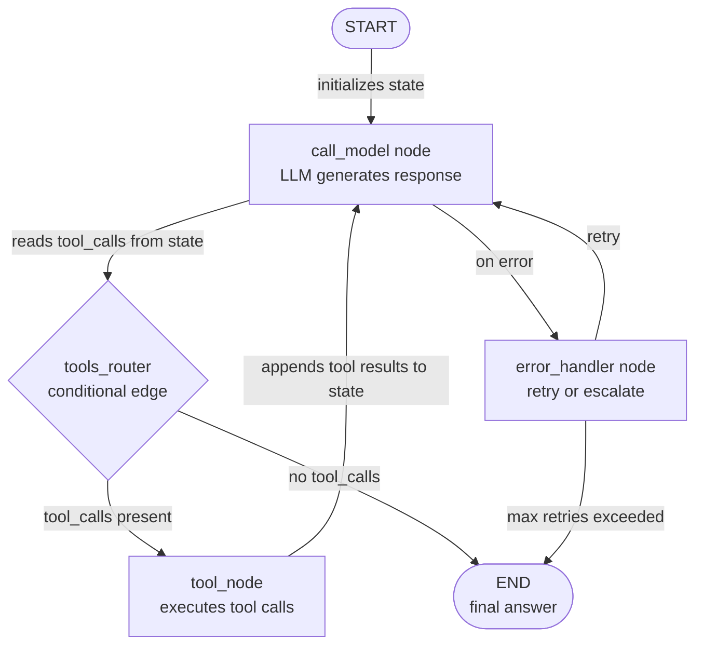

## Definition

LangGraph is an open-source Python library, built on top of LangChain, for constructing **stateful agent workflows as explicit directed graphs**. Where most agent frameworks hide the execution loop behind an opaque `run()` call, LangGraph exposes it as a first-class graph object you can inspect, test, and modify. Nodes are ordinary Python functions (each may call an LLM, a tool, or arbitrary logic); edges are transitions between nodes; and the entire workflow shares a single **state** object — a typed dictionary that every node can read from and write to.

The key insight in LangGraph is that many agent behaviors that seem complex — looping until a condition is met, branching on the content of an LLM response, pausing for human approval, resuming from a saved checkpoint — map cleanly onto graph primitives: cycles, conditional edges, interrupts, and persistent state. This explicitness has a cost (more boilerplate than CrewAI or AutoGen) but pays off in production: you can unit test every node in isolation, trace exactly which path an execution took, and replay a workflow from any checkpoint.

LangGraph supports both **single-agent** patterns (a graph with a few nodes that calls tools in a loop) and **multi-agent** patterns (multiple subgraphs composed together, with cross-graph state sharing). It integrates natively with LangChain's tool ecosystem, chat models, and LangSmith for observability. The framework is the foundation of LangChain's recommended production agent architecture as of 2024-2025.

## How it works

### Nodes: Python functions as execution units

A node in LangGraph is any Python callable that accepts the current state and returns a (partial) updated state. Nodes are added to the graph with `graph.add_node("name", function)`. The function signature is always `(state: State) -> dict` — it reads what it needs from state, does its work (LLM call, tool execution, data transformation), and returns only the keys it wants to update. This makes nodes easy to test independently: pass in a mock state, assert on the returned dict. LangChain's `ToolNode` is a prebuilt node that executes tool calls from an LLM's response, which covers the most common agent pattern out of the box.

### Edges: routing and conditional branching

Edges connect nodes and determine execution order. A simple edge (`graph.add_edge("a", "b")`) always transitions from node `a` to node `b`. A conditional edge (`graph.add_conditional_edges`) calls a routing function with the current state and uses the returned string to decide the next node. This is the mechanism for dynamic control flow: after an LLM generates a response, a router checks whether it contains tool calls (route to `tools`) or a final answer (route to `END`). Conditional edges make LangGraph significantly more powerful than a sequential pipeline — you can express complex decision trees, retry logic, and escalation paths as readable graph structure.

### State: shared TypedDict across all nodes

State is the backbone of a LangGraph application. You define a `TypedDict` (or a Pydantic model) with all the fields your workflow needs: messages, intermediate results, flags, counters. Every node receives the full state and returns only the fields it modifies. LangGraph merges partial updates with the current state using **reducers** — by default, assignments overwrite; with the `add_messages` reducer, the messages list is appended rather than replaced. Explicit state typing means that type checkers can catch errors before runtime, and the state snapshot at any checkpoint is a complete, inspectable record of what happened.

### Cycles, persistence, and human-in-the-loop

LangGraph handles cycles natively: a node can edge back to a previous node (or itself) based on a condition, enabling agent retry loops, self-correction patterns, and multi-turn tool use without any special handling. Persistence is provided by **checkpointers** (SQLite, Postgres, Redis, or in-memory): the graph saves the full state after every node execution, so you can resume from any point after a crash or interruption. Human-in-the-loop is implemented via `interrupt_before` and `interrupt_after` — the graph pauses at the specified node, surfaces the current state to the caller, accepts human input, and resumes. This makes LangGraph the strongest choice when you need auditable, interruptible, production-grade agent pipelines.



## When to use / When NOT to use

| Use when | Avoid when |
|---|---|
| You need fine-grained control over every step of agent execution | You want a declarative, high-level API and do not need step-level control |
| You require persistence and the ability to resume workflows mid-execution | Your workflow is simple and linear — a chain or single-agent loop is sufficient |
| Human-in-the-loop approvals at specific steps are required | Team is unfamiliar with graph theory and prefers a simpler mental model |
| You are building production systems that need full observability and replay | Your agents are research prototypes that do not need production-grade reliability |
| Your workflow has complex conditional branching or cycles that are hard to express linearly | Multi-agent role coordination is your primary need — CrewAI or AutoGen are simpler |

## Comparisons

| Criterion | LangGraph | CrewAI | AutoGen |
|---|---|---|---|
| **Abstraction level** | Low: explicit graph, nodes, edges, and state | High: declarative roles, goals, tasks | Medium: conversational agents with message history |
| **Control flow** | Explicit conditional edges and cycles | Sequential or hierarchical process (opaque) | Message-driven, turn-based (opaque) |
| **Persistence** | First-class: checkpointers for SQLite, Postgres, Redis | Not built-in | Not built-in |
| **Human-in-the-loop** | First-class: `interrupt_before` / `interrupt_after` | Manual only | First-class: `human_input_mode` per agent |
| **Testability** | High: nodes are pure functions, easy to unit test | Medium: tasks can be tested but crew execution is opaque | Low: conversation flows are hard to unit test deterministically |

## Code examples

```python
import os
from typing import Annotated, TypedDict, Literal
from langchain_anthropic import ChatAnthropic
from langchain_core.tools import tool
from langchain_core.messages import HumanMessage, AIMessage, BaseMessage
from langgraph.graph import StateGraph, END
from langgraph.graph.message import add_messages
from langgraph.prebuilt import ToolNode

# --- State definition ---
# add_messages is a reducer: it appends to the messages list instead of replacing it.
class AgentState(TypedDict):
    messages: Annotated[list[BaseMessage], add_messages]
    step_count: int  # track how many steps we have taken

# --- Tool definitions ---
# Tools are standard LangChain tools decorated with @tool.
# The docstring becomes the tool description sent to the LLM.

@tool
def search_web(query: str) -> str:
    """Search the web for current information on a topic."""
    # In production, replace with a real search API (Serper, Tavily, etc.)
    return f"Search results for '{query}': LangGraph is a stateful agent framework by LangChain."

@tool
def add_numbers(a: float, b: float) -> str:
    """Add two numbers together and return the result."""
    return f"Result: {a + b}"

tools = [search_web, add_numbers]

# --- LLM setup ---
# Bind tools to the model so it knows what functions are available.
llm = ChatAnthropic(model="claude-opus-4-5")
llm_with_tools = llm.bind_tools(tools)

# --- Node definitions ---
# Each node is a plain Python function: (state) -> partial state update.

def call_model(state: AgentState) -> dict:
    """Primary agent node: calls the LLM and returns its response."""
    response = llm_with_tools.invoke(state["messages"])
    return {
        "messages": [response],  # add_messages reducer will append this
        "step_count": state["step_count"] + 1,
    }

def handle_error(state: AgentState) -> dict:
    """Error handling node: appends a fallback message if something went wrong."""
    fallback = AIMessage(content="I encountered an error. Let me try a different approach.")
    return {"messages": [fallback]}

# --- Routing function (conditional edge) ---
# Returns the name of the next node based on the current state.

def should_continue(state: AgentState) -> Literal["tools", "end"]:
    """Route to tools if the LLM made tool calls, otherwise end."""
    last_message = state["messages"][-1]
    # Safety limit: stop after 10 steps to prevent infinite loops
    if state["step_count"] >= 10:
        return "end"
    if hasattr(last_message, "tool_calls") and last_message.tool_calls:
        return "tools"
    return "end"

# --- Graph construction ---
tool_node = ToolNode(tools)  # prebuilt node that executes tool calls

graph = StateGraph(AgentState)

# Add nodes
graph.add_node("agent", call_model)
graph.add_node("tools", tool_node)
graph.add_node("error_handler", handle_error)

# Set entry point
graph.set_entry_point("agent")

# Add conditional edge from agent: either call tools or end
graph.add_conditional_edges(
    "agent",
    should_continue,
    {
        "tools": "tools",  # route to tool execution
        "end": END,        # route to terminal node
    },
)

# After tool execution, always return to the agent (creates a cycle)
graph.add_edge("tools", "agent")

# Error handler routes back to agent for a retry
graph.add_edge("error_handler", "agent")

# Compile the graph into a runnable application
app = graph.compile()

# --- Optional: add persistence with a checkpointer ---
# from langgraph.checkpoint.sqlite import SqliteSaver
# memory = SqliteSaver.from_conn_string(":memory:")
# app = graph.compile(checkpointer=memory)
# Use config={"configurable": {"thread_id": "session-1"}} to resume sessions.

# --- Run the agent ---
initial_state = {
    "messages": [HumanMessage(content="What is LangGraph and what is 42 plus 17?")],
    "step_count": 0,
}

result = app.invoke(initial_state)
print("Final answer:", result["messages"][-1].content)
print("Total steps:", result["step_count"])

# --- Inspect the graph structure ---
# app.get_graph().print_ascii()  # print ASCII diagram of the graph
```

## Practical resources

- [LangGraph official documentation](https://langchain-ai.github.io/langgraph/) — Complete reference for graph construction, state management, checkpointers, and human-in-the-loop patterns.
- [LangGraph GitHub repository](https://github.com/langchain-ai/langgraph) — Source code, issue tracker, and example notebooks covering common patterns.
- [LangGraph "How-to" guides](https://langchain-ai.github.io/langgraph/how-tos/) — Practical recipes for persistence, streaming, subgraphs, multi-agent coordination, and more.
- [LangSmith tracing for LangGraph](https://docs.smith.langchain.com/) — Observability platform for tracing LangGraph executions, inspecting state at each node, and debugging failures.

## See also

- [Agent frameworks overview](/docs/agents/frameworks-overview)
- [CrewAI](/docs/agents/crewai)
- [AutoGen](/docs/agents/autogen)
- [LangChain](/docs/tools/langchain)
- [Multi-agent systems](/docs/agents/multi-agent-systems)
- [ReAct](/docs/reasoning-patterns/react)
