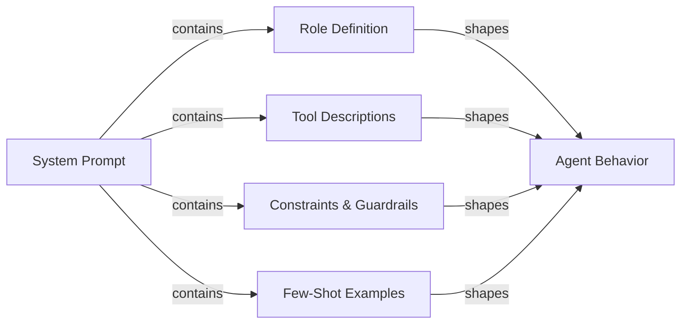

## Definition

Agent prompt engineering is the craft of writing system prompts and tool definitions that reliably produce the behavior you want from an AI agent. Unlike prompt engineering for a single-turn chatbot—where you mostly care about format and tone—agent prompts must govern multi-step reasoning, tool selection discipline, constraint adherence, error recovery, and termination conditions across an unbounded sequence of steps. A poorly written agent prompt produces agents that loop endlessly, call tools with wrong arguments, ignore user constraints, or confabulate results when tools fail.

The system prompt is the agent's constitution. It defines what the agent is, what it can do, what it must never do, how it should reason, and what its output should look like. Because LLMs are highly sensitive to phrasing, structure, and ordering, small changes to the system prompt can have large behavioral effects. Agent prompt engineering is therefore an iterative, empirical discipline: you write a prompt, evaluate it against a task dataset, identify failure modes, and refine. Tools like LangSmith and DeepEval (see [evaluation](/docs/agents/evaluation)) make this feedback loop faster.

Good agent prompts are modular and explicit. They separate role definition, capability declaration, constraint specification, output format rules, and few-shot examples into clearly delineated sections. This structure makes prompts easier to maintain, audit, and extend as the agent's capabilities evolve. It also helps the LLM activate the right "mode" for each section rather than mixing concerns.

## How it works



### Role definition

The role definition tells the agent who it is, what its primary purpose is, and what persona to adopt. A good role definition is specific: "You are a senior software engineer specializing in Python and PostgreSQL, helping developers debug production issues" is more useful than "You are a helpful assistant." Specificity activates relevant knowledge and sets appropriate response tone. The role should also establish the agent's relationship to the user (peer, assistant, expert), which influences how the agent handles uncertainty and disagreement. Keep the role definition concise (3-5 sentences) and place it first in the system prompt so it frames all subsequent instructions.

### Tool descriptions and tool selection

Every tool the agent has access to must be described precisely. The tool name, description, parameter names, parameter types, and return format should all be spelled out. Ambiguous tool descriptions are one of the most common causes of incorrect tool selection and malformed arguments. Include: what the tool does, when to use it (and critically, when not to), what inputs it expects, and what output format to expect. For tools with similar purposes, add explicit disambiguation: "Use `search_web` for current events and news; use `search_documents` for internal company knowledge base queries." Few-shot examples of correct tool invocations (within the system prompt or as conversation history) significantly reduce tool selection errors.

### Chain-of-thought for agents

Chain-of-thought (CoT) prompting asks the agent to reason explicitly before acting. For agents, this means thinking through: what is the user asking for, what information do I have, what information do I need, which tool should I call next, and what do I expect the result to look like. Instructing the agent to reason before acting ("Before calling any tool, briefly state your plan") improves accuracy on complex multi-step tasks and makes traces more interpretable. Some frameworks (ReAct, see [ReAct](/docs/reasoning-patterns/react)) formalize this as Thought / Action / Observation cycles. Be explicit in the prompt about whether reasoning should be in the output or only in the scratchpad.

### Constraints and guardrails in prompts

Constraints define what the agent must not do. They should be stated positively where possible ("always ask for confirmation before deleting data") rather than only negatively ("never delete data without asking"). Include: scope constraints (only answer questions about X), output constraints (always respond in English, always use valid JSON), behavior constraints (never make up URLs or file paths), and safety constraints (never generate harmful content). Guardrails in prompts are a first line of defense, not a replacement for technical controls (see [security](/docs/agents/security)); they are most effective when they specify the exact behavior expected in borderline cases.

### Output format specification

Agents that produce structured output (JSON, markdown, function calls) need explicit format instructions. Specify the exact schema, field names, types, and required vs. optional fields. Include a valid example in the prompt. For tool-calling agents, clarify when to return a final answer versus continuing to call tools, and what the termination condition looks like. If the agent interacts with downstream systems, the output format is a contract; ambiguity here propagates into broken integrations.

## When to use / When NOT to use

| Use when | Avoid when |
|---|---|
| Agent is calling multiple tools and tool selection is inconsistent | Treating the system prompt as a one-time setup never to be revised |
| Agent loops or terminates prematurely without completing the task | Writing an enormous wall-of-text prompt with no structure or sections |
| Agent ignores user constraints or violates safety policies | Relying solely on the model's defaults without any role or constraint specification |
| Onboarding a new LLM and need to transfer behavior from previous model | Adding new instructions in an ad-hoc way without evaluating for regressions |
| Building a multi-step workflow with deterministic output format requirements | Expecting the prompt alone to handle security threats (use technical controls too) |

## Comparisons

| Prompt element | Purpose | Common mistakes |
|---|---|---|
| Role definition | Sets persona, expertise, and tone | Too vague ("helpful assistant") or too long; placing it after other sections |
| Tool descriptions | Guides correct tool selection and argument formation | Missing when/when-not-to-use guidance; no example invocations |
| Constraints | Enforces scope, safety, and format boundaries | Only negative constraints ("never do X") without specifying the correct alternative |
| Chain-of-thought instruction | Improves reasoning accuracy on complex tasks | Mixing reasoning into tool call output when it should stay in scratchpad |
| Few-shot examples | Demonstrates expected behavior for tool use and output format | Examples that are too simple to represent real edge cases |

## Pros and cons

| Pros | Cons |
|---|---|
| Immediate effect: no fine-tuning or retraining required | Prompt sensitivity means small wording changes can break behavior |
| Modular structure makes maintenance and auditing straightforward | Long prompts consume tokens on every call, increasing cost |
| Few-shot examples significantly reduce tool selection errors | Instructions can conflict; LLMs may prioritize later instructions |
| Constraints provide a first-line defense against misuse | Prompts are visible to the model but not cryptographically protected |
| Chain-of-thought improves accuracy and trace interpretability | Over-specifying behavior can make the agent brittle on edge cases |

## Code examples

```python
# Well-structured agent system prompt with tool definitions
# pip install anthropic

import os
import json
import anthropic

# ---------------------------------------------------------------------------
# Tool definitions with precise descriptions
# ---------------------------------------------------------------------------

TOOLS = [
    {
        "name": "search_documents",
        "description": (
            "Search the internal company knowledge base for documents, policies, and procedures. "
            "Use this tool when the user asks about internal processes, company policies, or "
            "historical project information. Do NOT use this for current news or external information."
        ),
        "input_schema": {
            "type": "object",
            "properties": {
                "query": {
                    "type": "string",
                    "description": "The search query. Use specific keywords; avoid vague terms.",
                },
                "max_results": {
                    "type": "integer",
                    "description": "Maximum number of results to return. Default 5. Max 20.",
                    "default": 5,
                },
            },
            "required": ["query"],
        },
    },
    {
        "name": "create_ticket",
        "description": (
            "Create a support ticket in the project management system. "
            "Use this ONLY after confirming the details with the user. "
            "Never call this tool without explicit user confirmation of the ticket content."
        ),
        "input_schema": {
            "type": "object",
            "properties": {
                "title": {
                    "type": "string",
                    "description": "Short, descriptive title (under 80 characters).",
                },
                "description": {
                    "type": "string",
                    "description": "Full description of the issue or request.",
                },
                "priority": {
                    "type": "string",
                    "enum": ["low", "medium", "high", "critical"],
                    "description": "Ticket priority. Ask the user if unclear.",
                },
                "assignee": {
                    "type": "string",
                    "description": "Email address of the assignee. Optional.",
                },
            },
            "required": ["title", "description", "priority"],
        },
    },
]

# ---------------------------------------------------------------------------
# System prompt with all sections
# ---------------------------------------------------------------------------

SYSTEM_PROMPT = """
## Role
You are a senior IT support specialist for Acme Corp, helping internal employees resolve
technical issues and navigate company processes. You are thorough, patient, and always
confirm destructive actions before proceeding. You do not have access to external systems
or the public internet.

## Capabilities
You have access to two tools:
- `search_documents`: Search the internal knowledge base. Use this to find policies,
  procedures, troubleshooting guides, and historical decisions.
- `create_ticket`: Create a support ticket. ALWAYS confirm ticket details with the user
  before calling this tool.

## Reasoning approach
Before calling any tool, briefly state your plan in one sentence (e.g., "I'll search for
the VPN setup guide first."). After receiving tool results, summarize what you found and
what you'll do next. If a tool returns no results, say so and ask the user for more
details rather than guessing.

## Constraints
- Only answer questions about Acme Corp's internal systems and processes.
- If asked about external topics (competitor products, news, general knowledge),
  politely decline and redirect to your area of expertise.
- Never make up document names, ticket IDs, or employee contact information.
- If you do not know the answer and cannot find it in the knowledge base, say so clearly.
- Never create a ticket without explicit user confirmation of the title, description,
  and priority.
- Always respond in clear, professional English, regardless of the user's language.

## Output format
- For search results: summarize the key points in 2-4 bullet points, then offer to help
  with a follow-up action.
- For ticket creation: confirm the ticket details in a structured block before calling
  the tool, wait for user approval, then report the created ticket ID.
- Keep responses concise: under 300 words unless the user asks for more detail.

## Examples of correct tool use

Example 1 — searching the knowledge base:
User: "How do I request VPN access?"
Plan: I'll search the knowledge base for VPN access request procedures.
[call search_documents with query="VPN access request procedure"]
Response: summarize results in bullet points.

Example 2 — creating a ticket with confirmation:
User: "Can you create a ticket to fix my broken monitor?"
Response: "I'll create a ticket with these details — please confirm:
- Title: Broken monitor replacement request
- Description: User's monitor is not functioning; replacement needed.
- Priority: medium
Shall I proceed?"
[wait for user confirmation before calling create_ticket]
"""

# ---------------------------------------------------------------------------
# Simulated tool implementations
# ---------------------------------------------------------------------------

def search_documents(query: str, max_results: int = 5) -> list[dict]:
    """Simulated knowledge base search."""
    # In production, this calls a vector database or search API
    return [
        {
            "title": "VPN Access Request Process",
            "summary": "Submit an IT request form via the portal. Approval takes 1-2 business days.",
            "url": "internal://kb/vpn-access",
        }
    ][:max_results]


def create_ticket(title: str, description: str, priority: str, assignee: str = "") -> dict:
    """Simulated ticket creation."""
    return {
        "ticket_id": "TICK-4821",
        "title": title,
        "priority": priority,
        "status": "open",
        "assignee": assignee or "unassigned",
    }


def dispatch_tool(tool_name: str, tool_input: dict) -> str:
    """Route tool calls to their implementations."""
    if tool_name == "search_documents":
        results = search_documents(**tool_input)
        return json.dumps(results, indent=2)
    elif tool_name == "create_ticket":
        result = create_ticket(**tool_input)
        return json.dumps(result, indent=2)
    else:
        return json.dumps({"error": f"Unknown tool: {tool_name}"})


# ---------------------------------------------------------------------------
# Agent loop
# ---------------------------------------------------------------------------

def run_support_agent(user_message: str) -> str:
    """Run the support agent with the structured system prompt."""
    client = anthropic.Anthropic(api_key=os.environ["ANTHROPIC_API_KEY"])
    messages = [{"role": "user", "content": user_message}]

    while True:
        response = client.messages.create(
            model="claude-opus-4-5",
            max_tokens=1024,
            system=SYSTEM_PROMPT,
            tools=TOOLS,
            messages=messages,
        )

        # Append assistant response to conversation history
        messages.append({"role": "assistant", "content": response.content})

        if response.stop_reason == "end_turn":
            # Extract text response
            for block in response.content:
                if hasattr(block, "text"):
                    return block.text
            return ""

        elif response.stop_reason == "tool_use":
            # Process all tool calls in this response
            tool_results = []
            for block in response.content:
                if block.type == "tool_use":
                    print(f"  [Tool call] {block.name}({json.dumps(block.input)})")
                    result = dispatch_tool(block.name, block.input)
                    tool_results.append({
                        "type": "tool_result",
                        "tool_use_id": block.id,
                        "content": result,
                    })

            messages.append({"role": "user", "content": tool_results})

        else:
            # Unexpected stop reason
            return f"Agent stopped unexpectedly: {response.stop_reason}"


# ---------------------------------------------------------------------------
# Example run
# ---------------------------------------------------------------------------
if __name__ == "__main__":
    queries = [
        "How do I request VPN access for a new employee?",
        "What's the weather like in São Paulo today?",  # Out of scope — should be declined
    ]
    for query in queries:
        print(f"\nUser: {query}")
        answer = run_support_agent(query)
        print(f"Agent: {answer}")
```

## Practical resources

- [Anthropic - Prompt engineering overview](https://docs.anthropic.com/en/docs/build-with-claude/prompt-engineering/overview) — Anthropic's official guidance on system prompt structure, role definition, and chain-of-thought for Claude models.
- [Anthropic - Tool use documentation](https://docs.anthropic.com/en/docs/build-with-claude/tool-use) — Complete reference for writing tool definitions, handling tool calls, and structuring tool-use conversations with Claude.
- [OpenAI - Prompt engineering guide](https://platform.openai.com/docs/guides/prompt-engineering) — Foundational techniques for structured prompting, including few-shot examples, explicit format instructions, and constraint specification.
- [ReAct: Synergizing Reasoning and Acting in Language Models](https://arxiv.org/abs/2210.03629) — Original paper describing the Thought/Action/Observation prompting pattern foundational to most agent frameworks.

## See also

- [Agents](/docs/agents)
- [Prompt engineering](/docs/prompt-engineering)
- [Agent tools and actions](/docs/agents/tools-actions)
- [Anthropic tool use](/docs/agents/anthropic-tool-use)
