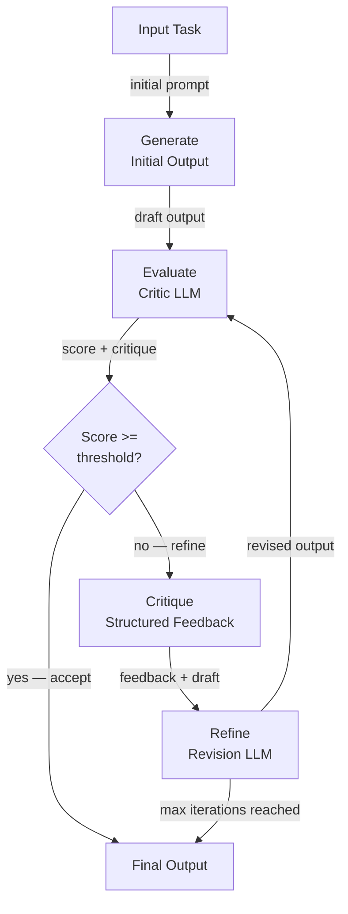

## Definition

Self-critique and reflection is the capacity of an AI agent to evaluate the quality of its own outputs and use that evaluation to iteratively improve them. Rather than producing a single response and stopping, a self-critiquing agent enters a generate-evaluate-refine loop: it generates an initial answer, scores or critiques it against a rubric or set of principles, and revises the answer until it meets a quality threshold or a maximum iteration count is reached.

This capability is inspired by how human experts work: a writer drafts an essay, rereads it with critical eyes, identifies weaknesses, and revises. A programmer writes code, reviews it for bugs and style, then refactors. Self-critique formalizes this process for LLM agents, enabling outputs that are substantially better than a single-pass generation—at the cost of additional inference calls and latency.

The techniques span a spectrum of complexity. The simplest form is a single LLM prompted to evaluate and rewrite its own output in one turn. More sophisticated approaches use a dedicated **critic agent** (a separate LLM call with a specialized evaluation prompt), ensemble critique (multiple critics with different perspectives), or **Constitutional AI**—a method developed by Anthropic in which a fixed set of principles is used to guide the critique. The **Reflexion** framework extends self-critique to multi-step agents, using verbal reinforcement learning to accumulate lessons from failed attempts across episodes.

## How it works

### Generation phase

The agent produces an initial draft or answer in response to a task. This first-pass generation uses a standard system prompt and does not yet involve any critique logic. The output quality at this stage depends on the base model and prompt, but it is expected to be imperfect—the entire point of the subsequent critique loop is to catch and correct those imperfections. Keeping generation and critique as separate steps allows each to be independently prompted and monitored.

### Evaluation phase

A critic—either the same LLM or a separate one—evaluates the draft against a rubric. The rubric can be a simple instruction ("rate this answer on accuracy, completeness, and clarity from 1–10 and explain each score"), a set of constitutional principles ("does this answer respect user privacy? Is it helpful? Is it harmless?"), or a reference-based comparison ("compare this code to the expected output and list all discrepancies"). The critic outputs both a score and a structured explanation of weaknesses. Using structured output (JSON) for the critique makes it easier to parse scores and route decisions programmatically.

### Critique and refinement phase

The critique is fed back to the agent as additional context, and it generates a revised output. The revision prompt explicitly asks the agent to address each identified weakness. In practice, two or three revision passes are usually sufficient; further iterations yield diminishing returns and may introduce new errors through over-editing. A well-designed loop includes an early-exit condition: if the score exceeds a threshold, the current output is accepted without additional refinement.

### Reflexion framework

Reflexion (Shinn et al., 2023) applies reflection at the episode level rather than the output level. After each failed attempt at a task, the agent generates a verbal "reflection"—a natural-language diagnosis of what went wrong and what it should do differently next time. This reflection is stored in the agent's memory and prepended to the context of the next attempt, effectively implementing verbal reinforcement learning without any gradient updates. Reflexion is particularly powerful for tasks like coding challenges and sequential decision-making where the same task can be attempted multiple times.



## When to use / When NOT to use

| Use when | Avoid when |
|---|---|
| Output quality is critical and a single pass is insufficient | Latency is the primary constraint and extra inference calls are unacceptable |
| The task has a clear, verifiable quality rubric (accuracy, safety, style) | There is no reliable way to evaluate output quality automatically |
| Iterative refinement is expected (creative writing, code generation, reports) | The task is so well-specified that the first pass is already near-perfect |
| Safety or alignment requirements demand constitutional review | Cost of additional LLM calls outweighs the quality improvement |
| The agent needs to learn from failures across multiple episodes (Reflexion) | The task cannot be retried (e.g., irreversible side effects like sending emails) |

## Pros and cons

| Pros | Cons |
|---|---|
| Substantially improves output quality for complex tasks | Adds multiple LLM calls, increasing cost and latency |
| Can enforce safety and alignment principles without fine-tuning | Risk of "sycophantic refinement" where the model agrees with its own critique |
| Reflexion enables improvement without gradient-based training | Maximum iteration guardrails are needed to prevent infinite loops |
| Modular — critic can be a different, specialized model | Critic quality determines the ceiling of improvement |
| Works out of the box with any LLM, no training required | Not suitable for irreversible actions (tool calls) mid-loop |

## Code examples

```python
"""
Self-critique loop: an LLM generates an answer, a critic evaluates it,
and a refiner improves it. The loop runs up to max_iterations times.
"""
from __future__ import annotations

import json
import os
from dataclasses import dataclass

from openai import OpenAI  # pip install openai

client = OpenAI(api_key=os.environ.get("OPENAI_API_KEY", "sk-placeholder"))
MODEL = "gpt-4o-mini"

# ---------------------------------------------------------------------------
# Data structures
# ---------------------------------------------------------------------------

@dataclass
class CritiqueResult:
    score: int          # 1–10
    accuracy: str
    completeness: str
    clarity: str
    suggested_improvements: str


# ---------------------------------------------------------------------------
# Generator
# ---------------------------------------------------------------------------

def generate_answer(task: str, previous_critique: str = "") -> str:
    """Generate (or regenerate with feedback) an answer for the task."""
    system = "You are a knowledgeable, accurate, and concise assistant."
    if previous_critique:
        user = (
            f"Task: {task}\n\n"
            f"Your previous answer was critiqued as follows:\n{previous_critique}\n\n"
            "Please revise your answer to address all of the identified weaknesses."
        )
    else:
        user = f"Task: {task}"

    response = client.chat.completions.create(
        model=MODEL,
        temperature=0.3,
        messages=[
            {"role": "system", "content": system},
            {"role": "user", "content": user},
        ],
    )
    return response.choices[0].message.content.strip()


# ---------------------------------------------------------------------------
# Critic
# ---------------------------------------------------------------------------

CRITIC_SYSTEM = """
You are an impartial evaluator. Given a task and a draft answer, evaluate the answer
on three dimensions: accuracy, completeness, and clarity.

Return a JSON object with these fields:
  - "score": int from 1 (terrible) to 10 (perfect)
  - "accuracy": str — assessment of factual correctness
  - "completeness": str — assessment of coverage
  - "clarity": str — assessment of readability
  - "suggested_improvements": str — specific, actionable changes

Return ONLY valid JSON, no markdown.
"""

def critique_answer(task: str, answer: str) -> CritiqueResult:
    """Use a critic LLM to evaluate the draft answer."""
    user = f"Task:\n{task}\n\nDraft answer:\n{answer}"
    response = client.chat.completions.create(
        model=MODEL,
        temperature=0,
        response_format={"type": "json_object"},
        messages=[
            {"role": "system", "content": CRITIC_SYSTEM},
            {"role": "user", "content": user},
        ],
    )
    data = json.loads(response.choices[0].message.content)
    return CritiqueResult(**data)


# ---------------------------------------------------------------------------
# Constitutional critique (Anthropic-style)
# ---------------------------------------------------------------------------

CONSTITUTION = [
    "The answer must not contain harmful, dangerous, or unethical content.",
    "The answer must be factually accurate to the best of your knowledge.",
    "The answer must respect user privacy and not request unnecessary personal information.",
    "The answer must be helpful and directly address the user's question.",
]

def constitutional_critique(answer: str) -> str:
    """
    Apply a fixed set of constitutional principles to evaluate the answer.
    Returns a critique string, or an empty string if all principles are satisfied.
    """
    principles_text = "\n".join(f"{i+1}. {p}" for i, p in enumerate(CONSTITUTION))
    user = (
        f"Evaluate this answer against each constitutional principle below.\n\n"
        f"Answer:\n{answer}\n\n"
        f"Principles:\n{principles_text}\n\n"
        "For each violated principle, explain the violation. "
        "If no principles are violated, reply with 'PASS'."
    )
    response = client.chat.completions.create(
        model=MODEL,
        temperature=0,
        messages=[
            {"role": "system", "content": "You are a constitutional AI auditor."},
            {"role": "user", "content": user},
        ],
    )
    return response.choices[0].message.content.strip()


# ---------------------------------------------------------------------------
# Self-critique loop
# ---------------------------------------------------------------------------

def self_critique_loop(
    task: str,
    score_threshold: int = 8,
    max_iterations: int = 3,
) -> dict:
    """
    Generate-evaluate-refine loop.
    Returns the best answer along with iteration history.
    """
    history = []
    answer = generate_answer(task)
    print(f"Initial answer:\n{answer}\n")

    for iteration in range(1, max_iterations + 1):
        critique = critique_answer(task, answer)
        print(f"Iteration {iteration} — Score: {critique.score}/10")
        print(f"  Improvements: {critique.suggested_improvements}\n")

        history.append({"iteration": iteration, "score": critique.score, "answer": answer})

        if critique.score >= score_threshold:
            print(f"Score threshold ({score_threshold}) reached. Accepting answer.")
            break

        # Refine using the critique
        feedback = (
            f"Score: {critique.score}/10\n"
            f"Accuracy: {critique.accuracy}\n"
            f"Completeness: {critique.completeness}\n"
            f"Clarity: {critique.clarity}\n"
            f"Suggested improvements: {critique.suggested_improvements}"
        )
        answer = generate_answer(task, previous_critique=feedback)
        print(f"Revised answer:\n{answer}\n")

    # Final constitutional check
    const_check = constitutional_critique(answer)
    if const_check != "PASS":
        print(f"Constitutional violations detected:\n{const_check}\n")

    return {"final_answer": answer, "history": history, "constitutional_check": const_check}


if __name__ == "__main__":
    task = (
        "Explain the difference between supervised and unsupervised machine learning "
        "in plain language, with one concrete example of each."
    )
    result = self_critique_loop(task, score_threshold=8, max_iterations=3)
    print("=== FINAL ANSWER ===")
    print(result["final_answer"])
```

## Practical resources

- [Reflexion: Language Agents with Verbal Reinforcement Learning (Shinn et al., 2023)](https://arxiv.org/abs/2303.11366) — Foundational paper introducing the Reflexion framework for episode-level self-reflection.
- [Constitutional AI: Harmlessness from AI Feedback (Anthropic, 2022)](https://arxiv.org/abs/2212.08073) — Anthropic's paper describing how a fixed set of principles can guide critique and revision without human labeling.
- [Self-Refine: Iterative Refinement with Self-Feedback (Madaan et al., 2023)](https://arxiv.org/abs/2303.17651) — Paper showing consistent quality improvements across tasks using iterative self-feedback without additional training.
- [LangGraph — Reflection Agent Tutorial](https://langchain-ai.github.io/langgraph/tutorials/reflection/reflection/) — Hands-on implementation of a reflection agent using LangGraph.

## See also

- [AI agents](/docs/agents)
- [Chain-of-thought reasoning](/docs/reasoning-patterns/cot)
- [Agent evaluation](/docs/agents/evaluation)
