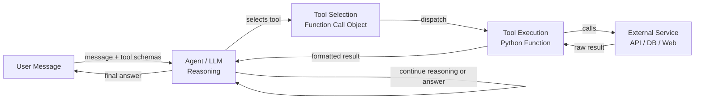

## Definition

Tools and actions are the hands of an AI agent. While the LLM provides reasoning and language understanding, tools give the agent the ability to affect the world: search the web, run code, query a database, send messages, or call any external API. Without tools, an agent is limited to what it knows from its training data; with tools, it can access real-time information, perform computation, and take side-effecting actions.

In the OpenAI and Anthropic ecosystems, the mechanism for tool use is called **function calling** (OpenAI) or **tool use** (Anthropic). The developer defines a set of tool schemas—structured JSON descriptions of each tool's name, purpose, and parameters—and includes them in the API request. When the LLM decides that a tool is needed, it returns a structured tool-call object rather than plain text. The calling code executes the tool and feeds the result back into the conversation. This loop repeats until the agent produces a final answer.

The breadth of available tools is essentially unlimited: if something can be expressed as a Python function, it can be a tool. Common categories include web search, code execution sandboxes, SQL or NoSQL database queries, file system access, REST API calls, email and messaging integrations, and computer-use tools that interact with GUIs. Designing good tools—with clear schemas, predictable behavior, and helpful error messages—is one of the most impactful things a developer can do to improve agent reliability.

## How it works

### Tool schema definition

Every tool is described by a schema that the LLM uses to understand when and how to call it. A schema includes: a name (short, snake_case identifier), a description (clear natural-language explanation of what the tool does and when to use it), and a parameters object (JSON Schema describing each argument: name, type, description, and whether it is required). The quality of the description directly affects how reliably the agent selects and invokes the tool correctly. Vague descriptions lead to misuse; precise descriptions with examples lead to accurate tool calls.

### Tool selection

When the LLM receives a user message alongside a set of tool schemas, it decides at each step whether to answer directly or to invoke a tool. This decision is implicitly learned during fine-tuning on function-calling data. In practice, tool selection is influenced by the system prompt (which can instruct the agent on when to prefer certain tools), the specificity of the tool descriptions, and the model's confidence that it can answer from training data alone. Providing a `tool_choice` parameter can force or restrict tool selection programmatically.

### Tool execution and result injection

When the LLM outputs a tool call, the calling code intercepts it, validates the arguments against the schema, executes the corresponding function, and receives a result. This result—whether a string, JSON object, or error message—is formatted as a `tool` role message and appended to the conversation history. The LLM then generates the next step with full awareness of the tool's output. Error messages from failed tool calls are important: the agent must know that a tool failed so it can retry, try an alternative, or ask the user for clarification.

### Multi-tool and parallel tool calls

Modern LLM APIs support parallel tool calls: the model can request multiple tool invocations in a single response when it identifies that they are independent. For example, an agent might call web_search for three different queries simultaneously rather than sequentially, cutting latency by two-thirds. The calling code executes all tools in parallel, collects the results, and feeds them back together in the next turn. Designing tools to be stateless and idempotent where possible maximizes the benefit of parallel execution.



## When to use / When NOT to use

| Use when | Avoid when |
|---|---|
| The agent needs real-time or external information not in training data | The task can be answered fully from the model's knowledge |
| Actions with side effects are required (send email, write file, update DB) | Tools introduce security risks without proper sandboxing or rate limiting |
| Computation beyond the LLM's abilities is needed (arithmetic, code execution) | Every tool call adds latency and the task is time-sensitive |
| Structured data retrieval (SQL queries, API responses) is essential | The tool schema is so complex that the model frequently misuses it |
| Multiple specialized tools can be composed to solve complex tasks | The tool's failure modes are unrecoverable and could cause harm |

## Pros and cons

| Pros | Cons |
|---|---|
| Extends the agent beyond static training data | Each tool call adds latency and API cost |
| Enables real-world side effects and automation | Tool misuse can cause irreversible actions |
| Supports structured, validated I/O via JSON Schema | Designing clear schemas requires careful prompt engineering |
| Parallel tool calls reduce overall response time | More tools increase cognitive load on the model for selection |
| Fully extensible — any Python function can become a tool | Error handling and retries must be implemented explicitly |

## Code examples

```python
"""
OpenAI function calling example with multiple tools:
- web_search: retrieve current information from the web
- safe_math: evaluate arithmetic using operator-based parsing (no eval)
- get_weather: fetch weather data for a city

The agent loop continues until the LLM produces a final text response
with no tool calls.
"""
from __future__ import annotations

import json
import math
import operator
import os
from typing import Any

from openai import OpenAI  # pip install openai

client = OpenAI(api_key=os.environ.get("OPENAI_API_KEY", "sk-placeholder"))
MODEL = "gpt-4o-mini"

# ---------------------------------------------------------------------------
# Tool implementations
# ---------------------------------------------------------------------------

def web_search(query: str, num_results: int = 3) -> str:
    """
    Mock web search. Replace with a real search API such as
    Tavily (https://tavily.com) or Serper (https://serper.dev).
    """
    return json.dumps({
        "query": query,
        "results": [
            {
                "title": f"Result {i + 1} for '{query}'",
                "snippet": f"Relevant information about {query}.",
            }
            for i in range(min(num_results, 10))
        ],
    })


def safe_math(operation: str, a: float, b: float) -> str:
    """
    Perform basic arithmetic safely using an explicit operator table.
    Supports: add, subtract, multiply, divide, power, sqrt (b unused), log.
    This avoids arbitrary code execution entirely.
    """
    ops: dict[str, Any] = {
        "add": operator.add,
        "subtract": operator.sub,
        "multiply": operator.mul,
        "divide": operator.truediv,
        "power": operator.pow,
        "sqrt": lambda x, _: math.sqrt(x),
        "log": lambda x, base: math.log(x, base) if base else math.log(x),
    }
    if operation not in ops:
        return f"Unknown operation '{operation}'. Supported: {', '.join(ops)}"
    try:
        result = ops[operation](a, b)
        return json.dumps({"operation": operation, "a": a, "b": b, "result": result})
    except (ValueError, ZeroDivisionError, OverflowError) as exc:
        return json.dumps({"error": str(exc)})


def get_weather(city: str, units: str = "celsius") -> str:
    """
    Mock weather API. Replace with OpenWeatherMap or similar.
    """
    mock_data = {
        "city": city,
        "temperature": 22,
        "units": units,
        "condition": "Partly cloudy",
        "humidity_percent": 65,
    }
    return json.dumps(mock_data)


# Map tool names to Python functions
TOOL_FUNCTIONS: dict[str, Any] = {
    "web_search": web_search,
    "safe_math": safe_math,
    "get_weather": get_weather,
}

# ---------------------------------------------------------------------------
# Tool schemas (sent to the LLM with every request)
# ---------------------------------------------------------------------------

TOOLS = [
    {
        "type": "function",
        "function": {
            "name": "web_search",
            "description": (
                "Search the web for current information. Use this tool when the user asks "
                "about recent events, facts that may have changed, or anything that requires "
                "up-to-date information."
            ),
            "parameters": {
                "type": "object",
                "properties": {
                    "query": {
                        "type": "string",
                        "description": "The search query to execute.",
                    },
                    "num_results": {
                        "type": "integer",
                        "description": "Number of results to return (default 3, max 10).",
                        "default": 3,
                    },
                },
                "required": ["query"],
            },
        },
    },
    {
        "type": "function",
        "function": {
            "name": "safe_math",
            "description": (
                "Perform a mathematical operation on two numbers. "
                "Supported operations: add, subtract, multiply, divide, power, sqrt, log. "
                "Use this instead of trying to compute arithmetic mentally."
            ),
            "parameters": {
                "type": "object",
                "properties": {
                    "operation": {
                        "type": "string",
                        "enum": ["add", "subtract", "multiply", "divide", "power", "sqrt", "log"],
                        "description": "The arithmetic operation to perform.",
                    },
                    "a": {
                        "type": "number",
                        "description": "The first operand (or the only operand for sqrt).",
                    },
                    "b": {
                        "type": "number",
                        "description": "The second operand (base for log, ignored for sqrt).",
                    },
                },
                "required": ["operation", "a", "b"],
            },
        },
    },
    {
        "type": "function",
        "function": {
            "name": "get_weather",
            "description": (
                "Get the current weather for a city. Use this tool when the user asks "
                "about weather conditions, temperature, or humidity in a specific location."
            ),
            "parameters": {
                "type": "object",
                "properties": {
                    "city": {
                        "type": "string",
                        "description": "The city name, e.g. 'Tokyo' or 'New York'.",
                    },
                    "units": {
                        "type": "string",
                        "enum": ["celsius", "fahrenheit"],
                        "description": "Temperature units (default: celsius).",
                        "default": "celsius",
                    },
                },
                "required": ["city"],
            },
        },
    },
]

# ---------------------------------------------------------------------------
# Agent loop
# ---------------------------------------------------------------------------

def dispatch_tool_call(tool_call) -> str:
    """Execute a single tool call and return the result as a string."""
    name = tool_call.function.name
    args = json.loads(tool_call.function.arguments)
    print(f"  [Tool call] {name}({args})")

    if name not in TOOL_FUNCTIONS:
        return f"Error: unknown tool '{name}'"

    result = TOOL_FUNCTIONS[name](**args)
    preview = result[:120] + ("..." if len(result) > 120 else "")
    print(f"  [Tool result] {preview}")
    return result


def run_agent(user_message: str, system_prompt: str = "You are a helpful assistant.") -> str:
    """
    Agent loop: send message, handle tool calls, repeat until a final answer is produced.
    """
    messages = [
        {"role": "system", "content": system_prompt},
        {"role": "user", "content": user_message},
    ]

    print(f"User: {user_message}\n")

    max_turns = 10  # Safety limit to prevent infinite loops
    for _ in range(max_turns):
        response = client.chat.completions.create(
            model=MODEL,
            messages=messages,
            tools=TOOLS,
            tool_choice="auto",  # Let the model decide; "none" disables tools
        )
        msg = response.choices[0].message

        # If no tool calls, we have the final answer
        if not msg.tool_calls:
            print(f"\nAssistant: {msg.content}")
            return msg.content

        # Append the assistant message with tool calls to history
        messages.append(msg)

        # Execute all tool calls (for parallel execution use asyncio + concurrent.futures)
        for tool_call in msg.tool_calls:
            result = dispatch_tool_call(tool_call)
            messages.append({
                "role": "tool",
                "tool_call_id": tool_call.id,
                "content": result,
            })

    return "Max turns reached without a final answer."


if __name__ == "__main__":
    # Example 1: requires web search
    run_agent("What are the main differences between GPT-4 and Claude 3?")

    print("\n" + "=" * 60 + "\n")

    # Example 2: requires safe_math tool
    run_agent("What is 2 raised to the power of 16, and what is the square root of that?")

    print("\n" + "=" * 60 + "\n")

    # Example 3: requires weather tool
    run_agent("What's the weather like in London right now?")
```

## Practical resources

- [OpenAI Function Calling Guide](https://platform.openai.com/docs/guides/function-calling) — Official documentation covering tool schemas, parallel calls, and best practices for function definitions.
- [Anthropic Tool Use Documentation](https://docs.anthropic.com/en/docs/tool-use) — Anthropic's guide to tool use with Claude, including streaming, computer use, and multi-tool patterns.
- [Tavily AI Search API](https://tavily.com/) — Purpose-built search API designed for LLM agents, providing clean structured results ideal for tool use.
- [LangChain Tools Concepts](https://python.langchain.com/docs/concepts/tools/) — High-level overview of tool design patterns in LangChain, including custom tools and built-in integrations.
- [Gorilla: Large Language Model Connected with Massive APIs (Patil et al., 2023)](https://arxiv.org/abs/2305.15334) — Research on fine-tuning LLMs for accurate API/tool selection across thousands of tools.

## See also

- [AI agents](/docs/agents)
- [Anthropic tool use](/docs/agents/anthropic-tool-use)
- [Agent frameworks overview](/docs/agents/frameworks-overview)
