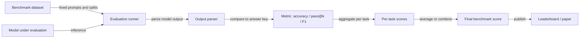

## Definition

Benchmarks are standardized datasets and evaluation protocols that enable reproducible, comparable assessment of AI models. By fixing the tasks, inputs, outputs, and scoring rules, benchmarks allow researchers, engineers, and practitioners to compare models fairly across time and across research groups. A benchmark score is not just a number — it is a claim that under the same conditions, using the same data splits and metrics, model A outperforms model B by a specific margin on a specific task. This comparability is what makes benchmarks the primary currency of progress in AI research.

Well-known benchmarks span the spectrum of AI capabilities. For **natural language understanding**, GLUE and SuperGLUE aggregate tasks like textual entailment, question answering, and coreference resolution. For **broad knowledge and reasoning**, MMLU (Massive Multitask Language Understanding) tests models across 57 subjects from STEM to law. For **code generation**, HumanEval measures whether a model can write Python functions that pass unit tests. For **vision**, ImageNet classification and COCO detection are canonical. Each benchmark encodes assumptions about what "intelligence" means — so model selection should always consider whether the benchmark actually reflects your target use case.

Benchmarks rely on [evaluation metrics](/docs/evaluation-metrics) for scoring and use fixed train/validation/test splits so that test set leakage does not inflate scores. A well-known failure mode is benchmark overfitting: as the research community trains models to maximize a specific benchmark, those models can achieve high scores through shortcut learning rather than genuine capability. This is why cutting-edge evaluation now emphasizes contamination detection, held-out benchmarks, and dynamic evaluation sets — and why benchmark results should always be supplemented with domain-specific and human evaluation before deploying [LLMs](/docs/llms) in production.

## How it works

### Benchmark execution pipeline



### Shot settings and evaluation protocols

Benchmarks are typically run in zero-shot (no examples in prompt) or few-shot (k examples in prompt) settings. The number of shots affects scores significantly, so reporting the shot setting is mandatory for reproducibility. Multiple-choice benchmarks (like MMLU) measure the log-probability assigned to each answer choice; free-form benchmarks (like HumanEval) require functional correctness checked by running code.

### Contamination and reliability

Data contamination — when benchmark test data appears in a model's training corpus — inflates scores. Modern evaluation efforts address this through temporal splits (test data is newer than training cutoff), dynamic benchmarks (questions are generated on demand), and contamination detection methods that check for n-gram overlap between training and test sets.

## When to use / When NOT to use

| Use when | Avoid when |
|----------|------------|
| Comparing models for a new project and wanting a standardized starting point | The benchmark does not cover your domain, language, or task type |
| Tracking progress in research or development over multiple model versions | You need to know real-world user-facing quality, not just benchmark accuracy |
| Reporting results in papers or technical reports for reproducibility | The benchmark is known to be contaminated for the model you are evaluating |
| Selecting a base model to fine-tune for a production application | Your task is highly specialized — a custom eval will be more informative |

## Comparisons

| Benchmark | Domain | Task type | Primary metric |
|-----------|--------|-----------|---------------|
| GLUE / SuperGLUE | NLP | Classification, QA, entailment | Average accuracy |
| MMLU | Knowledge / reasoning | Multiple choice (57 subjects) | Accuracy |
| HumanEval | Code generation | Python function synthesis | pass@k |
| HELM | Comprehensive | Multiple NLP + robustness | Aggregated metrics |
| COCO | Computer vision | Object detection, captioning | AP, CIDEr |
| SWE-bench | Software engineering | GitHub issue resolution | % resolved |

## Pros and cons

| Pros | Cons |
|------|------|
| Enables reproducible, fair comparison across models and methods | High benchmark scores do not guarantee real-world performance |
| Community-wide adoption makes progress easy to track | Benchmarks become saturated; models overfit through training data contamination |
| Fixed protocols reduce reporting ambiguity | Task coverage is narrow — no single benchmark captures full capability |
| Widely supported by evaluation frameworks and leaderboards | Results are sensitive to prompt format, shot setting, and decoding parameters |

## Code examples

### Running MMLU with the lm-evaluation-harness (shell + Python)

```bash
# Install the evaluation harness
pip install lm-eval

# Evaluate a model on MMLU (5-shot) using the CLI
lm_eval \
  --model hf \
  --model_args pretrained=mistralai/Mistral-7B-v0.1 \
  --tasks mmlu \
  --num_fewshot 5 \
  --output_path ./results/mmlu_mistral7b.json \
  --batch_size 8
```

```python
# Parse and summarize results
import json

with open("./results/mmlu_mistral7b.json") as f:
    results = json.load(f)

tasks = results["results"]
scores = {task: data["acc,none"] for task, data in tasks.items() if "acc,none" in data}
avg_score = sum(scores.values()) / len(scores)

print(f"MMLU average accuracy: {avg_score:.3f}")
print("\nTop 5 tasks by score:")
for task, score in sorted(scores.items(), key=lambda x: x[1], reverse=True)[:5]:
    print(f"  {task}: {score:.3f}")
```

## Practical resources

- [Papers with Code – Leaderboards](https://paperswithcode.com/) — Live benchmark leaderboards across all AI tasks
- [MMLU (Hendrycks et al., 2021)](https://arxiv.org/abs/2009.03300) — Broad knowledge benchmark across 57 subjects
- [HumanEval (Chen et al., 2021)](https://github.com/openai/human-eval) — Code generation benchmark with 164 Python problems
- [HELM (Liang et al., 2022)](https://crfm.stanford.edu/helm/) — Holistic evaluation framework covering accuracy, robustness, and fairness
- [lm-evaluation-harness](https://github.com/EleutherAI/lm-evaluation-harness) — Open-source framework for running standardized LLM benchmarks

## See also

- [Evaluation metrics](/docs/evaluation-metrics)
- [LLMs](/docs/llms)
