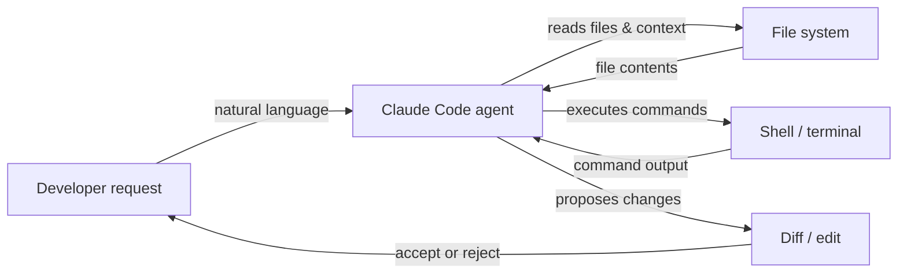

## Definition

Claude Code is Anthropic's AI-powered coding agent — a purpose-built tool that brings Claude's reasoning capabilities directly into the developer workflow. Unlike chat-oriented AI tools, Claude Code is designed for **agentic operation**: it can autonomously plan and execute multi-step tasks, navigate large codebases, run shell commands, edit files, manage git operations, and iterate on its own output without constant human guidance at every step.

It is available in multiple environments: as a **command-line interface (CLI)** that runs in any terminal, as an extension for **VS Code** and **JetBrains** IDEs with inline editing and visual diffs, and via the **web app** at claude.ai/code for browser-based sessions. This multi-environment presence means developers can use Claude Code wherever they already work, rather than switching to a dedicated tool-specific editor.

The core capability set covers the full coding lifecycle: **code generation** (scaffolding new files, writing functions, generating tests), **refactoring** (restructuring existing code while preserving behavior), **debugging** (diagnosing errors with full context), **git operations** (staging, committing, reading diffs, interpreting history), and **file management** (reading, writing, searching, and organizing project files). Because Claude Code operates with access to the entire project tree and a terminal, it handles tasks that require cross-file understanding and sequential tool use naturally.

## How it works

### Installation and authentication

Claude Code is installed as an npm package (`npm install -g @anthropic-ai/claude-code`) and requires a Claude subscription (Pro, Teams, or Enterprise) or API access via Amazon Bedrock or Google Vertex AI. After running `claude` in a terminal, authentication is handled via OAuth or an API key stored in the local configuration. The CLI reads the project directory, locates any `CLAUDE.md` instruction files, and enters an interactive session where the user types natural language requests.

### Agentic task execution loop

When given a task, Claude Code follows an internal plan-act-observe loop. It first reads relevant files to build context, then issues tool calls (file reads, shell commands, code edits) in sequence, observes each result, and adjusts its plan accordingly. This loop continues autonomously until the task is complete or Claude determines it needs clarification. The agent maintains the full conversation history across turns, so it can refer back to earlier discoveries and avoid redundant operations.

### IDE integrations

In VS Code and JetBrains, Claude Code surfaces as an integrated panel with a chat interface and inline diff views. When Claude proposes code changes, they appear as side-by-side diffs that the developer can accept, reject, or partially apply. The extension has access to the same file system and terminal as the CLI, so the capabilities are equivalent — the difference is ergonomic, not functional. Inline edit shortcuts (triggered by keyboard shortcut) let developers ask for targeted edits without switching to a chat panel.

### Context and tool use

Claude Code uses a set of built-in tools: `Read`, `Edit`, `Write`, `Bash`, `Glob`, and `Grep`. These map directly to the actions a developer would take when investigating and modifying a codebase. Each tool call is visible to the user in the session, making the agent's reasoning traceable. File context is loaded on demand rather than preloaded, which helps manage the context window efficiently. Project-level instructions in `CLAUDE.md` files are automatically injected into the system prompt to guide behavior.



## When to use / When NOT to use

| Use when | Avoid when |
|---|---|
| You need an agent to execute multi-step tasks autonomously (e.g., "add pagination to all list endpoints") | You only need a single autocomplete suggestion — a simpler inline tool is faster |
| You want to explore an unfamiliar codebase with natural language questions | The codebase contains sensitive secrets that should never be read by an external AI |
| You need git-aware operations: summarizing diffs, writing commit messages, reviewing PRs | Your project requires offline or air-gapped development with no API access |
| You want IDE integration with visual diffs and inline edits | You prefer fully local/open-source AI with no cloud dependency |
| You are running tasks from the terminal and want CLI-native AI assistance | You need fine-grained per-token cost tracking at the free tier |

## Comparisons

| Criterion | Claude Code | Cursor | GitHub Copilot |
|---|---|---|---|
| **Autonomy level** | High — full agentic loop with multi-step planning and execution | Medium — AI-powered editor with agent mode, but primarily editor-centric | Low to medium — inline completions and chat; Copilot Workspace adds planning |
| **IDE support** | VS Code, JetBrains, plus standalone CLI and web | Proprietary fork of VS Code only | VS Code, Visual Studio, JetBrains, Neovim, and more |
| **Pricing model** | Included in Claude Pro/Teams subscription or pay-per-token via API | Subscription ($20/mo hobby, $40/mo pro); no free tier beyond trial | Free for individuals; $10/mo Pro; Teams and Enterprise tiers |
| **Agentic capabilities** | Native: runs shell commands, edits files, uses git, loops autonomously | Growing: Agent mode available, runs terminal commands | Limited: Copilot Workspace for planning; standard mode is reactive |
| **Context handling** | Explicit tool-based file loading; supports `CLAUDE.md` for persistent instructions | Cursor Rules (`.cursorrules`) + codebase indexing with embeddings | Copilot context comes from open files and selected code; no persistent project rules |

See also the dedicated articles: [Cursor](/docs/tools/cursor) and [GitHub Copilot](/docs/tools/github-copilot).

## Code examples

```bash
# Install Claude Code globally
npm install -g @anthropic-ai/claude-code

# Start an interactive session in your project directory
cd ~/projects/my-app
claude

# --- Inside the Claude Code CLI session ---

# Ask a question about the codebase
> How is authentication handled in this project?

# Ask Claude to make a targeted change
> Add input validation to the POST /users endpoint in src/routes/users.ts

# Ask Claude to fix a bug with context
> The test in tests/auth.test.ts is failing with "Cannot read property 'id' of undefined". Fix it.

# Ask Claude to perform a cross-file refactor
> Rename the UserProfile component to ProfileCard across all files that import it

# Use git-aware operations
> Write a conventional commit message for the changes currently staged in git

# Run a slash command to clear conversation context
> /clear

# Run a multi-step agentic task
> Create a new Express route for GET /health that returns server uptime and version from package.json, add a unit test for it, and stage both files

# Exit the session
> /exit
```

## Practical resources

- [Claude Code documentation — Anthropic](https://docs.anthropic.com/en/docs/claude-code) — Official docs covering installation, CLI usage, IDE integrations, and configuration.
- [Claude Code quickstart](https://docs.anthropic.com/en/docs/claude-code/quickstart) — Step-by-step guide to installing, authenticating, and running your first session.
- [Claude Code GitHub repository](https://github.com/anthropics/claude-code) — Source, issue tracker, and release notes for the CLI and extensions.
- [Anthropic Claude Code product page](https://www.anthropic.com/claude-code) — High-level overview and use case examples from Anthropic.
- [Skills repository](https://github.com/EmersonBraun/skills) — Curated collection of reusable AI skills for Claude Code and other AI coding assistants

## See also

- [CLAUDE.md configuration](/docs/claude-code/claude-md)
- [Claude Code skills](/docs/claude-code/skills)
- [Cursor](/docs/tools/cursor)
- [GitHub Copilot](/docs/tools/github-copilot)
