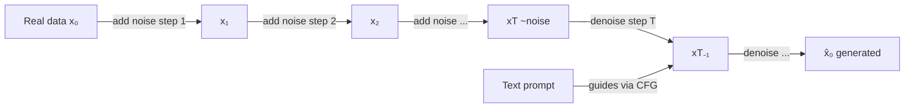

## Definition

Diffusion models are a class of generative models that learn to produce data by reversing a gradual noising process. During training, the model learns to predict and remove noise that was incrementally added to real data over many timesteps. At inference, starting from pure Gaussian noise, the model iteratively denoises to produce a sample from the target data distribution. This approach has become the dominant paradigm for high-quality image generation, with landmark systems including DALL·E 2, Stable Diffusion, and Imagen.

The key theoretical insight comes from score matching and stochastic differential equations: the model learns the **score function** (gradient of the log-density) of the data distribution at each noise level. The forward (noising) process is fixed and has a closed form, so training is straightforward — sample a real data point, corrupt it to a random noise level, train a U-Net (or transformer) to predict the added noise. The loss is a simple mean squared error between predicted and actual noise.

Unlike [GANs](/docs/gans), diffusion training is stable with no adversarial dynamic. Unlike [VAEs](/docs/vaes), samples are sharp and diverse because generation traces a rich trajectory through the data manifold rather than decoding from a bottlenecked latent. The main practical trade-off is inference speed: the reverse process requires many denoising steps (50–1000 for DDPM). **Distillation** (e.g., Consistency Models) and efficient schedulers (DDIM, DPM-Solver) have reduced this to as few as 1–4 steps without significant quality loss. See [case study: DALL-E](/docs/case-studies/dall-e).

## How it works

### Forward process (data → noise)

A real sample **x₀** is progressively corrupted by adding Gaussian noise over T timesteps to produce **x₁, x₂, …, xT**. After enough steps, xT is approximately pure Gaussian noise. The forward process has a closed form: given any timestep t, you can compute xₜ directly from x₀ without running all intermediate steps.

### Reverse process (noise → data)

A neural network (typically a U-Net with attention layers) learns to predict the noise εθ(xₜ, t) that was added at step t. Training minimizes the difference between predicted and actual noise. At generation time, the model starts from random **xT** and iteratively applies the denoising network to recover **x₀**.

### Conditioning and guidance

For conditional generation (e.g., text-to-image), **classifier-free guidance (CFG)** trains the model both with and without the condition, then blends the conditional and unconditional score at inference. Higher guidance weight increases prompt adherence at the cost of diversity.



### Latent diffusion

Stable Diffusion runs the diffusion process in the **latent space** of a pretrained VAE encoder, not in pixel space. This dramatically reduces computation while preserving quality. The VAE encoder compresses the image; the diffusion model denoises in the latent space; the VAE decoder reconstructs the final image.

## When to use / When NOT to use

| Scenario | Use diffusion | Avoid diffusion |
|---|---|---|
| High-quality, diverse image generation | Yes — state-of-the-art quality and diversity | No — if inference speed is critical and quality can be lower |
| Text-to-image or text-to-audio generation | Yes — conditioning via CFG is flexible and powerful | No — if you need a fast single-forward-pass generator |
| Image editing and inpainting | Yes — diffusion naturally supports masked denoising | No — if GAN-based editing pipeline is already established |
| Real-time generation (e.g., game assets) | No — multi-step inference adds latency | — |
| Tabular or low-dimensional data | No — overkill; simpler models work better | — |

## Comparisons

| Model | Sample quality | Diversity | Training stability | Inference speed |
|---|---|---|---|---|
| Diffusion | Excellent | Excellent | Stable | Slow (many steps) |
| GAN | High (sharp) | Low (mode collapse) | Difficult | Fast (1 step) |
| VAE | Medium (blurry) | Good | Stable | Fast |
| Flow-based | High | Good | Stable | Medium |

## Pros and cons

| Pros | Cons |
|---|---|
| Stable training — no adversarial dynamic | Slow inference — requires many denoising steps |
| Excellent sample diversity and coverage | High compute cost for both training and sampling |
| Flexible conditioning (text, class, image) | Requires careful noise schedule tuning |
| Strong theoretical foundations in score matching | Latent diffusion adds VAE compression artifacts |

## Code examples

Text-to-image generation using the Hugging Face Diffusers library:

```python
from diffusers import StableDiffusionPipeline
import torch

# Load Stable Diffusion v1.5 (fp16 for GPU efficiency)
pipe = StableDiffusionPipeline.from_pretrained(
    "runwayml/stable-diffusion-v1-5",
    torch_dtype=torch.float16,
)
pipe = pipe.to("cuda")

# Generate an image from a text prompt
prompt = "A photorealistic mountain landscape at golden hour, 4K"
negative_prompt = "blurry, low quality, artifacts"

image = pipe(
    prompt=prompt,
    negative_prompt=negative_prompt,
    num_inference_steps=50,    # Denoising steps
    guidance_scale=7.5,        # CFG strength
    height=512,
    width=512,
).images[0]

image.save("output.png")
```

## Practical resources

- [Denoising Diffusion Probabilistic Models (Ho et al., 2020)](https://arxiv.org/abs/2006.11239) — Foundational DDPM paper establishing the modern training objective
- [Hugging Face Diffusers](https://huggingface.co/docs/diffusers/) — Production library for diffusion pipelines, fine-tuning, and inference
- [DDIM (Song et al., 2020)](https://arxiv.org/abs/2010.02502) — Deterministic sampling that reduces steps from 1000 to 50 without retraining
- [Classifier-Free Guidance (Ho & Salimans, 2022)](https://arxiv.org/abs/2207.12598) — The key technique behind conditional generation in modern diffusion models

## See also

- [GANs](/docs/gans)
- [VAEs](/docs/vaes)
- [Case study: DALL-E](/docs/case-studies/dall-e)
