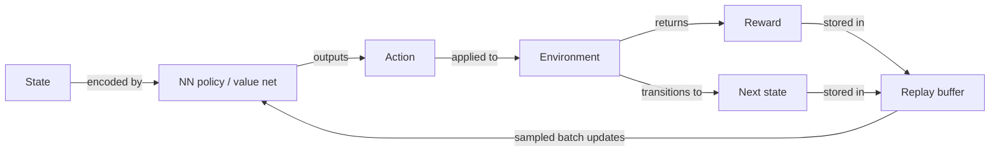

## Definition

Deep reinforcement learning (DRL) extends classical [reinforcement learning](/docs/rl) by replacing hand-crafted feature engineering and tabular value functions with deep [neural networks](/docs/neural-networks). This allows RL algorithms to handle high-dimensional state spaces — such as raw pixels from a game screen or joint angles from a robot — that were previously intractable. The neural network acts as a universal function approximator for the policy, the value function, or both.

The pivotal breakthrough came with DQN (Mnih et al., 2015), which combined Q-learning with a convolutional network, experience replay, and target networks to achieve human-level play on 49 Atari games. Since then, the field has produced a rich family of algorithms: value-based (DQN, Rainbow), policy gradient (REINFORCE, A3C), and actor-critic (PPO, SAC, TD3). Each family makes different trade-offs between sample efficiency, stability, and applicability to continuous versus discrete action spaces.

Training deep RL agents is notoriously unstable without specific stabilization techniques. **Experience replay** breaks temporal correlations by storing transitions in a buffer and sampling random mini-batches. **Target networks** are slowly-updated copies of the value network that provide stable regression targets. **Advantage estimation** (e.g., GAE) reduces variance in policy gradient updates. Modern algorithms such as PPO and SAC incorporate these ideas by default, making them reliable baselines for continuous control, robotics, and LLM alignment (RLHF, DPO).

## How it works

### Neural network policy and value functions

The state (e.g., an image, sensor vector, or token embedding) is encoded by a neural network that outputs either action probabilities (policy network) or expected returns (value network). In actor-critic methods both heads can share a backbone.



### Experience replay

Transitions (state, action, reward, next state, done) are stored in a **replay buffer**. Random mini-batches are sampled for each gradient update, breaking harmful temporal correlations and improving data efficiency.

### Target networks

A copy of the value network — updated slowly (Polyak averaging) or periodically — provides stable regression targets. Without this, gradient updates can oscillate because the target changes every step.

### Advantage estimation

Policy gradient methods compute the advantage A(s, a) = Q(s, a) − V(s) to tell the agent how much better an action was than average. **Generalized Advantage Estimation (GAE)** trades bias for variance with a hyperparameter λ, and is standard in PPO.

### Key algorithms

| Algorithm | Family | Action space | Key trait |
|---|---|---|---|
| DQN | Value-based | Discrete | Experience replay + target networks |
| PPO | Actor-critic | Both | Clipped policy updates for stability |
| SAC | Actor-critic | Continuous | Entropy maximization for exploration |
| TD3 | Actor-critic | Continuous | Twin critics reduce overestimation bias |

## When to use / When NOT to use

| Scenario | Use DRL | Avoid DRL |
|---|---|---|
| High-dimensional observations (pixels, sensors) | Yes — neural nets handle raw inputs | No — tabular RL if state space is small |
| Simulator available for safe trial-and-error | Yes — DRL requires millions of samples | No — real-world only with limited interactions |
| Complex, long-horizon control tasks | Yes — PPO/SAC excel at continuous control | No — imitation learning is faster if expert data exists |
| Limited compute or interpretability required | No — DRL is compute-intensive and opaque | — |
| Simple rule-based or low-D problem | No — classical RL or optimization suffices | — |

## Comparisons

| Method | State space | Stability | Sample efficiency | Typical use |
|---|---|---|---|---|
| Tabular Q-learning | Small discrete | High | Low | Toy environments |
| DQN | High-dim discrete | Medium | Low-medium | Atari games |
| PPO | Any | High | Medium | Robotics, RLHF |
| SAC | Continuous | High | Higher | Robot manipulation |

## Pros and cons

| Pros | Cons |
|---|---|
| Handles raw pixel and high-dimensional inputs | Extremely sample-inefficient vs. supervised learning |
| State-of-the-art on games, robotics, and LLM alignment | Hyperparameter sensitivity; unstable without tricks |
| PPO/SAC are robust, general-purpose baselines | Reward misspecification leads to unexpected behavior |
| Scales with compute and model capacity | Requires simulator or large environment interaction budget |

## Code examples

Minimal PPO training loop using Stable-Baselines3:

```python
from stable_baselines3 import PPO
from stable_baselines3.common.env_util import make_vec_env

# Vectorized environment for parallel rollout collection
env = make_vec_env("LunarLander-v2", n_envs=4)

model = PPO(
    policy="MlpPolicy",
    env=env,
    learning_rate=3e-4,
    n_steps=2048,        # Steps per rollout per env
    batch_size=64,
    n_epochs=10,         # Gradient epochs per rollout
    gamma=0.99,
    gae_lambda=0.95,
    clip_range=0.2,      # PPO clipping parameter
    verbose=1,
)

model.learn(total_timesteps=500_000)
model.save("ppo_lunar_lander")

# Evaluate
obs = env.reset()
for _ in range(1000):
    action, _ = model.predict(obs, deterministic=True)
    obs, rewards, dones, info = env.step(action)
```

## Practical resources

- [Spinning Up in Deep RL (OpenAI)](https://spinningup.openai.com/) — Concise algorithm explanations with PyTorch implementations of PPO, SAC, DDPG, and TD3
- [Stable-Baselines3](https://stable-baselines3.readthedocs.io/) — Well-tested, production-ready DRL implementations with unified API
- [CleanRL](https://docs.cleanrl.dev/) — Single-file, readable implementations of DQN, PPO, SAC, and more
- [DeepMind Lab / dm_control](https://github.com/deepmind/dm_control) — Continuous control environments for benchmarking DRL

## See also

- [RL](/docs/rl)
- [Neural networks](/docs/neural-networks)
