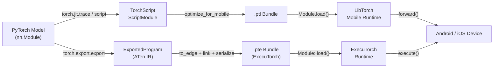

## Definition

PyTorch Mobile is the family of tools and runtimes that brings PyTorch-trained models to Android and iOS devices without requiring a server or cloud connection. It preserves the PyTorch development experience — researchers and engineers train in the familiar eager-mode Python API, then export their models through either the **TorchScript** or the newer **ExecuTorch** pathway for on-device deployment. This tight coupling between training and deployment environments reduces the surface area for numerical discrepancy bugs that often emerge when switching between frameworks.

The historical deployment path centers on TorchScript, a statically-typed subset of Python that can be compiled and serialized to a platform-independent format (`.ptl` for mobile). TorchScript supports two compilation modes: **tracing**, where a sample input is passed through the model and the executed path is recorded, and **scripting**, where Python control flow is analyzed statically. Both produce a `ScriptModule` that can be loaded by the LibTorch C++ runtime embedded in the mobile SDK.

Google and Meta jointly developed **ExecuTorch** as the next-generation framework for running PyTorch models at the edge. ExecuTorch introduces a portable execution format (`.pte`), a minimal C++ runtime (under 50 KB for simple models), and first-class support for delegation to hardware backends including Qualcomm AI Engine, Apple Neural Engine, Arm Ethos NPUs, and Cadence DSPs. ExecuTorch is designed for production use and supersedes the original PyTorch Mobile runtime for new projects requiring broad hardware portability and minimal binary size.

## How it works



### TorchScript Tracing and Scripting

Tracing (`torch.jit.trace`) runs a sample input through the model and records the sequence of tensor operations, producing a static computation graph. Tracing is simple and covers most standard architectures, but it captures only the execution path for the given input — data-dependent control flow (if statements, loops that vary with input values) will be silently baked in. Scripting (`torch.jit.script`) analyzes the Python source with a TorchScript type checker and preserves control flow, making it correct for models with branching logic. In practice, hybrid approaches are common: script the top-level module while tracing inner submodules that have no dynamic control flow.

### ExecuTorch Export Pipeline

ExecuTorch uses `torch.export.export` to capture a strict, side-effect-free representation of the model in ATen IR — a canonical set of PyTorch operators guaranteed to have well-defined semantics. The exported program is then lowered to the **Edge IR** via `to_edge`, which performs backend-specific graph passes (operator decomposition, layout propagation). Backends (delegation targets) can claim subgraphs during the `to_backend` step, replacing them with hardware-specific implementations. The final artifact is serialized to a `.pte` flatbuffer that is loaded by the ExecuTorch C++ runtime, which requires no dynamic memory allocation during inference.

### Optimization: Quantization and Pruning

PyTorch offers post-training static and dynamic quantization through `torch.quantization` (legacy) and the newer `torch.ao.quantization` namespace. Static INT8 quantization requires a representative calibration dataset and reduces model size by ~4x with 2-3x latency improvement on ARM CPUs. Quantization-aware training (QAT) inserts `FakeQuantize` nodes into the forward graph during fine-tuning, allowing the model to adapt its weights to INT8 precision. Pruning (`torch.nn.utils.prune`) removes individual weights or entire channels based on magnitude or structured criteria, reducing the effective compute load before quantization. Both techniques can be combined: prune first to reduce channels, then quantize to reduce precision.

### Mobile Runtime and Platform Integration

The `.ptl` bundle produced by `optimize_for_mobile` includes operator fusing optimizations and strips unused operators from the operator registry, reducing binary footprint. The Android SDK (`pytorch_android`) is published to Maven Central and exposes a Kotlin/Java API. The iOS SDK is distributed as a CocoaPod or Swift Package and provides Objective-C and Swift bindings. Both SDKs wrap the same LibTorch C++ core. ExecuTorch targets the same platforms but exposes a leaner C API and also supports bare-metal embedded targets. The `torch::executor::Module` class provides a minimal `execute()` API that operates directly on pre-allocated `EValue` tensors, avoiding JNI-style overhead.

### GPU and NPU Acceleration

PyTorch Mobile's GPU delegate for Android works through the Vulkan backend (`torch.backends.vulkan`), which offloads convolutions and matrix multiplications to the GPU. ExecuTorch's XNNPACK backend accelerates floating-point and INT8 operations on ARM CPUs via NEON SIMD instructions and is the recommended default for CPU acceleration. The Qualcomm AI Engine Direct backend and Apple Core ML backend provide NPU-level acceleration through ExecuTorch's delegation API, typically yielding 5-15x speedups over reference CPU paths for standard vision and NLP models.

## When to use / When NOT to use

| Use when | Avoid when |
|---|---|
| Your training codebase is PyTorch and you want minimal conversion friction | Your models originate in TensorFlow/Keras and conversion overhead is a concern |
| You need to deploy to Android or iOS with a Python-familiar workflow | You need microcontroller targets with &lt;256 KB RAM (TFLM is better suited) |
| You want ExecuTorch for next-gen hardware NPU delegation (Qualcomm, Apple ANE) | Your model uses Python-level dynamic control flow that TorchScript cannot capture via tracing |
| Rapid iteration: reuse the same model class for training and mobile inference | You need mature production tooling with broad hardware delegate coverage today (TFLite is more mature) |
| You are building on top of the Hugging Face ecosystem (many models export via TorchScript) | Binary size is extremely constrained and the LibTorch runtime footprint (~3-8 MB compressed) is too large |

## Comparisons

Comparison of PyTorch Mobile with TFLite and ONNX Runtime for edge deployment scenarios.

| Criterion | PyTorch Mobile | TensorFlow Lite | ONNX Runtime |
|---|---|---|---|
| Platform support | Android, iOS; ExecuTorch extends to embedded and bare-metal | Android, iOS, embedded Linux, microcontrollers (TFLM) | Windows, Linux, macOS, Android, iOS, WebAssembly |
| Model conversion | torch.jit.trace / script (PyTorch-native) or torch.export (ExecuTorch) | TFLite Converter from TF/Keras SavedModel | Any framework → ONNX export (most interoperable path) |
| On-device performance | XNNPACK on ARM CPUs; Vulkan GPU; ExecuTorch NPU delegation | Excellent on Android via NNAPI/GPU delegate; best-in-class for microcontrollers | Competitive CPU EP; CUDA/TensorRT EPs shine in GPU-enabled edge devices |
| Ecosystem | Strong in research; Hugging Face integration; growing ExecuTorch community | Mature: MediaPipe, TF Hub, Model Garden; largest mobile ML community | Broad enterprise support; framework-agnostic; strong Microsoft/Azure integration |
| Quantization support | PTQ (dynamic + static INT8) and QAT via torch.ao.quantization; ExecuTorch backend-specific quantization | Comprehensive: dynamic-range, INT8, FP16, QAT with full INT8 paths | INT8 via QDQ nodes; hardware INT8 depends on execution provider |

## Pros and cons

| Pros | Cons |
|---|---|
| Seamless workflow for PyTorch users — same model class trains and deploys | LibTorch mobile binary adds ~3-8 MB to app size compressed |
| ExecuTorch provides a modern, extensible architecture for NPU delegation | TorchScript tracing silently misses data-dependent control flow |
| Strong Hugging Face ecosystem integration | Less mature than TFLite for production Android/iOS deployments |
| QAT is well-integrated with the standard training loop | Vulkan GPU delegate coverage is narrower than TFLite's GPU delegate |
| Active development with strong Meta and community backing | ONNX interoperability requires an extra conversion step through the ONNX exporter |

## Code examples

```python
import torch
import torch.nn as nn

# ── 1. Define a simple convolutional model ────────────────────────────────────
class SmallCNN(nn.Module):
    """Minimal CNN for demonstration. Replace with your real model."""

    def __init__(self, num_classes: int = 10):
        super().__init__()
        self.features = nn.Sequential(
            nn.Conv2d(1, 16, kernel_size=3, padding=1),
            nn.ReLU(inplace=True),
            nn.MaxPool2d(2),
            nn.Conv2d(16, 32, kernel_size=3, padding=1),
            nn.ReLU(inplace=True),
            nn.AdaptiveAvgPool2d(1),
        )
        self.classifier = nn.Linear(32, num_classes)

    def forward(self, x: torch.Tensor) -> torch.Tensor:
        x = self.features(x)
        x = x.flatten(1)
        return self.classifier(x)


model = SmallCNN(num_classes=10)
model.eval()  # set model to inference mode (disables dropout, batch-norm tracks running stats)

# ── 2. Export with TorchScript tracing ───────────────────────────────────────
# Provide a representative input with the expected shape (batch=1, C=1, H=28, W=28)
example_input = torch.rand(1, 1, 28, 28)

# trace() records the ops executed for example_input
scripted_model = torch.jit.trace(model, example_input)

# optimize_for_mobile fuses ops and strips unused kernels for a smaller bundle
from torch.utils.mobile_optimizer import optimize_for_mobile

optimized_model = optimize_for_mobile(scripted_model)
optimized_model._save_for_lite_interpreter("model.ptl")
print("Saved model.ptl")

# ── 3. Apply post-training dynamic quantization ───────────────────────────────
quantized_model = torch.quantization.quantize_dynamic(
    model,
    qconfig_spec={nn.Linear, nn.Conv2d},  # quantize these layer types to INT8
    dtype=torch.qint8,
)
quantized_model.eval()

# Verify quantized inference produces sensible output
with torch.no_grad():
    output = quantized_model(example_input)
print(f"Output shape: {output.shape}, predicted class: {output.argmax(dim=1).item()}")

# ── 4. Load .ptl on Python (mirrors Android/iOS Module.load() behavior) ───────
loaded = torch.jit.load("model.ptl")
loaded.eval()
with torch.no_grad():
    result = loaded(example_input)
print(f"Loaded mobile model predicted class: {result.argmax(dim=1).item()}")
```

## Practical resources

- [PyTorch Mobile documentation](https://pytorch.org/mobile/home/) — official guide covering TorchScript export, the Android and iOS SDKs, model optimization, and performance profiling on device.
- [ExecuTorch documentation](https://pytorch.org/executorch/) — the next-generation edge runtime documentation, covering the export pipeline, backend delegation, and hardware integration guides for Qualcomm, Apple, and ARM targets.
- [torch.ao.quantization guide](https://pytorch.org/docs/stable/quantization.html) — comprehensive reference for PyTorch's quantization API, covering PTQ, QAT, and the newer `torch.ao` namespace used in ExecuTorch workflows.
- [PyTorch Android demo apps](https://github.com/pytorch/android-demo-app) — open-source Android apps demonstrating image classification, object detection, speech recognition, and NLP with PyTorch Mobile; useful as integration templates.
- [ExecuTorch tutorials](https://pytorch.org/executorch/stable/tutorials/export-to-executorch-tutorial.html) — step-by-step tutorials for exporting models through the ExecuTorch pipeline and running them with the C++ runtime.

## See also

- [TensorFlow Lite](/docs/edge-ai/tflite)
- [ONNX Runtime](/docs/edge-ai/onnx)
- [PyTorch](/docs/frameworks/pytorch)
- [Quantization](/docs/quantization)
