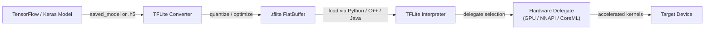

## Definition

TensorFlow Lite (TFLite) is Google's open-source framework for running machine learning models on resource-constrained devices — mobile phones, tablets, embedded systems, and microcontrollers. Rather than a training framework, TFLite is a purpose-built **inference runtime**: models are trained with full TensorFlow, converted to the compact `.tflite` format, and then executed on-device without requiring a server connection. This design allows applications to perform ML tasks — image classification, object detection, speech recognition, natural language understanding — entirely offline and with low latency.

The core of TFLite is a flat-buffer model format that minimizes memory allocation overhead and avoids the need for a complex runtime graph interpreter. The format strips away training-time constructs (gradients, optimizer state) and retains only the operations needed for forward-pass inference. This results in model files that are often an order of magnitude smaller than their full TensorFlow counterparts, making distribution through app stores practical even for users on metered connections.

TFLite targets an unusually wide hardware range. At the high end it runs on Android and iOS devices and leverages hardware accelerators through its **delegate** API. At the low end, the TensorFlow Lite for Microcontrollers (TFLM) variant removes dynamic memory allocation entirely and can fit within tens of kilobytes of flash, enabling deployment on bare-metal Cortex-M chips and similar ultra-constrained targets.

## How it works



### Model Conversion

The TFLite Converter (`tf.lite.TFLiteConverter`) accepts SavedModel directories, Keras `.h5` files, or concrete TensorFlow functions and emits a `.tflite` flatbuffer. During conversion the graph is frozen (variables become constants), unused operations are pruned, and operator fusing (e.g. Conv + ReLU → fused ConvReLU) reduces kernel dispatch overhead. The converter supports a growing set of TensorFlow ops through the **select TF ops** mechanism, falling back to a restricted set of TFLite built-in ops that are guaranteed to run on every target. Post-training quantization can be applied at this stage, shrinking the model and unlocking integer-only inference paths.

### Quantization

TFLite supports four quantization modes: dynamic-range quantization (weights only, activations quantized at runtime), full integer quantization (weights and activations, requires a representative dataset for calibration), float16 quantization (good for GPU delegates), and quantization-aware training (QAT, where fake-quantization nodes are inserted during training so the model learns to be robust to precision reduction). Full INT8 quantization typically reduces model size by 4x and latency by 2-3x on CPUs with SIMD support. Quantization is particularly impactful on mobile chipsets that lack fast FP32 execution paths.

### Interpreter and Op Kernels

The TFLite Interpreter loads a `.tflite` file, allocates tensor memory (all in a single arena to avoid fragmentation), and executes operations in topological order. Each operation is implemented by a kernel registered in the op resolver; the MutableOpResolver lets applications include only the ops they need, reducing binary size significantly. The interpreter exposes a minimal C++ API (`AllocateTensors`, `Invoke`, `typed_input_tensor`, `typed_output_tensor`) and higher-level wrappers exist for Java/Kotlin (Android), Swift/ObjC (iOS), and Python. The Python interpreter is mainly used for validation and benchmarking before deploying native binaries.

### Delegates

Delegates are TFLite's hardware acceleration plugin interface. When a delegate is applied to the interpreter, it inspects the model graph and claims the subgraphs it can accelerate, replacing TFLite's reference CPU kernels with optimized implementations. The **GPU delegate** offloads convolutions and matrix multiplications to OpenGL ES or Metal, yielding 2-7x speedups on typical vision models. The **NNAPI delegate** routes operations through Android's Neural Networks API to any vendor-provided accelerator (DSP, NPU). The **CoreML delegate** uses Apple's CoreML on iOS. The **Hexagon delegate** targets Qualcomm DSPs directly. Delegates degrade gracefully: unsupported ops fall back to CPU automatically.

### TFLite for Microcontrollers

The TFLM fork removes the standard C++ allocator, file I/O, and dynamic dispatch. Models are compiled into the firmware as C byte arrays and inference runs from SRAM with a fixed-size scratch buffer. Supported targets include STM32, Arduino Nano 33 BLE Sense, SparkFun Edge, and Sony Spresense. TFLM supports a subset of operations sufficient for keyword spotting, gesture recognition, and simple vision tasks on sub-milliwatt power budgets.

## When to use / When NOT to use

| Use when | Avoid when |
|---|---|
| Deploying on Android or iOS without cloud dependency | Your model uses ops not yet supported by the TFLite op set |
| You need sub-100ms latency for real-time inference on mobile | You require dynamic shapes or control flow not expressible in static TFLite graphs |
| Running on embedded Linux boards (Raspberry Pi, Coral Edge TPU) | Your team primarily works in PyTorch and model conversion friction is a blocker |
| Binary size matters and you want a minimal inference runtime | You need advanced serving features: batching, model versioning, A/B routing |
| You want broad hardware acceleration through the delegate API | Your model architecture changes frequently during experimentation |

## Comparisons

Comparison of TFLite with PyTorch Mobile and ONNX Runtime for edge deployment scenarios.

| Criterion | TensorFlow Lite | PyTorch Mobile | ONNX Runtime |
|---|---|---|---|
| Platform support | Android, iOS, embedded Linux, microcontrollers | Android, iOS (limited embedded) | Windows, Linux, macOS, Android, iOS, WebAssembly |
| Model conversion | TF/Keras → TFLite Converter (mature, well-documented) | PyTorch → TorchScript or ExecuTorch (Pythonic, less friction for PyTorch users) | Any framework → ONNX export → ORT (most interoperable) |
| On-device performance | Excellent on Android via NNAPI/GPU delegate; best-in-class for microcontrollers | Good on mobile; ExecuTorch brings improved performance and portability | Competitive with CPU EP; CUDA/TensorRT EPs excel in cloud/edge GPU scenarios |
| Ecosystem | Large: TensorFlow Hub models, Model Garden, MediaPipe integration | Growing: strong in research, torchvision models, Hugging Face integration | Broad: any ONNX-compatible framework; strong in enterprise and Microsoft stack |
| Quantization support | Comprehensive: dynamic-range, INT8, FP16, QAT | PTQ and QAT via torch.quantization; ExecuTorch adds more backends | Supports INT8 via QDQ nodes; depends on execution provider for hardware INT8 |

## Pros and cons

| Pros | Cons |
|---|---|
| Mature ecosystem with extensive mobile tooling and documentation | Requires conversion step; not all TensorFlow ops are supported |
| Excellent microcontroller support via TFLM | Debugging converted models is harder than in eager-mode TensorFlow |
| Hardware delegate API covers major mobile accelerators | ONNX interoperability requires intermediate conversion |
| Flat-buffer format loads instantly without parsing overhead | Less flexible than full TF for dynamic model architectures |
| Strong community, Google backing, and MediaPipe integration | PyTorch users face more friction than TFLite-native TF workflows |

## Code examples

```python
import numpy as np
import tensorflow as tf

# ── 1. Build and train a simple Keras model ──────────────────────────────────
model = tf.keras.Sequential([
    tf.keras.layers.InputLayer(input_shape=(28, 28, 1)),
    tf.keras.layers.Conv2D(8, (3, 3), activation="relu"),
    tf.keras.layers.MaxPooling2D(),
    tf.keras.layers.Flatten(),
    tf.keras.layers.Dense(10, activation="softmax"),
])
model.compile(optimizer="adam", loss="sparse_categorical_crossentropy", metrics=["accuracy"])

# Dummy training data — replace with real dataset (e.g. MNIST)
x_train = np.random.rand(128, 28, 28, 1).astype(np.float32)
y_train = np.random.randint(0, 10, 128).astype(np.int32)
model.fit(x_train, y_train, epochs=1, verbose=0)

# ── 2. Convert to TFLite with full INT8 quantization ─────────────────────────
def representative_dataset():
    """Yields small batches from training data for calibration."""
    for i in range(0, len(x_train), 8):
        yield [x_train[i : i + 8]]

converter = tf.lite.TFLiteConverter.from_keras_model(model)
converter.optimizations = [tf.lite.Optimize.DEFAULT]
converter.representative_dataset = representative_dataset
converter.target_spec.supported_ops = [tf.lite.OpsSet.TFLITE_BUILTINS_INT8]
converter.inference_input_type = tf.int8
converter.inference_output_type = tf.int8

tflite_model = converter.convert()

# Persist the .tflite file
with open("model.tflite", "wb") as f:
    f.write(tflite_model)
print(f"Model size: {len(tflite_model) / 1024:.1f} KB")

# ── 3. Run inference with the TFLite Interpreter ─────────────────────────────
interpreter = tf.lite.Interpreter(model_content=tflite_model)
interpreter.allocate_tensors()

input_details = interpreter.get_input_details()
output_details = interpreter.get_output_details()

# Quantize a float32 input to INT8 using the input tensor's scale and zero-point
scale, zero_point = input_details[0]["quantization"]
sample = x_train[:1]  # shape (1, 28, 28, 1)
sample_int8 = (sample / scale + zero_point).astype(np.int8)

interpreter.set_tensor(input_details[0]["index"], sample_int8)
interpreter.invoke()

output = interpreter.get_tensor(output_details[0]["index"])
# Dequantize output
out_scale, out_zero = output_details[0]["quantization"]
probabilities = (output.astype(np.float32) - out_zero) * out_scale
predicted_class = np.argmax(probabilities)
print(f"Predicted class: {predicted_class}")
```

## Practical resources

- [TensorFlow Lite official guide](https://www.tensorflow.org/lite/guide) — comprehensive documentation covering model conversion, optimization, delegates, and platform-specific deployment guides for Android, iOS, and embedded Linux.
- [TFLite Model Maker](https://www.tensorflow.org/lite/models/modify/model_maker) — high-level API for transfer learning that directly outputs `.tflite` models, useful for rapid prototyping with custom datasets.
- [TFLite for Microcontrollers](https://www.tensorflow.org/lite/microcontrollers) — the TFLM guide explaining how to deploy on Cortex-M boards with no OS dependency; includes keyword spotting and gesture recognition examples.
- [MediaPipe Solutions](https://developers.google.com/mediapipe/solutions) — Google's production-ready pipelines (face detection, hand tracking, pose estimation) built on TFLite; useful as a reference for integrating TFLite into real applications.
- [TFLite Performance benchmarks](https://www.tensorflow.org/lite/performance/benchmarks) — official latency and accuracy benchmarks across mobile chipsets for common vision models, useful for hardware selection decisions.

## See also

- [PyTorch Mobile](/docs/edge-ai/pytorch-mobile)
- [ONNX Runtime](/docs/edge-ai/onnx)
- [Infrastructure](/docs/infrastructure)
- [Model compression](/docs/model-compression)
