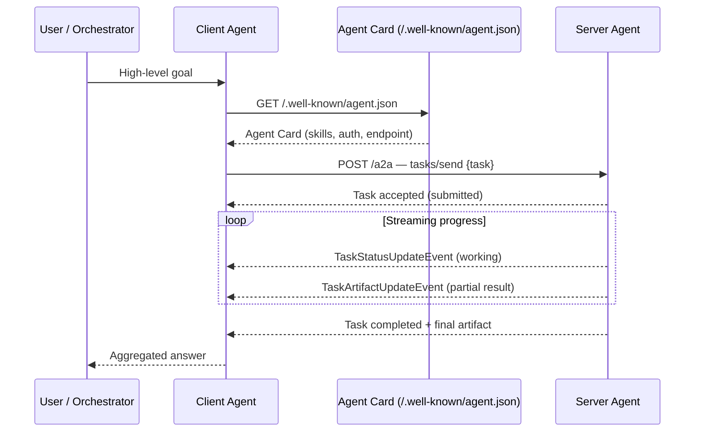

## Definition

The **Agent2Agent (A2A) protocol** is an open, vendor-neutral standard that lets autonomous AI agents communicate with each other regardless of which framework, model, or cloud they run on. Introduced by Google in April 2025 and contributed to the **Linux Foundation** in June 2025 (Apache 2.0 license), A2A complements the [Model Context Protocol (MCP)](/docs/mcp) at a different layer: where MCP governs how an agent connects to **tools and data sources**, A2A governs how one **agent talks to another agent**.

As of early 2026, more than 150 organizations — including Google, Microsoft, AWS, Salesforce, SAP, and IBM — support or implement A2A, making it the de-facto standard for multi-agent interoperability.

The core design goals are:

- **Discoverability** — any client can find what an agent does before calling it.
- **Interoperability** — agents built in LangGraph, CrewAI, ADK, or custom code can collaborate without custom adapters.
- **Security** — authentication is declared in the Agent Card; credentials flow through standard HTTP headers.
- **Streaming** — long-running tasks report progress incrementally via Server-Sent Events.

## How it works

### Agent Cards

Every A2A-compliant agent publishes a self-description at the well-known URL `/.well-known/agent.json` called an **Agent Card**. The card is a JSON document with:

| Field | Description |
|---|---|
| `name` / `description` | Human-readable identity |
| `url` | The agent's A2A endpoint |
| `version` | Protocol and agent version |
| `skills` | Array of capability objects (id, name, description, input/output modes) |
| `capabilities` | Flags: `streaming`, `pushNotifications`, `stateTransitionHistory` |
| `authentication` | Supported schemes (bearer, OAuth, API key) |
| `provider` | Organization publishing the agent |

A **Skill** is the A2A equivalent of a function signature: it tells a calling agent exactly what the remote agent can do and what input format it expects. Agent Cards can optionally be signed with JSON Web Signatures (JWS) to guarantee authenticity.

### Task lifecycle

A2A models work as **tasks** with a defined state machine:

```
submitted → working → (input-required) → completed | failed | canceled
```

The **client agent** (`A2AClient`) calls the remote agent's endpoint with a task object containing a message. The **server agent** (`A2AServer`) accepts the task and responds either synchronously (for fast results) or via streaming (for long-running work). Streaming uses Server-Sent Events; the server emits `TaskStatusUpdateEvent` and `TaskArtifactUpdateEvent` messages as work progresses. The `input-required` state allows interactive multi-turn tasks where the server pauses and asks the client for clarification.

### A2A vs MCP — complementary protocols

| Dimension | MCP | A2A |
|---|---|---|
| **Purpose** | Agent ↔ Tool / data source | Agent ↔ Agent |
| **What is connected** | LLM host + external API, DB, file system | Peer agents across frameworks |
| **Discovery** | Tool schemas via `tools/list` | Agent Cards at `/.well-known/agent.json` |
| **Transport** | stdio or Streamable HTTP | HTTPS (JSON-RPC over HTTP) |
| **State** | Stateless per call (tools) | Stateful task lifecycle |
| **Governance** | Anthropic / open community | Linux Foundation |

The protocols are designed to work together: a **client agent** can use MCP to reach tools while simultaneously acting as an A2A client to delegate subtasks to specialist agents.



### Authentication and security

Authentication requirements are declared in the Agent Card. At call time, credentials (OAuth bearer tokens, API keys) are passed in standard HTTP headers — they are never embedded in the A2A protocol messages themselves. Agents can refuse or scope tasks based on the caller's identity, and cards can be signed (JWS) so that clients can verify they are talking to the real agent.

## When to use / When NOT to use

| Use when | Avoid when |
|---|---|
| You are building a **multi-agent system** where specialist agents from different vendors need to collaborate | All agents live in the same process — direct function calls are simpler |
| You need **cross-framework interoperability** (LangGraph agent talking to a CrewAI agent) | Your agents are tightly coupled and co-deployed — A2A overhead adds latency |
| Agents are **long-running** and need to stream progress back to the caller | Tasks are trivially fast — synchronous MCP tool calls suffice |
| You want **discovery without prior coordination** — client finds capabilities at runtime from the Agent Card | You control all agents and prefer a simpler proprietary RPC layer |
| You are building **enterprise agent marketplaces** where agents from different orgs must interoperate | You only have a single LLM invoking local tools — use MCP instead |

## Practical guidance

### Python quick-start (google-a2a SDK)

```python
# Install: pip install a2a-sdk
from a2a.client import A2AClient
import asyncio

async def main():
    # The client fetches the Agent Card automatically from /.well-known/agent.json
    client = A2AClient(url="https://specialist-agent.example.com")
    await client.initialize()          # fetches Agent Card

    response = await client.send_task(
        skill_id="summarize_document",
        message={"role": "user", "content": "Summarize: https://example.com/report.pdf"},
    )

    # Stream progress events
    async for event in client.stream_task(response.task_id):
        print(event)

asyncio.run(main())
```

### Minimal A2A server (Python)

```python
from a2a.server import A2AServer, AgentCard, Skill

card = AgentCard(
    name="Summarizer Agent",
    description="Summarizes documents from a URL",
    url="https://my-agent.example.com",
    version="1.0.0",
    skills=[
        Skill(
            id="summarize_document",
            name="Summarize Document",
            description="Fetches a URL and returns a concise summary",
            input_modes=["text"],
            output_modes=["text"],
        )
    ],
    capabilities={"streaming": True},
    authentication={"schemes": ["bearer"]},
)

server = A2AServer(card=card)

@server.skill("summarize_document")
async def summarize(task):
    url = task.message["content"].split()[-1]
    # ... fetch and summarize url ...
    return {"summary": "..."}

server.run(host="0.0.0.0", port=8080)
```

## Sources

- [A2A Protocol official specification](https://a2a-protocol.org/latest/specification/)
- [A2A Protocol GitHub repository](https://github.com/a2aproject/A2A)
- [Agent Card concept — A2A Protocol docs](https://agent2agent.info/docs/concepts/agentcard/)
- [A2A Protocol explained — HuggingFace blog](https://huggingface.co/blog/1bo/a2a-protocol-explained)
- [IBM — What is Agent2Agent Protocol](https://www.ibm.com/think/topics/agent2agent-protocol)
- [Stellagent — A2A Protocol: 150+ Organizations](https://stellagent.ai/insights/a2a-protocol-google-agent-to-agent)

## See also

- [Multi-agent systems](/docs/agents/multi-agent-systems)
- [Model Context Protocol overview](/docs/mcp)
- [Agent runtimes](/docs/agents/agent-runtimes)
- [AI agents](/docs/agents)
