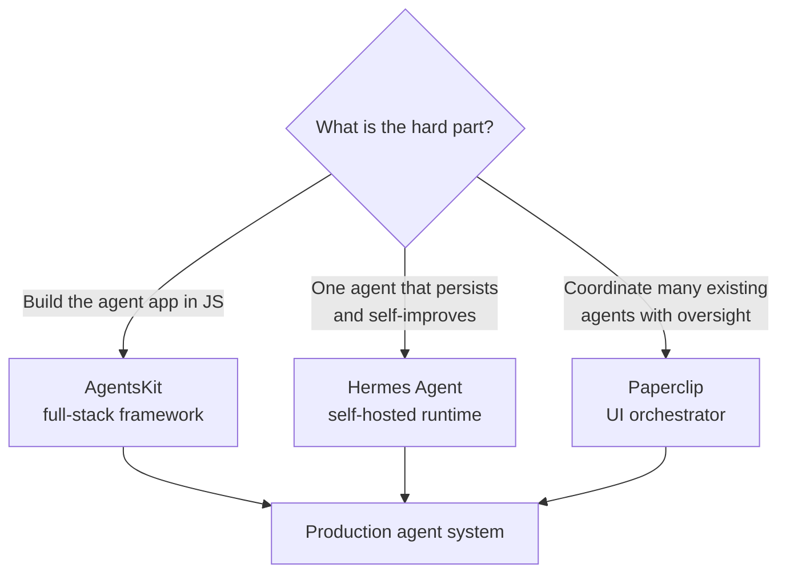

## Definition

An **agent runtime / orchestrator** is the layer that sits *above* an agent framework. A framework (LangGraph, CrewAI, the native APIs — see [frameworks overview](/docs/agents/frameworks-overview)) helps you build one agent loop. A runtime answers the operational questions: where does the agent run, how does it persist memory across days, how do many heterogeneous agents coordinate, and who supervises their cost and output.

Through 2026 this layer matured into three notable open-source projects with distinct philosophies: **AgentsKit** (a batteries-included JavaScript framework), **Hermes Agent** (a persistent self-hosted single agent that improves over time), and **Paperclip** (a UI-driven orchestrator that runs a team of existing agents like a company). They are complementary, not interchangeable.

## How it works

### AgentsKit — full-stack JavaScript agent framework

[AgentsKit](https://www.agentskit.io/) is a TypeScript/JavaScript framework organized into layers: a zero-dependency core (`@agentskit/core`), adapters and a durable runtime (provider routing, ReAct loops), unified UI bindings across React/Vue/Svelte/Angular/Solid/React Native and terminal (Ink), and capability packages for tools, memory (chat / vector / graph / encrypted), RAG, and skills/personas. It adds an MCP bridge, sandboxed code execution, multi-agent topologies, plus observability and eval integrations (Langfuse, Braintrust). Its [for-agents documentation](https://www.agentskit.io/docs/for-agents) is deliberately written as dense, cross-linked package summaries sized to fit in a single LLM context window. AgentsKit is the choice when you want one coherent, end-to-end stack in the JS ecosystem instead of stitching libraries together.

### Hermes Agent — persistent, self-improving single agent

Hermes Agent (Nous Research, released February 2026) is a self-hosted autonomous agent designed to run 24/7 on your own server and **get better with use**. Its differentiators are persistent long-term memory and a built-in data flywheel: it has 11 tool-call parsers, executes tool calls sequentially or concurrently (thread pool, up to 8 workers), supports MCP servers, and can generate thousands of tool-calling trajectories with checkpointing for RL experiments and fine-tuning export. It is a *single* long-lived agent that accumulates context and training signal, not a multi-agent coordinator.

### Paperclip — UI-driven multi-agent orchestrator

Paperclip (released March 2026) is a Node.js server + React UI that organizes *existing* agents — Claude Code, OpenClaw, Codex, Python scripts, HTTP webhooks — into a coordinated "company". You do not code against it like a library; you hire agents in a dashboard, assign goals, and it handles task routing, inter-agent communication, org charts, budgets, governance, and cost tracking. It is self-hosted and requires no account. Paperclip is the choice when you already have working agents and the hard problem is *coordination and oversight* across many of them.

## When to use / When NOT to use

| Use when | Avoid when |
| --- | --- |
| **AgentsKit:** you want one integrated JS/TS stack (UI + runtime + memory + RAG) | You are in Python — use LangGraph / CrewAI instead |
| **Hermes Agent:** you need a durable agent that accumulates memory and training data | You need many specialized agents collaborating in parallel |
| **Paperclip:** you already have agents and need coordination, budgets, governance | You have a single simple agent — the orchestration layer is overkill |
| You are operating agents long-term and need cost/observability | A stateless one-shot script with no persistence requirement |

## Comparison

| | AgentsKit | Hermes Agent | Paperclip |
| --- | --- | --- | --- |
| Layer | Framework | Single-agent runtime | Multi-agent orchestrator |
| Language | TypeScript/JS | Python (self-hosted) | Node.js + React UI |
| Interaction | Code (SDK) | Server process | Dashboard / UI |
| Core strength | End-to-end stack | Persistence + self-improvement | Coordination + governance |
| Brings agents? | Builds them | Is the agent | Orchestrates existing ones |

## Practical guidance

These layers compose. A realistic 2026 stack: build individual agents with AgentsKit (or the native APIs), run a long-lived one as a Hermes Agent for memory-heavy workflows, and place Paperclip on top when you need a team of them working toward business goals with budgets and audit trails. Pick the runtime by your *operational* bottleneck — building, persisting, or coordinating — not by popularity. See also [multi-agent systems](/docs/agents/multi-agent-systems) and [agent evaluation](/docs/agents/evaluation).

## Sources

- AgentsKit — [agentskit.io](https://www.agentskit.io/) and [for-agents docs](https://www.agentskit.io/docs/for-agents)
- Hermes Agent — [Nous Research](https://hermes-agent.nousresearch.com/) and [GitHub](https://github.com/nousresearch/hermes-agent)
- Paperclip — [paperclip.ing](https://paperclip.ing/) and [GitHub](https://github.com/paperclipai/paperclip)
