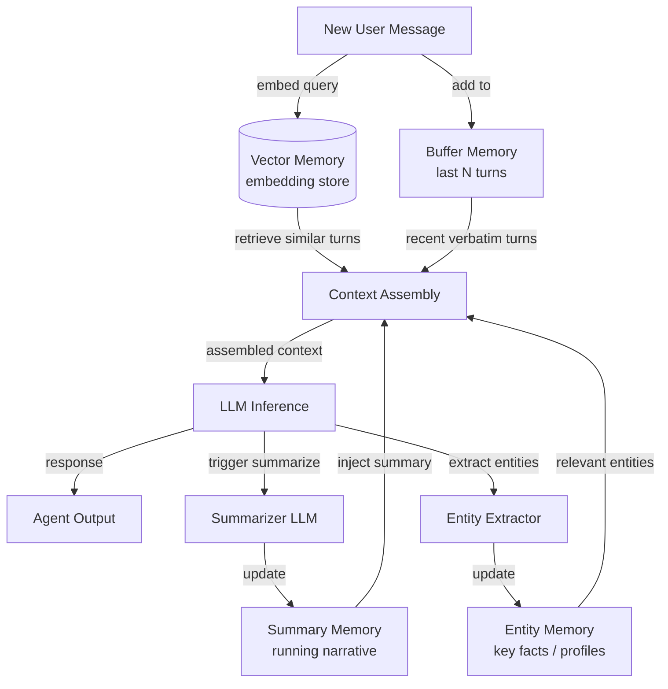

## Definition

Conversational memory refers to the set of techniques that allow a chat agent to retain and utilize information from previous turns in a dialogue. Unlike retrieval-augmented generation, which pulls in external documents, conversational memory is exclusively concerned with what has already been said between the user and the agent. Getting this right is what separates a frustrating chatbot that asks you to repeat yourself from an agent that feels genuinely attentive.

There are several distinct strategies for managing conversation history, each with different trade-offs between cost, fidelity, and scalability. The simplest approach—keeping every message verbatim—works fine for short conversations but quickly exhausts the model's context window. More sophisticated patterns use summarization or semantic indexing to compress or selectively retrieve the history that matters most for the current turn.

Choosing the right memory pattern depends heavily on the expected conversation length, the importance of exact wording versus semantic meaning, and the cost constraints of the deployment. In practice, production chat agents often combine two or more patterns: a short-term verbatim buffer for immediate coherence and a summary or vector layer for long-horizon recall.

## How it works

### Buffer memory

Buffer memory is the most straightforward pattern: the agent maintains an ordered list of the last N message pairs and prepends them to every new context window. When the buffer reaches capacity, the oldest pair is dropped (FIFO). This guarantees that the agent always has access to the most recent exchanges without any transformation or lossy compression. Buffer memory is ideal for short to medium conversations where recency is the primary signal, and it incurs no extra LLM calls. Its main weakness is that older context is silently lost without any summary.

### Summary memory

Summary memory addresses the forgetting problem by using an LLM to periodically generate a running summary of the conversation so far. When the buffer grows too large, the agent condenses it into a compact narrative—capturing key facts, decisions, and sentiment—then discards the raw messages. The summary occupies far fewer tokens than the original turns, making long conversations tractable. The trade-off is a secondary LLM call for each summarization step, which adds latency and cost, and some information is inevitably lost in the compression.

### Vector memory

Vector memory embeds each conversation turn and stores it in a vector database. On each new turn, the most semantically relevant past exchanges are retrieved by similarity search and injected into the context window alongside recent buffer messages. This pattern excels when conversations are very long or when the current question relates to something said many turns ago. Vector memory is the highest-fidelity approach for long-horizon recall but requires embedding infrastructure and introduces retrieval latency.

### Entity memory

Entity memory extracts named entities—people, places, products, preferences—from the conversation and maintains a structured record of what the agent knows about each entity. When an entity is mentioned again, its stored profile is injected into the context. Entity memory is ideal for personal assistant use cases where remembering that "Alice prefers morning meetings" or "the project deadline is June 10" is more valuable than remembering the exact wording of past messages.



## When to use / When NOT to use

| Use when | Avoid when |
|---|---|
| Conversations span more than a handful of turns | The task is single-turn with no need for history |
| Users expect the agent to remember what they said earlier | Conversation data cannot be stored for privacy or compliance reasons |
| Context window costs are significant and history is long | The conversation is always short enough to fit fully in the context window |
| Users discuss multiple entities or topics across the session | Summarization latency is unacceptable for the use case |
| Cross-session recall is required (vector/entity patterns) | Added infrastructure complexity outweighs the fidelity benefit |

## Comparisons

| Criterion | Buffer memory | Summary memory | Vector memory |
|---|---|---|---|
| Cost per turn | Low (no extra LLM call) | Medium (occasional summarizer call) | Medium (embedding call + DB query) |
| Fidelity of recall | Exact but bounded to last N turns | Lossy compression of older turns | High for semantically relevant content |
| Context length handling | Poor — oldest turns silently dropped | Good — summary compresses old turns | Excellent — retrieves only relevant chunks |
| Latency | Minimal | Moderate (summarization adds a step) | Moderate (embedding + nearest-neighbor search) |
| Cross-session recall | No (in-memory buffer) | Possible if summary is persisted | Yes (vector store is persistent) |
| Implementation complexity | Very low | Low–medium | Medium–high |

## Code examples

```python
"""
Conversational memory patterns using LangChain.

Demonstrates:
1. ConversationBufferMemory  — keep verbatim last N messages
2. ConversationSummaryMemory — compress history into a running summary
3. ConversationBufferWindowMemory — sliding window variant
"""
# pip install langchain langchain-openai openai
from langchain.memory import (
    ConversationBufferMemory,
    ConversationSummaryMemory,
    ConversationBufferWindowMemory,
)
from langchain.chains import ConversationChain
from langchain_openai import ChatOpenAI


# ---------------------------------------------------------------------------
# 1. Buffer memory — keeps ALL messages (use for short conversations)
# ---------------------------------------------------------------------------
def demo_buffer_memory():
    llm = ChatOpenAI(model="gpt-4o-mini", temperature=0)
    memory = ConversationBufferMemory(return_messages=True)
    chain = ConversationChain(llm=llm, memory=memory, verbose=False)

    reply1 = chain.predict(input="My name is Alice. I enjoy hiking.")
    reply2 = chain.predict(input="What outdoor activities would you recommend for me?")

    # The second call has access to the first turn verbatim
    print("Buffer memory — reply 2:", reply2)
    print("History length:", len(memory.chat_memory.messages), "messages\n")


# ---------------------------------------------------------------------------
# 2. Summary memory — LLM compresses history on each turn
# ---------------------------------------------------------------------------
def demo_summary_memory():
    llm = ChatOpenAI(model="gpt-4o-mini", temperature=0)
    # The same LLM is used to generate summaries; you can use a cheaper model here
    memory = ConversationSummaryMemory(llm=llm, return_messages=True)
    chain = ConversationChain(llm=llm, memory=memory, verbose=False)

    chain.predict(input="I'm planning a trip to Japan next spring.")
    chain.predict(input="I'm most interested in traditional temples and local food.")
    reply3 = chain.predict(input="Can you suggest a one-week itinerary?")

    print("Summary memory — reply 3:", reply3)
    # The buffer contains only the latest summary, not all past raw messages
    print("Summary:", memory.moving_summary_buffer[:200], "...\n")


# ---------------------------------------------------------------------------
# 3. Window memory — keeps only the last k turns (sliding window)
# ---------------------------------------------------------------------------
def demo_window_memory(k: int = 3):
    llm = ChatOpenAI(model="gpt-4o-mini", temperature=0)
    # k=3 means only the last 3 HumanMessage+AIMessage pairs are retained
    memory = ConversationBufferWindowMemory(k=k, return_messages=True)
    chain = ConversationChain(llm=llm, memory=memory, verbose=False)

    for i in range(6):
        reply = chain.predict(input=f"This is message number {i + 1}.")
        print(f"Turn {i + 1}: {reply[:80]}")

    print(
        f"\nWindow memory keeps {len(memory.chat_memory.messages)} messages "
        f"(max {k * 2} for k={k} turn pairs)\n"
    )


# ---------------------------------------------------------------------------
# Manual entity-style memory (illustrative, no extra dependency)
# ---------------------------------------------------------------------------
def demo_entity_memory_manual():
    """
    Minimal entity memory: parse key facts from each turn and inject them.
    In production, use LangChain's ConversationEntityMemory or a dedicated NER model.
    """
    entity_store: dict[str, str] = {}

    def extract_entities_mock(text: str) -> dict[str, str]:
        """Mock extraction — real impl would call an LLM or NER model."""
        entities = {}
        if "my name is" in text.lower():
            name = text.lower().split("my name is")[-1].strip().split()[0].rstrip(".,")
            entities["user_name"] = name.capitalize()
        if "deadline" in text.lower():
            entities["deadline"] = "mentioned but not parsed in this mock"
        return entities

    turns = [
        ("user", "My name is Bob and my project deadline is end of July."),
        ("user", "Can you help me prioritize my tasks?"),
    ]
    for role, msg in turns:
        entity_store.update(extract_entities_mock(msg))
        entity_context = "; ".join(f"{k}={v}" for k, v in entity_store.items())
        print(f"[{role}] {msg}")
        print(f"  Entity context injected: {entity_context}\n")


if __name__ == "__main__":
    import os

    if os.getenv("OPENAI_API_KEY"):
        demo_buffer_memory()
        demo_summary_memory()
        demo_window_memory()
    else:
        print("Set OPENAI_API_KEY to run LangChain demos.")
    demo_entity_memory_manual()
```

## Practical resources

- [LangChain Memory Docs](https://python.langchain.com/docs/concepts/memory/) — Comprehensive reference for all LangChain memory classes with usage examples.
- [Rethinking Memory in Conversational AI (Lilian Weng)](https://lilianweng.github.io/posts/2023-06-23-agent/#memory) — Deep-dive blog post covering memory taxonomy and design trade-offs in agent systems.
- [MemoryOS: Memory-based Operating System for LLM Agents](https://arxiv.org/abs/2506.06326) — Research on hierarchical memory management inspired by OS design.
- [OpenAI Assistants Thread Management](https://platform.openai.com/docs/assistants/how-it-works/managing-threads) — How OpenAI's managed API handles persistent conversation threads.

## Sources

- [MemGPT: Towards LLMs as Operating Systems (Packer et al., 2023)](https://arxiv.org/abs/2310.08560) — Introduces virtual context management for unbounded long-term agent memory.
- [Cognitive Architectures for Language Agents (Sumers et al., 2023)](https://arxiv.org/abs/2309.02427) — Survey of memory and action architectures for LLM-based agents.
- [Generative Agents: Interactive Simulacra of Human Behavior (Park et al., 2023)](https://arxiv.org/abs/2304.03442) — Demonstrates long-term episodic memory and retrieval in conversational agents.
- [LangChain Memory concepts](https://python.langchain.com/docs/concepts/memory/) — Official documentation for buffer, summary, entity, and vector-backed memory types.

## See also

- [Agent memory](/docs/agents/memory)
- [AI agents](/docs/agents)
- [RAG embeddings](/docs/rag/embeddings)
