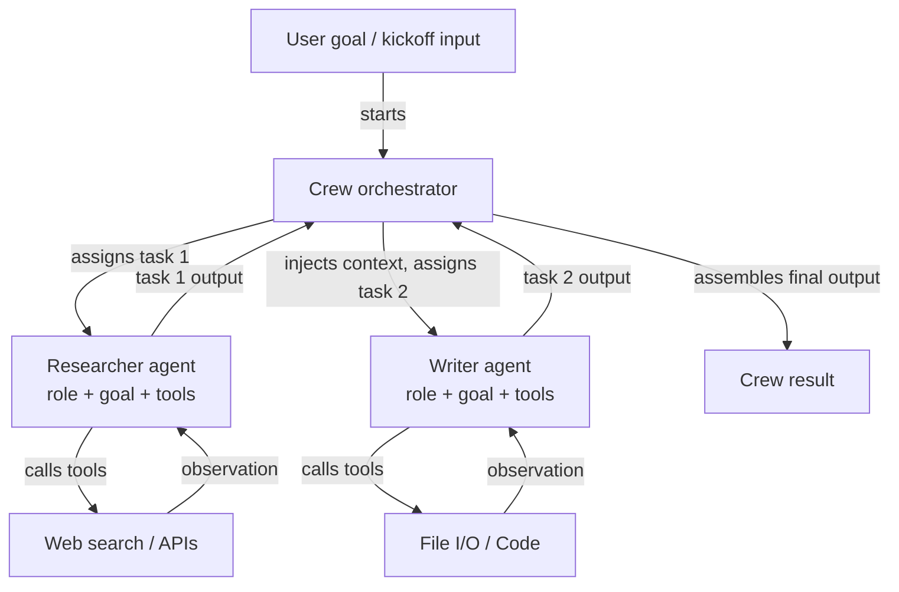

## Definition

CrewAI is an open-source Python framework for orchestrating **role-based multi-agent systems**. Each agent in a crew is defined by three things: a **role** (what the agent does, e.g. "Senior Researcher"), a **goal** (what the agent is trying to achieve, e.g. "Find accurate and up-to-date information"), and a **backstory** (a persona description that shapes the agent's behavior and tone). This structure makes agent behavior intuitive to specify and easy to understand — it mirrors how you would onboard a human team member.

Tasks in CrewAI are discrete units of work assigned to agents. A task has a description, expected output, and optionally context from prior tasks. Tasks are grouped into a **Crew**, which defines the execution process: **sequential** (tasks run one after another, with output from each feeding into the next) or **hierarchical** (a manager agent delegates and coordinates tasks among workers). This declarative model abstracts away the message-passing loop, letting developers focus on *what* needs to be done rather than *how* the agents talk to each other.

CrewAI has built-in tool integration, supporting LangChain tools, custom Python functions decorated with `@tool`, and a growing library of built-in tools (web search, file I/O, code execution). Agents can also be given memory (short-term, long-term, entity memory) to maintain context across task executions and crew runs.

## How it works

### Agents: roles, goals, and backstories

An agent is the fundamental unit of work in CrewAI. You instantiate an `Agent` with a role, goal, and backstory, plus optional tools and an LLM override. The backstory primes the agent's system prompt, giving it a consistent persona across all task interactions. Agents can be configured with `verbose=True` to expose their internal reasoning steps. Each agent operates independently within the crew's orchestration layer, receiving tasks from the process manager and returning structured outputs. Agent memory (when enabled) persists observations between tasks, which is critical for long-running research or analysis workflows.

### Tasks: descriptions, expected outputs, and context

A `Task` object describes what an agent must do, what a good output looks like, and which agent should execute it. Tasks can declare `context` dependencies on other tasks, causing their outputs to be automatically injected as context. Expected output descriptions guide the LLM to produce structured, usable results. Tasks support output formats: plain text, JSON via Pydantic models, or file outputs. When using a hierarchical process, the manager agent uses task descriptions to decide assignment and sequencing dynamically, without requiring the developer to hard-code dependencies.

### Processes: sequential and hierarchical

The `Crew` object ties agents and tasks together and specifies a `Process`. In `Process.sequential`, tasks execute in list order, with each task's output passed to the next. In `Process.hierarchical`, a manager LLM is automatically instantiated to decompose goals, assign work, and review results — enabling emergent coordination without explicit wiring. Sequential is predictable and easy to test; hierarchical is more flexible but less deterministic. Choosing between them depends on whether your workflow has a fixed DAG (sequential) or needs dynamic task allocation (hierarchical).

### Built-in tool integration

CrewAI ships with a `@tool` decorator compatible with LangChain tools, making it easy to equip agents with web search (SerperDev, DuckDuckGo), code execution, file reading/writing, and custom API calls. Tools are registered per-agent, so the researcher agent can have search tools while the writer agent has file tools. Tool descriptions are included in the agent's prompt, and the framework handles the tool-calling loop transparently. For production use, the `CrewAI Tools` package provides a curated set of pre-built integrations.



## When to use / When NOT to use

| Use when | Avoid when |
|---|---|
| Your problem maps naturally to distinct human-like roles (researcher, writer, reviewer) | You need a single agent with tools — CrewAI's overhead is unnecessary |
| You want a declarative, high-level API that hides message-passing complexity | You need precise control over each message exchanged between agents |
| You are building content pipelines, research workflows, or analysis systems | Your workflow requires complex conditional branching or cycles not supported by sequential/hierarchical |
| You want built-in memory and tool integration with minimal configuration | Real-time latency is critical — multi-agent sequential runs add overhead |
| Your team is non-expert in agent frameworks and needs an intuitive API | You need fine-grained observability into every agent interaction at the graph level |

## Comparisons

| Criterion | CrewAI | AutoGen | LangGraph |
|---|---|---|---|
| **Abstraction level** | High: declarative roles, goals, tasks | Medium: conversational agents with message-based API | Low: explicit graph nodes and edges |
| **Multi-agent model** | Role-based crew with sequential or hierarchical processes | Conversation-driven agent pairs or group chats | Subgraphs; single stateful graph with multiple nodes per agent |
| **State management** | Implicit: passed via task context and crew memory | Implicit: message history | Explicit: TypedDict state shared across all nodes |
| **Ease of setup** | Very easy: 10-20 lines for a working multi-agent crew | Moderate: requires understanding agent types and initiation patterns | Harder: requires graph construction mental model |
| **Conditional/cyclic flows** | Limited: sequential is linear, hierarchical is opaque | Limited: depends on agent responses | First-class: conditional edges and cycles are the core feature |

## Code examples

```python
import os
from crewai import Agent, Task, Crew, Process
from crewai_tools import SerperDevTool

# --- Tool setup ---
# Requires SERPER_API_KEY environment variable for web search
search_tool = SerperDevTool()

# --- Agent definitions ---
# Each agent has a role, a goal that guides its behavior, and a backstory
# that sets its persona. Tools are assigned per-agent.

researcher = Agent(
    role="Senior AI Research Analyst",
    goal="Uncover the latest developments and practical applications of AI agent frameworks",
    backstory=(
        "You are an expert AI researcher with 10 years of experience evaluating "
        "LLM frameworks. You excel at finding accurate, up-to-date information "
        "and synthesizing it into clear technical summaries."
    ),
    tools=[search_tool],
    verbose=True,  # shows reasoning steps
    allow_delegation=False,
)

writer = Agent(
    role="Technical Content Writer",
    goal="Transform technical research into clear, engaging documentation",
    backstory=(
        "You are a seasoned technical writer who specializes in AI and machine learning. "
        "You turn dense research into accessible content without losing precision."
    ),
    tools=[],  # writer does not need search tools
    verbose=True,
)

reviewer = Agent(
    role="Editorial Reviewer",
    goal="Ensure accuracy, clarity, and completeness of technical content",
    backstory=(
        "You are a detail-oriented editor with a background in computer science. "
        "You catch technical inaccuracies, improve clarity, and verify all claims."
    ),
    verbose=True,
)

# --- Task definitions ---
# Tasks describe what to do, what output to expect, and which agent executes them.
# Context dependencies are declared explicitly.

research_task = Task(
    description=(
        "Research the current state of AI agent frameworks in 2024-2025. "
        "Focus on CrewAI, AutoGen, LangGraph, and Anthropic Tool Use. "
        "Cover: architecture, use cases, community size, and key differentiators."
    ),
    expected_output=(
        "A structured research report with sections for each framework, "
        "covering architecture, strengths, weaknesses, and best use cases. "
        "Include specific version numbers and recent updates where available."
    ),
    agent=researcher,
)

writing_task = Task(
    description=(
        "Using the research report, write a 500-word technical blog post comparing "
        "the four agent frameworks. Target audience: senior software engineers "
        "who are evaluating frameworks for production use."
    ),
    expected_output=(
        "A well-structured blog post with an introduction, per-framework sections, "
        "a comparison table, and a recommendation section. "
        "Use clear headings and avoid jargon where possible."
    ),
    agent=writer,
    context=[research_task],  # injects research_task output as context
)

review_task = Task(
    description=(
        "Review the blog post for technical accuracy, clarity, and completeness. "
        "Fix any errors and improve readability without changing the core content."
    ),
    expected_output=(
        "A polished, publication-ready blog post with all inaccuracies corrected "
        "and prose improved. Return the full revised text."
    ),
    agent=reviewer,
    context=[writing_task],
)

# --- Crew assembly ---
# Process.sequential runs tasks in order, passing outputs as context.
# Switch to Process.hierarchical for dynamic task allocation by a manager LLM.

crew = Crew(
    agents=[researcher, writer, reviewer],
    tasks=[research_task, writing_task, review_task],
    process=Process.sequential,
    verbose=True,
)

# --- Execution ---
result = crew.kickoff(inputs={"topic": "AI agent frameworks comparison 2025"})
print(result.raw)
```

## Practical resources

- [CrewAI official documentation](https://docs.crewai.com/) — Full reference covering agents, tasks, crews, processes, tools, and memory configuration.
- [CrewAI GitHub repository](https://github.com/crewAIInc/crewAI) — Source code, examples, and issue tracker for the open-source framework.
- [CrewAI Tools documentation](https://docs.crewai.com/concepts/tools) — Pre-built tool integrations: web search, file I/O, code execution, and custom tool creation.
- [CrewAI + LangChain integration guide](https://docs.crewai.com/how-to/llm-connections) — How to configure different LLM providers including OpenAI, Anthropic, and local models.

## Sources

- [CrewAI official documentation](https://docs.crewai.com/) — Authoritative reference for the role-based multi-agent framework.
- [Role Playing with Language Models (Wang et al., 2023)](https://arxiv.org/abs/2303.17760) — Research on assigning personas and roles to LLMs for collaborative task solving.
- [MetaGPT: Meta Programming for A Multi-Agent Collaborative Framework (Hong et al., 2023)](https://arxiv.org/abs/2308.00352) — Related work on structured role assignment in multi-agent LLM systems.
- [AutoGen: Enabling Next-Gen LLM Applications via Multi-Agent Conversation (Wu et al., 2023)](https://arxiv.org/abs/2308.08155) — Contextual reference for the multi-agent conversation paradigm CrewAI builds on.

## See also

- [Agent frameworks overview](/docs/agents/frameworks-overview)
- [AutoGen](/docs/agents/autogen)
- [LangGraph](/docs/agents/langgraph)
- [Multi-agent systems](/docs/agents/multi-agent-systems)
- [AI agents](/docs/agents)
