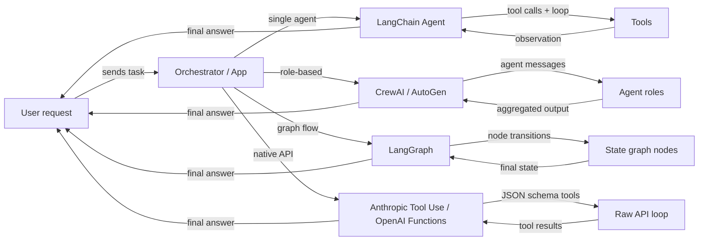

## Definition

An **agent framework** is a library or SDK that handles the infrastructure concerns of building AI agents: tool registration, message passing, state management, orchestration, and integration with LLM providers. Without a framework you write those plumbing layers yourself; with a framework you describe *what* your agent should do and it handles *how* the loop runs.

The agent framework landscape has grown quickly and now spans several distinct categories. Some frameworks focus on a single agent with tools (LangChain agents), others prioritize role-based collaboration between many agents (CrewAI, AutoGen), others model agent behavior as explicit stateful graphs (LangGraph), and some skip the framework entirely and rely on the model provider's native capabilities (Anthropic Tool Use, OpenAI Function Calling). Each category reflects a different philosophy about where control and complexity should live.

Choosing the right framework is not just a technical decision — it shapes how you reason about your system, debug failures, and scale to production. A beginner building a simple research assistant has very different needs than a platform team wiring together a dozen specialized agents in a production pipeline.

## How it works

### Single-agent frameworks (LangChain agents)

Single-agent frameworks give one LLM access to a set of tools and run a loop: the model decides which tool to call, the framework executes it, the observation is appended to the conversation, and the loop continues until the model emits a final answer. LangChain is the canonical example, exposing `create_react_agent` and `AgentExecutor` for straightforward ReAct-style agents. The developer registers tools (Python functions with docstrings or Pydantic schemas) and the framework handles prompt construction and result parsing. Single-agent is the right starting point: lower latency, easier to debug, and simpler to test. Complexity grows when you need multiple specialized roles working in parallel or when state becomes too large for one context window.

### Multi-agent frameworks (CrewAI, AutoGen)

Multi-agent frameworks coordinate several LLM-backed agents, each with its own role, instructions, and tools, toward a shared objective. CrewAI uses a crew metaphor with roles, goals, and backstories; AutoGen uses a conversation metaphor where agents exchange messages. Both support sequential and parallel execution patterns. The framework manages message routing, output passing between agents, and optionally human-in-the-loop checkpoints. Multi-agent approaches shine when the problem decomposes naturally into distinct specializations (researcher, writer, critic) or when you need redundancy and debate to improve output quality.

### Graph-based frameworks (LangGraph)

Graph-based frameworks represent agent behavior as an explicit directed graph: nodes are Python functions (each may call an LLM or a tool), edges are transitions between nodes, and the shared state is a typed dictionary. LangGraph, built on top of LangChain, popularized this approach. Cycles in the graph enable the agent to loop until a termination condition is met; conditional edges allow dynamic routing based on intermediate results. The explicitness of a graph makes complex flows easier to reason about, test in isolation, and persist across interruptions. This is the preferred pattern when you need fine-grained control over execution flow, checkpointing, or human-in-the-loop approvals at specific steps.

### Native tool use (Anthropic Tool Use, OpenAI Function Calling)

Native tool use skips the framework layer entirely and uses the model provider's built-in mechanism for structured function calling. Anthropic's API accepts a `tools` parameter with JSON schema definitions; the model returns `tool_use` blocks that your code executes, then you feed back `tool_result` blocks. OpenAI's equivalent is `functions` / `tools` with `function_call` responses. This approach has minimal abstraction overhead, full control over the loop, and the tightest integration with model-specific features like streaming and parallel tool calls. The tradeoff is that you write the orchestration logic yourself, which is fine for simple use cases but grows complex at scale.



## When to use / When NOT to use

| Use when | Avoid when |
|---|---|
| You need tool-augmented LLM behavior beyond a single prompt | Your task is a one-shot prompt with no external data needs |
| Your problem decomposes into multiple specialized roles (multi-agent) | You need ultra-low latency and cannot afford multi-step loops |
| You want reproducible, inspectable agent flows (graph-based) | Your team lacks the expertise to debug non-deterministic agent loops |
| You want to stay close to the provider API with minimal abstraction (native) | You need rapid prototyping and do not want to write orchestration boilerplate |
| You are building a production system that needs checkpointing and persistence | The task can be solved with a simple RAG pipeline or a single prompt chain |

## Comparisons

| Criterion | CrewAI | AutoGen | LangGraph | Anthropic Tool Use |
|---|---|---|---|---|
| **Architecture** | Role-based crew with tasks and processes | Conversation-driven agent pairs and group chats | Explicit state graph with nodes and edges | Raw API with JSON schema tool definitions |
| **Multi-agent support** | First-class: agents are crew members with roles and goals | First-class: agents converse via a message bus | Possible via subgraphs, but primarily single-agent graphs | Manual: you implement multi-agent coordination yourself |
| **State management** | Implicit: passed between tasks via crew context | Implicit: message history in conversation | Explicit: TypedDict shared state across all nodes | Manual: you maintain your own state dict |
| **Learning curve** | Low: declarative YAML-style API | Medium: requires understanding agent roles and group chat | Medium-High: requires graph theory intuition | Low: just Python + JSON schema, but more boilerplate |
| **Community & ecosystem** | Growing quickly, strong tutorials | Large (Microsoft-backed), strong research community | Rapidly growing, tight LangChain integration | Official Anthropic SDK, well-documented |
| **Best for** | Structured role-based pipelines, content workflows | Research, code-gen, human-in-the-loop experimentation | Complex branching flows, production pipelines | Simple to medium tools, tight model integration |
| **Streaming support** | Limited | Limited | Supported via LangChain streaming | Full streaming via Anthropic SDK |

## Code examples

```python
# --- LangChain agent (single-agent, ReAct) ---
from langchain_anthropic import ChatAnthropic
from langchain.agents import create_react_agent, AgentExecutor
from langchain_core.tools import tool

@tool
def search(query: str) -> str:
    """Search the web for information."""
    return f"Results for: {query}"

llm = ChatAnthropic(model="claude-sonnet-4-6")
agent = create_react_agent(llm, tools=[search])
executor = AgentExecutor(agent=agent, tools=[search])
result = executor.invoke({"input": "What is LangGraph?"})


# --- CrewAI minimal setup ---
from crewai import Agent, Task, Crew

researcher = Agent(role="Researcher", goal="Find accurate information", backstory="Expert researcher")
task = Task(description="Research LangGraph", agent=researcher)
crew = Crew(agents=[researcher], tasks=[task])
result = crew.kickoff()


# --- AutoGen minimal setup ---
import autogen

assistant = autogen.AssistantAgent(name="assistant", llm_config={"model": "gpt-4o"})
user = autogen.UserProxyAgent(name="user", human_input_mode="NEVER")
user.initiate_chat(assistant, message="Explain LangGraph in one paragraph.")


# --- LangGraph minimal setup ---
from langgraph.graph import StateGraph, END
from typing import TypedDict

class State(TypedDict):
    message: str

def process(state: State) -> State:
    return {"message": f"Processed: {state['message']}"}

graph = StateGraph(State)
graph.add_node("process", process)
graph.set_entry_point("process")
graph.add_edge("process", END)
app = graph.compile()
result = app.invoke({"message": "hello"})


# --- Anthropic Tool Use minimal setup ---
import anthropic

client = anthropic.Anthropic()
tools = [{"name": "search", "description": "Search the web", "input_schema": {"type": "object", "properties": {"query": {"type": "string"}}, "required": ["query"]}}]
response = client.messages.create(
    model="claude-opus-4-7",
    max_tokens=1024,
    tools=tools,
    messages=[{"role": "user", "content": "Search for LangGraph documentation."}]
)
```

## Practical resources

- [LangChain Agents documentation](https://python.langchain.com/docs/concepts/agents/) — Comprehensive guide to building agents with LangChain, including ReAct, tool use, and memory.
- [CrewAI official documentation](https://docs.crewai.com/) — Full reference for roles, tasks, crews, and processes in CrewAI.
- [AutoGen documentation (Microsoft)](https://microsoft.github.io/autogen/) — Covers ConversableAgent, group chats, code execution, and human-in-the-loop patterns.
- [LangGraph documentation](https://langchain-ai.github.io/langgraph/) — Graph-based agent state machines, persistence, and human-in-the-loop checkpoints.
- [Anthropic Tool Use guide](https://docs.anthropic.com/en/docs/build-with-claude/tool-use) — Official guide to defining tools with JSON schema and handling tool_use / tool_result message types.
- [AgentsKit](https://www.agentskit.io/) — Production-ready full-stack JavaScript framework for building AI agents with memory, tools, RAG, and multi-agent orchestration

## Beyond frameworks: runtimes and orchestrators

Frameworks help you *build* an agent loop. A separate, fast-growing layer (2026) focuses on *running and coordinating* agents long-term: **AgentsKit** as an end-to-end JS stack, **Hermes Agent** as a persistent self-improving single agent, and **Paperclip** as a UI-driven orchestrator that runs a team of existing agents like a company. If your hard problem is operation rather than construction, see [agent runtimes and orchestrators](/docs/agents/agent-runtimes).

## Sources

- [ReAct: Synergizing Reasoning and Acting in Language Models (Yao et al., 2022)](https://arxiv.org/abs/2210.03629) — Foundational paper on the thought–action–observation loop that underlies most single-agent frameworks.
- [AutoGen: Enabling Next-Gen LLM Applications via Multi-Agent Conversation (Wu et al., 2023)](https://arxiv.org/abs/2308.08155) — Research basis for the conversation-driven multi-agent paradigm.
- [LangGraph official documentation](https://langchain-ai.github.io/langgraph/) — Reference for graph-based agent state machine design.
- [Anthropic Tool Use guide](https://docs.anthropic.com/en/docs/build-with-claude/tool-use) — Official specification for native tool use in Claude agents.
- [Cognitive Architectures for Language Agents (Sumers et al., 2023)](https://arxiv.org/abs/2309.02427) — Survey taxonomizing agent architectures, memory, and reasoning approaches.

## See also

- [Agent runtimes and orchestrators](/docs/agents/agent-runtimes)

- [CrewAI](/docs/agents/crewai)
- [AutoGen](/docs/agents/autogen)
- [LangGraph](/docs/agents/langgraph)
- [Anthropic Tool Use](/docs/agents/anthropic-tool-use)
- [Multi-agent systems](/docs/agents/multi-agent-systems)
- [AI agents](/docs/agents)
