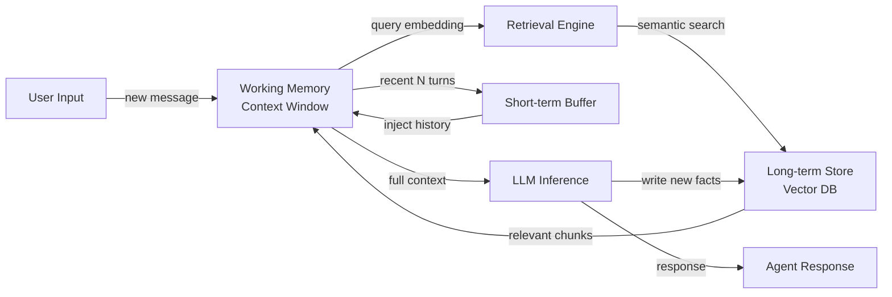

## Definition

Agent memory refers to the mechanisms by which an AI agent stores, indexes, and retrieves information over the course of its operation. Without memory, every interaction starts from a blank slate—the agent cannot learn from past conversations, accumulate facts, or track the state of a long-running task. Memory transforms a stateless LLM call into a persistent, goal-directed system.

In cognitive science, memory is divided into several types: working memory (active information held in mind right now), short-term memory (recent events retained for a limited period), and long-term memory (durable knowledge that persists indefinitely). AI agents mirror this taxonomy closely. The LLM's context window acts as working memory; a sliding buffer of recent messages serves as short-term memory; and an external store—often a vector database—serves as long-term memory.

Memory is what enables multi-turn reasoning. When an agent needs to answer a follow-up question, execute a plan over multiple steps, or remember a user's preferences from a previous session, it is drawing on one or more of these memory layers. Designing memory correctly determines whether an agent feels like a knowledgeable assistant or an amnesiac chatbot.

## How it works

### Working memory and the context window

The context window is the most immediate form of memory available to any LLM-backed agent. All messages, tool results, and intermediate thoughts within a single inference call reside in working memory. Typical context windows range from 8K to 200K tokens, setting a hard ceiling on how much the agent can actively reason over at once. When this limit is approached, older information must either be summarized, compressed, or evicted to make room. Working memory is fast and zero-latency but entirely volatile—it vanishes when the call ends.

### Short-term buffer memory

Short-term memory is implemented as a rolling buffer that holds the last N conversation turns. When a new turn arrives, the oldest turn is dropped if the buffer is full. This approach is simple, cheap, and sufficient for conversational continuity within a single session. The buffer is usually serialized and passed back into the context window at the start of each new inference call. Its main limitation is that it does not scale to long sessions or cross-session recall.

### Long-term semantic memory

Long-term memory uses an external persistent store—typically a vector database—to hold embeddings of past events, facts, and summaries. When the agent needs to recall something, it embeds the current query and performs approximate nearest-neighbor search to retrieve the most semantically relevant memories. Retrieved chunks are injected into the context window before inference. This pattern scales to millions of stored facts and supports cross-session recall, but adds retrieval latency and requires an embedding model.

### Episodic vs semantic memory

Episodic memory stores specific past events with their context: "In session 23, the user asked about refund policy and was frustrated." Semantic memory stores general world knowledge or accumulated facts: "The refund window is 30 days." Both types can coexist in the same vector store, distinguished by metadata. Episodic memory is valuable for personalization; semantic memory is valuable for grounding the agent in domain knowledge.

### Retrieval loop

The retrieval loop connects all layers. On each turn, the agent queries long-term memory for relevant context, merges it with the short-term buffer, and feeds the combined context into the LLM's working memory. After generation, important facts from the new turn can be written back to long-term storage, closing the loop.



## When to use / When NOT to use

| Use when | Avoid when |
|---|---|
| The agent must recall information from previous sessions or turns | The task is fully self-contained in a single prompt with no follow-up |
| Users expect personalization based on past interactions | Memory storage cost or latency is unacceptable for the use case |
| The agent tracks long-running tasks with many intermediate results | The context window is large enough to hold all relevant information |
| Domain knowledge exceeds what fits in a single context window | Privacy requirements prohibit storing user conversation data |
| You need consistent behavior across multiple agent invocations | The added complexity outweighs the marginal benefit of persistence |

## Pros and cons

| Pros | Cons |
|---|---|
| Enables multi-turn and cross-session continuity | Long-term stores add retrieval latency |
| Supports personalization and user-specific context | Vector databases introduce infrastructure complexity |
| Scales beyond context window limits | Retrieval quality depends on embedding model accuracy |
| Episodic memory improves user experience significantly | Memory staleness requires eviction or update strategies |
| Semantic memory grounds the agent in domain knowledge | Privacy and data retention policies must be managed explicitly |

## Code examples

```python
"""
Simple agent memory implementation combining a list-based short-term buffer
with a vector-based long-term store using sentence-transformers and numpy.
"""
from __future__ import annotations

import json
import numpy as np
from dataclasses import dataclass, field
from typing import Optional
from sentence_transformers import SentenceTransformer  # pip install sentence-transformers


# ---------------------------------------------------------------------------
# Short-term buffer memory (last N turns)
# ---------------------------------------------------------------------------

@dataclass
class ShortTermMemory:
    """Keeps the most recent `max_turns` conversation turns in a list."""
    max_turns: int = 10
    turns: list[dict] = field(default_factory=list)

    def add(self, role: str, content: str) -> None:
        self.turns.append({"role": role, "content": content})
        # Evict oldest turn when capacity is exceeded
        if len(self.turns) > self.max_turns:
            self.turns.pop(0)

    def get_history(self) -> list[dict]:
        """Return all buffered turns for injection into the context window."""
        return list(self.turns)


# ---------------------------------------------------------------------------
# Long-term vector memory (semantic retrieval)
# ---------------------------------------------------------------------------

@dataclass
class LongTermMemory:
    """
    Simple in-memory vector store backed by numpy.
    In production, replace with Chroma, Pinecone, or pgvector.
    """
    model_name: str = "all-MiniLM-L6-v2"
    _model: Optional[SentenceTransformer] = field(default=None, init=False, repr=False)
    _texts: list[str] = field(default_factory=list, init=False)
    _embeddings: Optional[np.ndarray] = field(default=None, init=False)

    @property
    def model(self) -> SentenceTransformer:
        if self._model is None:
            self._model = SentenceTransformer(self.model_name)
        return self._model

    def store(self, text: str) -> None:
        """Embed and store a piece of text in long-term memory."""
        embedding = self.model.encode([text])  # shape: (1, dim)
        self._texts.append(text)
        if self._embeddings is None:
            self._embeddings = embedding
        else:
            self._embeddings = np.vstack([self._embeddings, embedding])

    def retrieve(self, query: str, top_k: int = 3) -> list[str]:
        """Return the top_k most semantically similar stored memories."""
        if not self._texts:
            return []
        query_emb = self.model.encode([query])  # shape: (1, dim)
        # Cosine similarity
        norms = np.linalg.norm(self._embeddings, axis=1, keepdims=True)
        normed = self._embeddings / (norms + 1e-9)
        query_norm = query_emb / (np.linalg.norm(query_emb) + 1e-9)
        scores = (normed @ query_norm.T).flatten()
        top_indices = np.argsort(scores)[::-1][:top_k]
        return [self._texts[i] for i in top_indices]


# ---------------------------------------------------------------------------
# Agent with combined memory
# ---------------------------------------------------------------------------

class MemoryAgent:
    """
    A simple agent that combines short-term buffer and long-term vector memory.
    Uses a mock LLM call for illustration; replace with openai.chat.completions.create.
    """

    def __init__(self, max_short_term_turns: int = 6):
        self.short_term = ShortTermMemory(max_turns=max_short_term_turns)
        self.long_term = LongTermMemory()
        self.system_prompt = "You are a helpful assistant with access to past context."

    def _build_context(self, user_message: str) -> list[dict]:
        """Combine long-term retrieval + short-term buffer into a message list."""
        # Retrieve relevant memories from long-term store
        memories = self.long_term.retrieve(user_message, top_k=3)
        memory_block = "\n".join(f"- {m}" for m in memories) if memories else "None"

        messages = [
            {"role": "system", "content": self.system_prompt},
            {"role": "system", "content": f"Relevant past context:\n{memory_block}"},
        ]
        # Append recent conversation history
        messages.extend(self.short_term.get_history())
        # Append the current user message
        messages.append({"role": "user", "content": user_message})
        return messages

    def chat(self, user_message: str) -> str:
        """Process a user message and return the agent's response."""
        messages = self._build_context(user_message)

        # --- Replace this mock with a real LLM call ---
        # import openai
        # response = openai.chat.completions.create(model="gpt-4o", messages=messages)
        # reply = response.choices[0].message.content
        reply = f"[Mock LLM reply to: {user_message!r} with {len(messages)} context messages]"
        # ----------------------------------------------

        # Update short-term buffer
        self.short_term.add("user", user_message)
        self.short_term.add("assistant", reply)

        # Write important facts to long-term memory (in production, use LLM to decide)
        self.long_term.store(f"User said: {user_message}")
        self.long_term.store(f"Assistant replied: {reply}")

        return reply


# ---------------------------------------------------------------------------
# Example usage
# ---------------------------------------------------------------------------
if __name__ == "__main__":
    agent = MemoryAgent(max_short_term_turns=4)

    turns = [
        "My name is Alice and I prefer concise answers.",
        "What is the capital of France?",
        "What did I say my name was?",
    ]
    for turn in turns:
        print(f"User: {turn}")
        print(f"Agent: {agent.chat(turn)}\n")
```

## Practical resources

- [LangChain Memory Concepts](https://python.langchain.com/docs/concepts/memory/) — Official LangChain documentation covering all built-in memory types and when to apply each.
- [MemGPT: Towards LLMs as Operating Systems](https://arxiv.org/abs/2310.08560) — Research paper introducing virtual context management for unbounded agent memory, comparable to OS virtual memory.
- [Chroma – Open-source embedding database](https://docs.trychroma.com/) — Popular lightweight vector store used in many agent memory implementations.
- [OpenAI Assistants Threads](https://platform.openai.com/docs/assistants/how-it-works/managing-threads) — How OpenAI's managed agent API handles conversation threads and persistent memory.

## Sources

- [MemGPT: Towards LLMs as Operating Systems (Packer et al., 2023)](https://arxiv.org/abs/2310.08560) — Introduces virtual context management for persistent agent memory beyond a fixed context window.
- [Generative Agents: Interactive Simulacra of Human Behavior (Park et al., 2023)](https://arxiv.org/abs/2304.03442) — Demonstrates episodic memory retrieval and reflection in long-running agent simulations.
- [Cognitive Architectures for Language Agents (Sumers et al., 2023)](https://arxiv.org/abs/2309.02427) — Taxonomy of memory types (in-context, external, parametric) used in LLM agents.
- [Retrieval-Augmented Generation for Knowledge-Intensive NLP Tasks (Lewis et al., 2020)](https://arxiv.org/abs/2005.11401) — Foundation for retrieval-based external memory in agents.

## See also

- [AI agents](/docs/agents)
- [Conversational memory](/docs/agents/conversational-memory)
- [RAG](/docs/rag)
