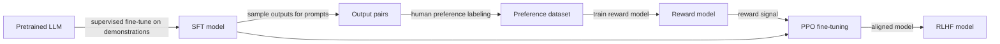

## Definition

Alignment methods are training techniques that steer a language model's behavior to match human values, intentions, and safety requirements after initial pretraining. Pretraining on raw internet text produces models that mimic data distribution well but may generate harmful, false, or unhelpful content. Alignment is the process of shaping model behavior via additional training signals derived from human preferences or explicit principles.

The major approaches as of 2025-2026:

- **RLHF (Reinforcement Learning from Human Feedback)** — humans rank model outputs; a reward model is trained on these rankings; the LLM is fine-tuned via RL (usually PPO) to maximize the reward model. Used to align GPT-4, Claude 1-2, Gemini, and Llama 2-Chat.
- **Constitutional AI (CAI)** — introduced by Anthropic; the model critiques and revises its own outputs against a set of written principles (a "constitution"), generating preference data without human labelers for the harmlessness dimension. Used in Claude 3+.
- **Direct Preference Optimization (DPO)** — reformulates RLHF into a classification objective without requiring explicit RL. Given a preference dataset of (prompt, chosen, rejected) triples, DPO directly updates the LLM to prefer chosen over rejected responses. Simpler to implement and often matches or exceeds RLHF quality.
- **Scalable oversight** — techniques designed to align models even when human evaluators cannot reliably judge model outputs at capability level (e.g., debate, recursive reward modeling, weak-to-strong generalization).

## How it works

### RLHF pipeline

1. **SFT** — fine-tune on high-quality human-written demonstrations.
2. **Reward model** — train a classifier that scores outputs by predicted human preference.
3. **PPO** — use RL to update the policy LLM to maximize the reward model score, with a KL penalty against the SFT model to prevent reward hacking.

### Constitutional AI

CAI replaces human harmlessness labelers with model self-critique. A "red" model samples potentially harmful responses; a "critic" model iteratively revises them according to the constitution (e.g., "Does this response respect user autonomy? Revise if not"). The resulting revised responses form a preference dataset for DPO or RLHF.

### DPO training objective

Given a preference dataset D = \{(x, y_w, y_l)\}, DPO optimizes:

`L_DPO = -E[log σ(β log π_θ(y_w|x)/π_ref(y_w|x) - β log π_θ(y_l|x)/π_ref(y_l|x))]`

where π_ref is the SFT reference policy and β controls KL divergence from the reference. No separate reward model or RL loop is needed.

## When to use / When NOT to use

| Scenario | Recommended approach | Notes |
|---|---|---|
| General-purpose chat alignment (helpfulness + safety) | RLHF or DPO on human preference data | DPO is simpler to implement |
| Large-scale harmlessness alignment without human labelers | Constitutional AI | Reduces annotation cost |
| Aligning on domain-specific preferences (medical, legal) | DPO on domain preference pairs | Faster iteration than RLHF |
| Aligning models that exceed human ability to judge | Scalable oversight (debate, RRM) | Active research area, not yet production standard |
| Small teams, limited compute | DPO with TRL library — no RL infrastructure | RLHF PPO requires more engineering |

## Sources

- [RLHF — Training language models to follow instructions with human feedback (InstructGPT, OpenAI, 2022)](https://arxiv.org/abs/2203.02155)
- [Constitutional AI — Harmlessness from AI Feedback (Anthropic, 2022)](https://arxiv.org/abs/2212.08073)
- [Direct Preference Optimization (DPO — Rafailov et al., 2023)](https://arxiv.org/abs/2305.18290)
- [Scalable oversight — Supervising Strong Learners (Irving et al., 2018)](https://arxiv.org/abs/1805.00899)
- [Weak-to-Strong Generalization (OpenAI, 2023)](https://arxiv.org/abs/2312.09390)

## See also

- [AI safety](/docs/ai-safety)
- [Red teaming](/docs/ai-safety/red-teaming)
- [Interpretability](/docs/ai-safety/interpretability)
- [RLHF](/docs/rl/rlhf)
- [LLMs](/docs/llms)
