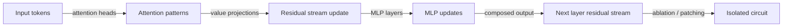
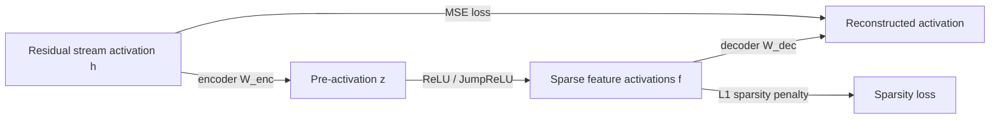

## Definition

Interpretability (also called mechanistic interpretability or mech interp) is the field that studies the internal computations of neural networks to understand *why* they produce the outputs they do. Unlike explainability methods that produce post-hoc attributions (SHAP, LIME), mechanistic interpretability attempts to reverse-engineer the actual algorithms encoded in a model's weights and activations.

The field distinguishes three levels of analysis:

- **Feature identification** — what concepts do individual neurons or directions in activation space represent? (e.g., "token 312 in layer 7 activates for names of European cities")
- **Circuit analysis** — how do groups of attention heads and MLP neurons interact to implement specific behaviors? (e.g., the indirect object identification circuit in GPT-2)
- **Full model understanding** — can we derive a complete, faithful algorithmic description of the model? (Open research problem)

**Sparse Autoencoders (SAEs)** have emerged as the primary tool for scalable mechanistic interpretability of LLMs. SAEs decompose the dense superposition of features in residual stream activations into a sparse, human-interpretable basis — finding thousands to millions of monosemantic features corresponding to coherent concepts (e.g., "DNA", "the concept of trust", "base64 encoding"). Anthropic's interpretability research using SAEs on Claude has become a leading line of work in the field.

## How it works

### Neuron / feature analysis

Early interpretability examined individual neurons — plotting the inputs that maximally activate a neuron to infer what it "detects". Modern transformer analysis focuses on directions in activation space rather than individual neurons because the residual stream is polysemantic: a single neuron may encode multiple unrelated features simultaneously (superposition hypothesis).

### Circuit discovery

Activation patching (causal tracing) identifies which components are causally responsible for a behavior by replacing activations from a "clean" run with those from a "corrupted" run and measuring the effect on output. This isolates the minimal set of components — the circuit — responsible for a capability.

### Sparse Autoencoders (SAEs)

An SAE is a shallow autoencoder trained to reconstruct residual stream activations using a sparse hidden layer with far more dimensions than the residual stream (e.g., 4096-dim residual → 32768-dim SAE). The L1 penalty forces most features to be zero for any given input. Each active feature can then be analyzed by inspecting which inputs activate it — yielding monosemantic, human-interpretable concepts.

## When to use / When NOT to use

| Scenario | Use interpretability | Notes |
|---|---|---|
| Auditing a model for unexpected internal representations | SAE feature analysis — scalable, systematic | Core use case for safety auditing |
| Debugging a capability failure or unexpected behavior | Activation patching / circuit analysis — localizes the cause | Requires access to model weights and activations |
| Post-hoc explanation for end users (SHAP, LIME) | Attribution methods — faster, model-agnostic | Not mechanistic but practical for compliance |
| Black-box API model | Limited — can only study input-output behavior | No access to internals |
| Research on model capabilities and safety | Mechanistic interp — deepest understanding | Significant engineering investment |

## Sources

- [Anthropic — Scaling Monosemanticity: Extracting Interpretable Features from Claude (2024)](https://transformer-circuits.pub/2024/scaling-monosemanticity/index.html)
- [Circuits Thread — In-context Learning and Induction Heads (Olsson et al., 2022)](https://transformer-circuits.pub/2022/in-context-learning-and-induction-heads/index.html)
- [Towards Monosemanticity (Elhage et al., Anthropic, 2023)](https://transformer-circuits.pub/2023/monosemantic-features/index.html)
- [Interpretability in the Wild — IOI circuit in GPT-2 (Wang et al., 2022)](https://arxiv.org/abs/2211.00593)
- [SAEBench — Evaluating Sparse Autoencoders (2024)](https://arxiv.org/abs/2408.11508)

## See also

- [AI safety](/docs/ai-safety)
- [Alignment methods](/docs/ai-safety/alignment-methods)
- [Red teaming](/docs/ai-safety/red-teaming)
- [Explainable AI](/docs/xai)
