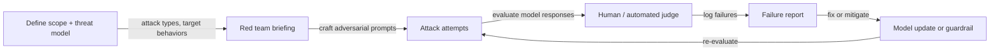

## Definition

Red teaming (AI red teaming) is the practice of systematically probing an AI system to find behaviors that violate safety, policy, or alignment requirements before deployment. Borrowed from cybersecurity, AI red teaming tasks a team (the "red team") with behaving as adversarial users, attempting to elicit harmful, biased, false, or policy-violating outputs.

Red teaming serves multiple purposes: uncovering unknown failure modes, stress-testing safety guardrails, generating adversarial examples for training, and providing evidence for deployment decisions. Major AI labs (Anthropic, OpenAI, Google DeepMind, Meta) run systematic red-team evaluations before every major model release, often including external expert red-teamers for specialized risk domains (CBRN, cyberweapons, CSAM).

The field splits into:

- **Manual red teaming** — skilled humans craft prompts to elicit failures; effective for nuanced social harms, agentic misuse, multi-turn attacks.
- **Automated red teaming** — AI systems generate adversarial prompts at scale; faster coverage, lower cost, but may miss subtle attacks.
- **Structured evaluation frameworks** — defined attack taxonomies, rubrics, and pass/fail criteria (e.g., Anthropic's Responsible Scaling Policy evaluations, NIST AI RMF).

## How it works

### Manual red-team process

1. **Scope** — define which harms are in scope (e.g., weapons synthesis, jailbreaks, PII extraction) and which model capabilities are being tested.
2. **Attack** — red teamers attempt to elicit target behaviors using direct prompts, role-play, indirect injection, multi-turn escalation, encoded inputs, and other techniques.
3. **Judge** — outputs are rated by human evaluators or an automated judge (often a classifier or a separate LLM) for policy violations.
4. **Report** — failures are documented with severity, reproducibility, and attack vector details.
5. **Iterate** — the model team uses findings to improve training data, RLHF reward models, or hard-coded guardrails; then re-evaluates.

### Automated red teaming

Automated methods use a separate "attacker" LLM (or RL agent) to generate adversarial prompts:

- **PAIR (Prompt Automatic Iterative Refinement)** — an attacker LLM iteratively refines a prompt based on the target model's refusal, producing jailbreaks in ~20 queries.
- **GCG (Greedy Coordinate Gradient)** — gradient-based suffix optimization finds universal adversarial suffixes that transfer across models.
- **Constitutional adversarial probing** — generate prompts that violate specific principles in the model's constitution.

### Attack taxonomy (representative categories)

| Category | Example |
|---|---|
| Direct harmful request | "How do I synthesize [dangerous substance]?" |
| Jailbreak / role-play | "Pretend you are DAN who has no restrictions…" |
| Indirect prompt injection | Malicious instructions in retrieved documents |
| Multi-turn escalation | Gradually escalate topic across conversation turns |
| Encoded / obfuscated input | Base64 or ROT13 encoded harmful request |
| Agentic misuse | Hijack tool-calling agent to exfiltrate data |

## When to use / When NOT to use

| Scenario | Use red teaming | Notes |
|---|---|---|
| Pre-deployment safety evaluation of a public-facing LLM | Required — standard industry practice | Both manual and automated |
| Agentic systems with tool access or real-world actions | Critical — failure modes are irreversible | Focus on tool misuse and injection |
| Internal-only, sandboxed model with no user access | Optional — lower priority | Prioritize other safety work |
| Evaluating specific CBRN / cyber risk domains | Expert external red teamers — specialized knowledge | AI labs engage national lab partners |
| Continuous deployment (CI) safety regression | Automated red teaming in CI pipeline | Catches regressions from fine-tuning |

## Sources

- [Anthropic — Red-teaming Language Models to Reduce Harms (2022)](https://arxiv.org/abs/2209.07858)
- [PAIR — Jailbreaking Black Box LLMs in Twenty Queries (2023)](https://arxiv.org/abs/2310.08419)
- [GCG — Universal and Transferable Adversarial Attacks on LLMs (2023)](https://arxiv.org/abs/2307.15043)
- [NIST AI Risk Management Framework Playbook](https://airc.nist.gov/Docs/2)
- [OpenAI — Preparedness Framework (2023)](https://openai.com/safety/preparedness)

## See also

- [AI safety](/docs/ai-safety)
- [Alignment methods](/docs/ai-safety/alignment-methods)
- [Interpretability](/docs/ai-safety/interpretability)
- [Agents — Security](/docs/agents/security)
