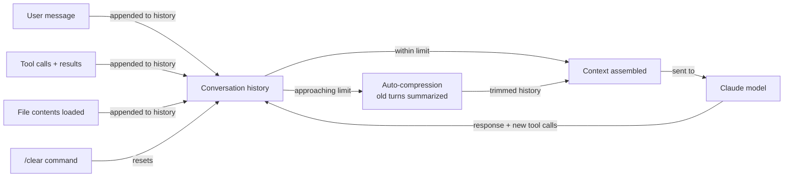

## Definition

Context management refers to the strategies and mechanisms Claude Code uses to keep conversations effective within the finite bounds of the model's context window. Every model has a maximum context window — the total number of tokens it can process in a single request — and that window must accommodate the system prompt, tool definitions, the entire conversation history (user messages, assistant responses, tool calls, and tool results), and any file contents loaded during the session. When the cumulative context approaches the limit, something must give: either old content is compressed or discarded, or the session must be reset.

Understanding context management is particularly important for long Claude Code sessions. A straightforward debugging session might consume the full context window after 30-50 turns, especially if Claude reads multiple large files, runs commands with verbose output, or accumulates many rounds of tool calls. Developers who are unaware of context limits may notice that Claude starts to "forget" earlier decisions, give inconsistent answers, or appear confused about prior context — these are symptoms of context pressure, not model failure.

Claude Code addresses context limits through a combination of automatic mechanisms (context compression, selective file loading) and user-controlled strategies (the `/clear` command, focused task scoping, CLAUDE.md for persistent conventions). Effective context management is not just about avoiding errors — it is about designing sessions that stay sharp and accurate from start to finish by keeping the most relevant information in the active window at all times.

## How it works

### Context window structure

The context window is divided into several zones, each contributing to the total token count. The **system prompt zone** contains CLAUDE.md instructions and tool definitions — these are relatively stable and can be cached (see prompt caching). The **conversation history zone** grows with every turn: each user message, assistant response, tool call, and tool result adds tokens. The **file content zone** contains the actual source code and file contents that Claude has read during the session. As the session progresses, the conversation history and file content zones grow until they approach the model's limit.

### Automatic context compression

When Claude Code detects that the context window is approaching its limit, it applies automatic compression to the conversation history. The compression algorithm identifies older turns that are less likely to be needed for the current task and summarizes or truncates them. Tool results — especially large ones like directory listings or long file contents — are preferentially compressed because they contain raw data that the model has already processed. The goal is to preserve the logical thread of the conversation while shedding the verbatim content of older turns. Users may notice compressed summaries appearing in place of earlier detailed exchanges.

### Selective file loading

Claude Code does not pre-load all project files into the context at session start. Instead, it uses a just-in-time loading strategy: files are read with the `Read` or `Glob` tool only when Claude determines they are relevant to the current task. This keeps the initial context small and focused. However, as the session progresses and Claude reads more files, the file contents accumulate in the context. For very large codebases, Claude may need to selectively re-read specific files rather than keeping all previously read files in the active window.

### The /clear command

The `/clear` command discards the entire conversation history and starts a fresh session. It is the most aggressive form of context management — equivalent to closing and reopening the terminal. Use it between unrelated tasks, after completing a major feature, or when context drift (contradictory or stale information in the history) is causing confusing behavior. CLAUDE.md instructions and project configuration survive `/clear` because they are reloaded from the file system at the start of every session.



## When to use / When NOT to use

| Use when | Avoid when |
|---|---|
| Starting a new, unrelated task — use `/clear` to begin with a clean context | The conversation history contains critical decisions or discoveries you still need |
| The session has been running for many turns and Claude seems confused — context drift is a sign | You are in the middle of a multi-step task where prior context is actively needed |
| You are loading very large files — consider `/clear` first and load only what the current task needs | The session is short and context pressure is not yet a concern |
| You want to benchmark response quality — a fresh context gives a clean baseline | You rely on CLAUDE.md for project context — `/clear` preserves it, but session-specific context is lost |
| You are writing a CLAUDE.md that captures important project context so it survives `/clear` | The "confusion" is actually a model limitation unrelated to context — more context won't help |

## Code examples

```bash
# Context management strategies in a Claude Code session

# Strategy 1: Use /clear between unrelated tasks
# Working on feature A...
claude
> Implement the user registration endpoint in src/routes/auth.ts
> Add validation for email format and password strength
> Write the unit tests for the new endpoint

# Feature A is done. Switch to a completely different task.
> /clear    # Reset context — start fresh for unrelated work
> Refactor the logging module in src/utils/logger.ts to use structured JSON output

# ---

# Strategy 2: Scope tasks narrowly to avoid loading unnecessary files
# BAD: Loads everything, inflates context early
> Read all files in the src/ directory and tell me how authentication works

# GOOD: Targeted question that loads only relevant files
> How does authentication work? Start by reading src/routes/auth.ts and src/middleware/auth.ts

# ---

# Strategy 3: Summarize before /clear to preserve key decisions
> Before I run /clear, summarize the architectural decisions we made in this session
  so I can paste them into CLAUDE.md

# Paste the summary into CLAUDE.md, then:
> /clear    # Now the decisions persist via CLAUDE.md across future sessions

# ---

# Strategy 4: Use focused sessions for large codebases
# Instead of one giant session, break work into focused chunks
# Session 1: Understand the data model
claude
> Read src/models/ and explain the database schema and entity relationships
> /exit

# Session 2: Implement a specific feature
claude
> Given our Prisma schema in prisma/schema.prisma, add a 'tags' relation to Post
```

```bash
# Monitoring context usage (verbose mode)
claude --verbose

# Look for token count indicators in the verbose output:
# "Context: 45,231 / 200,000 tokens (22%)"
# When this approaches 80-90%, consider /clear or wrapping up the session

# The model will also proactively warn you when context is getting full:
# "Note: This session is using a significant portion of the context window.
#  Consider using /clear before starting unrelated tasks."
```

```markdown
# CLAUDE.md pattern: capturing session context for future sessions
# This lets important discoveries survive /clear

## Current architecture decisions (updated 2026-04-01)
- Authentication uses JWT with 24h access tokens and 30d refresh tokens stored in httpOnly cookies
- All database queries go through the repository layer in src/repositories/ — never call Prisma directly from routes
- We decided against Redis for session storage in favor of stateless JWT (revisit if auth rate-limiting is needed)
- The `UserService` was split into `UserAuthService` and `UserProfileService` in the April 2026 refactor

## Known complexity areas (read these files before touching related code)
- `src/services/billing.ts` — complex subscription state machine, read the inline comments carefully
- `src/middleware/rateLimit.ts` — custom sliding window implementation, not a standard library
```

## Practical resources

- [Claude Code context and memory](https://docs.anthropic.com/en/docs/claude-code/memory) — Official guide to how Claude Code manages context, including /clear and CLAUDE.md for persistent memory.
- [Claude model context windows](https://docs.anthropic.com/en/docs/about-claude/models) — Token limits for each Claude model variant.
- [Prompt caching documentation](https://docs.anthropic.com/en/docs/build-with-claude/prompt-caching) — How to cache stable context portions to reduce cost and latency in long sessions.
- [Claude Code CLI reference](https://docs.anthropic.com/en/docs/claude-code/cli-reference) — Full list of slash commands including /clear and /compact.

## See also

- [Claude Code overview](/docs/claude-code)
- [Prompt caching](/docs/claude-code/prompt-caching)
- [CLAUDE.md configuration](/docs/claude-code/claude-md)
