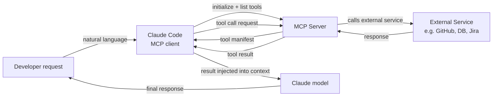

## Definition

The Model Context Protocol (MCP) is an open standard developed by Anthropic that defines how AI models communicate with external data sources and tools. In the context of Claude Code, MCP servers are plugins that extend the set of tools available to Claude beyond its built-in capabilities (file system access, shell commands, git). With MCP, Claude can query databases, call external APIs, browse the web, read Jira tickets, query Grafana dashboards, interact with GitHub, and do anything else that an MCP server implements — all through the same natural language interface as built-in tools.

MCP follows a client-server architecture. Claude Code acts as an **MCP client**: it discovers available MCP servers from configuration, connects to them at session start, and queries them for the list of tools they expose. Each MCP server exposes a set of **tools** (functions with JSON Schema input definitions, identical in structure to built-in tools), optional **resources** (read-only data sources like documentation or database schemas), and optional **prompts** (reusable prompt templates). When Claude decides to call an MCP tool, Claude Code routes the call to the appropriate server, executes the operation, and returns the result to the model as a tool result.

The key benefit of MCP over ad-hoc tool integrations is standardization. Before MCP, every AI assistant had its own proprietary plugin format. MCP defines a universal protocol so that an MCP server written once can work with any MCP-compatible client — Claude Code, Claude Desktop, or any other MCP client. This means the ecosystem of available integrations is growing rapidly, and building a new integration does not require understanding Claude-specific internals.

## How it works

### MCP server types and transports

MCP servers come in two transport varieties. **stdio servers** run as local subprocesses: Claude Code spawns the server process at session start and communicates via stdin/stdout using JSON-RPC. Stdio servers are the most common type for local tools (database clients, file processors, specialized code analysis). **SSE (Server-Sent Events) servers** run as persistent HTTP servers and communicate over a network connection. SSE servers are better for remote services, shared team infrastructure, or servers that need to maintain state across multiple client connections.

### Configuration and discovery

MCP servers are configured in Claude Code's settings file, typically at `~/.claude/settings.json` for global configuration or `.claude/settings.json` for project-specific servers. Each server entry specifies a name, transport type, and the command (for stdio) or URL (for SSE) needed to start or connect to it. Claude Code reads this configuration at session start, initializes connections to all configured servers, and fetches their tool manifests. The tools from all connected MCP servers appear in the model's tool list alongside built-in tools — from the model's perspective, there is no difference.

### Tool invocation flow

When Claude decides to call an MCP tool, Claude Code acts as the intermediary: it serializes the tool call arguments to JSON, sends a `tools/call` request to the MCP server over the configured transport, waits for the response, deserializes the result, and returns it to the model as a `tool_result` block. The entire round-trip is transparent to the model — it simply sees a tool result, just like a built-in tool call. MCP servers can return text, images, or structured data, all of which Claude Code forwards to the model appropriately.

### Authentication and security

MCP servers handle their own authentication. A GitHub MCP server, for example, reads a GitHub personal access token from an environment variable configured in the server entry's `env` field. Claude Code passes the configured environment to the subprocess but does not manage secrets itself — it is the responsibility of the MCP server to authenticate with external services. Because MCP servers execute code with the permissions of the local user, care should be taken when using third-party MCP servers: review the server's code or trust the publisher before adding it to your configuration.



## When to use / When NOT to use

| Use when | Avoid when |
|---|---|
| You need Claude to interact with an external service (GitHub, Jira, Slack, databases) | The task can be accomplished with built-in tools (file system, shell) — no need to add complexity |
| Your team shares a common set of tools and you want a standardized integration layer | You are in a security-sensitive environment where external tool access must be tightly controlled |
| You want to give Claude access to private data sources (internal APIs, proprietary databases) | You need a quick one-off integration — a shell script called via the Bash tool is simpler |
| You are building a reusable tool that should work across multiple AI clients | The MCP server you want to use is from an untrusted source — review its code first |
| You want Claude to have live access to system state (metrics, logs, error tracking) | The external service has rate limits that could be exceeded by Claude's autonomous tool calling |

## Code examples

```json
// ~/.claude/settings.json — MCP server configuration
{
  "mcpServers": {
    // GitHub MCP server — gives Claude access to repos, issues, PRs
    "github": {
      "command": "npx",
      "args": ["-y", "@modelcontextprotocol/server-github"],
      "env": {
        "GITHUB_PERSONAL_ACCESS_TOKEN": "${GITHUB_TOKEN}"
      }
    },

    // PostgreSQL MCP server — gives Claude read access to your database schema and query capability
    "postgres": {
      "command": "npx",
      "args": ["-y", "@modelcontextprotocol/server-postgres", "postgresql://localhost/mydb"],
      "env": {
        "PGPASSWORD": "${DB_PASSWORD}"
      }
    },

    // Filesystem MCP server (extended) — gives Claude access to directories beyond the project root
    "filesystem": {
      "command": "npx",
      "args": [
        "-y",
        "@modelcontextprotocol/server-filesystem",
        "/Users/me/projects",
        "/Users/me/documents/specs"
      ]
    },

    // Custom internal MCP server (stdio, local binary)
    "internal-tools": {
      "command": "/usr/local/bin/my-mcp-server",
      "args": ["--config", "/etc/my-mcp/config.json"],
      "env": {
        "INTERNAL_API_KEY": "${INTERNAL_API_KEY}"
      }
    },

    // Remote SSE server — shared team infrastructure
    "team-server": {
      "url": "https://mcp.internal.mycompany.com/sse",
      "headers": {
        "Authorization": "Bearer ${TEAM_MCP_TOKEN}"
      }
    }
  }
}
```

```typescript
// Custom MCP server — TypeScript implementation using the official MCP SDK
// This example creates an MCP server that wraps an internal metrics API

import { McpServer } from "@modelcontextprotocol/sdk/server/mcp.js";
import { StdioServerTransport } from "@modelcontextprotocol/sdk/server/stdio.js";
import { z } from "zod";

// Initialize the MCP server with a name and version
const server = new McpServer({
  name: "metrics-server",
  version: "1.0.0",
});

// Define a tool: get_error_rate
// The description is critical — Claude uses it to decide when to call this tool
server.tool(
  "get_error_rate",
  "Get the error rate for a service over a specified time window. Use this when the user asks about errors, reliability, or service health.",
  {
    // Zod schema — the SDK converts this to JSON Schema automatically
    service: z.string().describe("The service name, e.g. 'api', 'frontend', 'worker'"),
    window: z
      .enum(["1h", "6h", "24h", "7d"])
      .describe("Time window for the metric. Defaults to 1h."),
  },
  async ({ service, window }) => {
    // In production, this would call your metrics API (Prometheus, Datadog, etc.)
    const response = await fetch(
      `https://metrics.internal.mycompany.com/api/error-rate?service=${service}&window=${window}`,
      { headers: { Authorization: `Bearer ${process.env.METRICS_API_KEY}` } }
    );

    if (!response.ok) {
      return {
        content: [{ type: "text", text: `Error fetching metrics: ${response.statusText}` }],
        isError: true,
      };
    }

    const data = await response.json();
    return {
      content: [
        {
          type: "text",
          text: JSON.stringify({
            service,
            window,
            error_rate: data.errorRate,
            total_requests: data.totalRequests,
            error_count: data.errorCount,
            timestamp: new Date().toISOString(),
          }, null, 2),
        },
      ],
    };
  }
);

// Define a tool: list_services
server.tool(
  "list_services",
  "List all services that have metrics available for monitoring.",
  {},
  async () => {
    const response = await fetch("https://metrics.internal.mycompany.com/api/services", {
      headers: { Authorization: `Bearer ${process.env.METRICS_API_KEY}` },
    });
    const services = await response.json();
    return {
      content: [{ type: "text", text: JSON.stringify(services, null, 2) }],
    };
  }
);

// Start the server with stdio transport (for local subprocess use)
const transport = new StdioServerTransport();
await server.connect(transport);
```

```bash
# Install the MCP SDK for building custom servers
npm install @modelcontextprotocol/sdk zod

# Compile and run the custom server locally for testing
npx ts-node metrics-server.ts

# Add the custom server to your Claude Code configuration
cat >> ~/.claude/settings.json << 'EOF'
# (add to the mcpServers object in your existing settings.json)
"metrics": {
  "command": "node",
  "args": ["/path/to/metrics-server.js"],
  "env": {
    "METRICS_API_KEY": "your-api-key-here"
  }
}
EOF

# Inside a Claude Code session, use the MCP tools naturally:
claude
> What is the current error rate for the api service?
> List all services and show me the error rates for any that exceed 1% in the last hour
> Compare error rates across all services for the past 24 hours
```

## Practical resources

- [MCP documentation — Anthropic](https://docs.anthropic.com/en/docs/mcp) — Official MCP specification, protocol overview, and client/server architecture.
- [MCP TypeScript SDK](https://github.com/modelcontextprotocol/typescript-sdk) — Official SDK for building MCP servers and clients in TypeScript/JavaScript.
- [MCP servers repository](https://github.com/modelcontextprotocol/servers) — Official collection of reference MCP servers: filesystem, GitHub, PostgreSQL, Google Drive, Slack, and more.
- [Claude Code MCP integration guide](https://docs.anthropic.com/en/docs/claude-code/mcp) — Claude Code-specific guide for configuring and using MCP servers in sessions.
- [MCP specification](https://spec.modelcontextprotocol.io) — Full protocol specification for implementing custom clients or servers.

## See also

- [Claude Code overview](/docs/claude-code)
- [Claude Code skills](/docs/claude-code/skills)
- [Anthropic Tool Use](/docs/agents/anthropic-tool-use)
