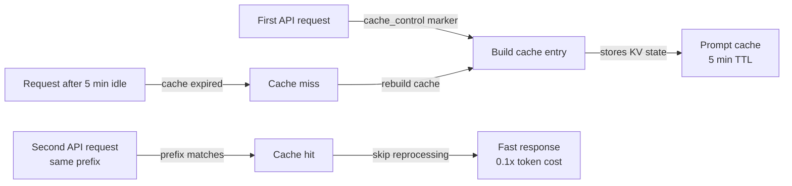

## Definition

Prompt caching is a feature of the Claude API that allows repeated portions of a prompt — the system prompt, tool definitions, document context, or long conversation prefixes — to be processed once and reused across multiple subsequent API calls. Instead of re-processing identical token sequences on every request, the model reads them from a cache, which reduces latency and lowers the cost of cached tokens. In Claude Code, prompt caching operates automatically in the background to make long sessions and repeated tool use faster and cheaper.

The core insight behind prompt caching is that most of what changes between API calls in a coding session is small: a new user message, a new tool result, or an updated file. The large, stable parts — the system prompt containing project instructions, the definitions of all available tools, and the accumulated conversation history — remain unchanged for most turns. Processing these stable portions redundantly on every request is wasteful. Prompt caching eliminates that waste by storing processed key-value states and reusing them when the prompt prefix matches.

From a developer perspective, prompt caching is largely transparent in Claude Code sessions — it happens automatically without configuration. Understanding it matters most when building on top of the Claude API directly, designing long-running agent loops, or troubleshooting unexpectedly high latency or costs. In those contexts, knowing how to structure prompts for optimal cache utilization can yield substantial savings: cached input tokens are billed at a fraction of the cost of regular input tokens, and cache hits eliminate the processing latency for cached portions entirely.

## How it works

### Cache control markers

Prompt caching uses explicit `cache_control` annotations to mark where in the prompt a cache checkpoint should be created. When the API processes a request with `{"type": "ephemeral"}` cache control on a content block, it stores the processed state of all tokens up to and including that block. On subsequent requests with the same prefix, the API detects the cache hit and skips reprocessing those tokens. A prompt can have up to four active cache checkpoints simultaneously, allowing developers to cache the system prompt separately from tool definitions and from conversation history.

### Cache lifetime and invalidation

The ephemeral cache has a time-to-live of approximately five minutes of inactivity. If no API call references a cached prefix within that window, the cache entry is evicted and must be rebuilt on the next request. This means prompt caching is most effective for high-frequency use cases: interactive coding sessions where requests arrive every few seconds, agent loops that execute many tool calls in rapid succession, or batch processing pipelines that process many documents with a shared system prompt. For low-frequency workflows where minutes pass between requests, the cache may expire and provide no benefit.

### What to cache

The highest-value candidates for caching are content that is large, stable, and reused frequently. The system prompt is the most obvious candidate: in Claude Code it contains project instructions from CLAUDE.md, tool definitions, and behavioral guidelines — often thousands of tokens that are identical across every turn. Tool definitions (JSON schemas for all available tools) are another strong candidate. In RAG or document-heavy workflows, large reference documents loaded at the start of a session can be cached so subsequent questions about those documents incur only the marginal cost of the new question, not the cost of re-reading the documents.

### Cache hit detection and usage reporting

The API response includes a `usage` object that distinguishes between regular input tokens, cache-creation tokens, and cache-read tokens. Cache-creation tokens are charged at 1.25x the base rate (the one-time cost of writing to cache). Cache-read tokens are charged at 0.1x the base rate — a 90% discount versus regular input tokens. Monitoring these fields lets developers measure actual cache effectiveness: the ratio of cache-read tokens to total input tokens indicates how much of the prompt is being served from cache.



## When to use / When NOT to use

| Use when | Avoid when |
|---|---|
| Your system prompt is large (>1,000 tokens) and constant across many requests | Your prompts change significantly on every request — no stable prefix to cache |
| You are running an agent loop with many sequential tool calls in a single session | Requests are infrequent (>5 min between turns) — the cache expires before it can be reused |
| You load large reference documents (specs, codebases) at session start | Your use case is single-shot requests with no repeated context |
| You want to reduce latency on the first user-visible response in an interactive session | You are testing or debugging and want deterministic token counts per request |
| You are optimizing costs in a production system with high API call volume | The overhead of structuring cache_control markers outweighs the savings at low volume |

## Code examples

```python
import anthropic

client = anthropic.Anthropic()

# Example: caching a large system prompt and tool definitions
# The system prompt is the same on every request — mark it for caching

SYSTEM_PROMPT = """
You are a senior software engineer working on a large TypeScript monorepo.
The project uses React on the frontend, Node.js/Express on the backend, and PostgreSQL.
[... imagine 2000+ tokens of detailed project instructions here ...]
""" * 10  # simulating a large system prompt

# Tool definitions for the coding agent — stable across all requests
TOOLS = [
    {
        "name": "read_file",
        "description": "Read a file from the project directory",
        "input_schema": {
            "type": "object",
            "properties": {
                "path": {"type": "string", "description": "Relative file path"}
            },
            "required": ["path"]
        }
    },
    {
        "name": "write_file",
        "description": "Write content to a file",
        "input_schema": {
            "type": "object",
            "properties": {
                "path": {"type": "string"},
                "content": {"type": "string"}
            },
            "required": ["path", "content"]
        }
    },
    # ... more tools
]

def make_request(messages: list, turn_number: int) -> dict:
    """
    Make a Claude API request with prompt caching enabled.
    The system prompt and tools are marked with cache_control so they are
    processed once and reused on subsequent calls in the same session.
    """
    response = client.messages.create(
        model="claude-opus-4-5",
        max_tokens=4096,
        # Mark the system prompt for caching with cache_control
        system=[
            {
                "type": "text",
                "text": SYSTEM_PROMPT,
                # This tells the API to cache everything up to this point
                "cache_control": {"type": "ephemeral"}
            }
        ],
        # Mark tool definitions for caching too
        tools=[
            {**tool, "cache_control": {"type": "ephemeral"}} if i == len(TOOLS) - 1 else tool
            for i, tool in enumerate(TOOLS)
        ],
        messages=messages
    )

    # Inspect cache usage in the response
    usage = response.usage
    print(f"Turn {turn_number} token usage:")
    print(f"  Input tokens:        {usage.input_tokens:>8}")
    print(f"  Cache creation:      {usage.cache_creation_input_tokens:>8}  (1.25x cost)")
    print(f"  Cache read:          {usage.cache_read_input_tokens:>8}  (0.1x cost)")
    print(f"  Output tokens:       {usage.output_tokens:>8}")

    # Calculate effective cost savings
    if usage.cache_read_input_tokens > 0:
        savings_pct = (usage.cache_read_input_tokens / usage.input_tokens) * 100 * 0.9
        print(f"  Estimated savings:   {savings_pct:.1f}% on input tokens this turn")

    return response

# Simulate a multi-turn coding session
messages = []

# Turn 1 — cold start, cache is built
messages.append({"role": "user", "content": "What files exist in the src/ directory?"})
response1 = make_request(messages, turn_number=1)
# Output: cache_creation_input_tokens > 0, cache_read_input_tokens = 0
messages.append({"role": "assistant", "content": response1.content})

# Turn 2 — system prompt and tools are now cached
messages.append({"role": "user", "content": "Read the main entry point file"})
response2 = make_request(messages, turn_number=2)
# Output: cache_read_input_tokens > 0, significant cost savings

# Turn 3 — still cache-hitting on system prompt + tools
messages.append({"role": "user", "content": "Explain how the authentication middleware works"})
response3 = make_request(messages, turn_number=3)
# Output: continued cache hits, growing cache_read_input_tokens
```

```bash
# Observing prompt caching in Claude Code sessions
# Claude Code automatically applies caching — use verbose mode to see token counts

# Start a session with verbose output to inspect token usage
claude --verbose

# Inside the session, run several requests in sequence
> List all TypeScript files in src/
> Read src/index.ts
> Explain the main function

# With --verbose, Claude Code prints token usage per turn including cache statistics
# You'll see cache_creation_input_tokens spike on turn 1, then
# cache_read_input_tokens grow on subsequent turns
```

## Practical resources

- [Prompt caching documentation — Anthropic](https://docs.anthropic.com/en/docs/build-with-claude/prompt-caching) — Full official reference: cache control format, token pricing, TTL, and supported models.
- [Prompt caching cookbook](https://github.com/anthropics/anthropic-cookbook/blob/main/misc/prompt_caching.ipynb) — Jupyter notebook with working examples including cost calculation and cache hit measurement.
- [Claude API pricing](https://www.anthropic.com/pricing) — Current token rates for input, cache creation, and cache read tokens across all models.
- [Anthropic usage monitoring](https://console.anthropic.com/usage) — Console dashboard for inspecting token usage breakdowns per API key.

## See also

- [Claude Code overview](/docs/claude-code)
- [Context management](/docs/claude-code/context-management)
- [Thinking modes and effort](/docs/claude-code/thinking-modes)
