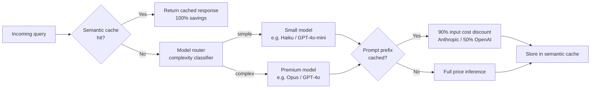

## Definition

**LLM cost optimization** is the practice of reducing the per-request and aggregate expense of operating AI applications powered by large language model APIs, while preserving response quality and acceptable latency. As enterprises move LLM workloads to production, API spend frequently becomes the dominant infrastructure line item — it is common to see $6 per user session in unoptimised deployments drop to under $1 once a full optimization stack is applied.

Cost is determined by four factors: the number of **input tokens** sent to the model, the number of **output tokens** generated, the **price tier** of the model selected, and whether responses can be **served from cache** instead of invoking the model at all. This section covers each lever independently and shows how to compose them:

- **[Token budgeting](/docs/cost-optimization/token-budgeting)** — controlling input token volume through prompt compression, RAG context trimming, and output constraints.
- **[Prompt caching](/docs/cost-optimization/prompt-caching)** — reusing unchanged prefix tokens across requests with Anthropic prefix caching and OpenAI automatic caching.
- **[Model tiering](/docs/cost-optimization/model-tiering)** — routing queries to the cheapest model capable of answering them, including semantic caching to skip the LLM entirely.

## How it works

## When to use / When NOT to use

| Scenario | Apply optimization | Skip |
|---|---|---|
| Production app with > 1 000 requests/day | Yes — even 30% savings compound quickly | No — optimising prematurely at prototype stage |
| Long system prompts (> 1 000 tokens) repeated per request | Yes — prompt caching delivers 50–90% input discount | No — short, variable prompts miss the cache anchor |
| Mixed query complexity (simple FAQs + complex analysis) | Yes — model tiering routes 60-70% to cheap models | No — all-uniform workloads gain less from routing |
| High query repetition (support bots, FAQs) | Yes — semantic caching eliminates LLM calls entirely | No — creative or unique-per-user queries won't cache |
| Strict latency SLA < 200 ms | With semantic cache (no model call) | Token budgeting / routing adds classifer latency |

## Combined impact (illustrative)

| Lever | Typical savings | Cumulative spend |
|---|---|---|
| Baseline | — | $6.00/session |
| Prompt caching (long system prompt) | 40% | $3.60 |
| Model tiering (60% of queries → mini) | 35% | $2.34 |
| Semantic caching (30% cache hit rate) | 30% | $1.64 |
| Token budgeting (RAG context trim) | 20% | $1.31 |

Numbers are illustrative; actual savings depend on workload mix and cache hit rates.

## Sources

- [LLM cost optimization: 5 levers to cut API spend 70–85% — Morph](https://www.morphllm.com/llm-cost-optimization)
- [LLM token optimization: cut costs and latency in 2026 — Redis](https://redis.io/blog/llm-token-optimization-speed-up-apps/)
- [Prompt caching: the optimization that cuts LLM costs by 90% — TianPan](https://tianpan.co/blog/2025-10-13-prompt-caching-cut-llm-costs)
- [LLM cost optimization: complete guide — Koombea AI](https://ai.koombea.com/blog/llm-cost-optimization)

## See also

- [Token budgeting](/docs/cost-optimization/token-budgeting)
- [Prompt caching](/docs/cost-optimization/prompt-caching)
- [Model tiering](/docs/cost-optimization/model-tiering)
- [Model routing](/docs/model-routing)
- [RAG](/docs/rag)
- [LLMs](/docs/llms)
