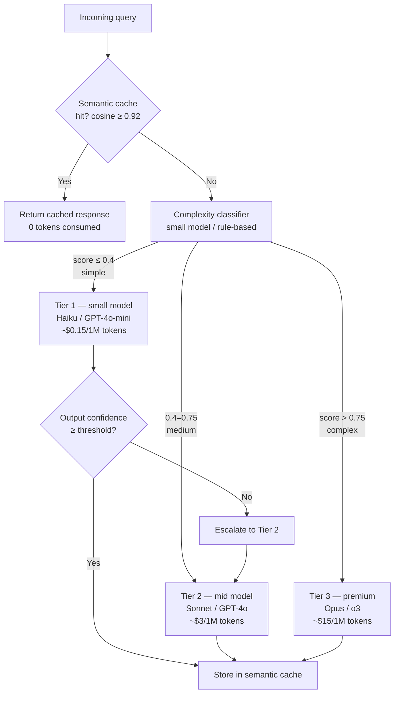

## Definition

**Model tiering** is the practice of classifying incoming queries by complexity and routing each query to the least expensive model capable of answering it correctly. Instead of sending every request to a frontier model, a tiering system maintains two or three model tiers — a cheap small model, an mid-range model, and an optional premium model — and directs traffic based on estimated difficulty.

Industry data from 2025–2026 consistently shows that 50–70% of enterprise LLM requests can be handled by the cheapest tier with no measurable quality loss, while only 5–15% genuinely require a premium frontier model. Applying tiering to those workloads alone reduces average per-request cost by 40–70%.

**Semantic caching** sits above all tiers: when a new query is semantically equivalent to a previously answered query (cosine similarity > threshold), the cached response is returned directly without invoking any model at all, yielding 100% savings on that request.

## How it works

### Routing strategies

**Classifier-based routing:** a lightweight classifier (fine-tuned small model or embedding similarity to labelled examples) scores query complexity before invocation. RouteLLM (LMSys, 2024) trains a router on human preference data and reduces premium model calls by 40–85% with < 5% win-rate degradation. LiteLLM's router supports classifier-based routing alongside load balancing and fallback.

**Rule-based routing:** keyword lists, token count thresholds, or intent classifiers (regex + embeddings) route common patterns deterministically. Simple factual lookups, short classification tasks, and structured extraction reliably go to cheap models; multi-step reasoning, code generation, and ambiguous tasks escalate.

**Cascading (sequential fallback):** the query always starts at Tier 1; if the output confidence or a self-assessment score falls below a threshold, the original query is re-sent to Tier 2. True cascading costs more than classifier routing because Tier 1 always runs, but it eliminates the classifier overhead and is simpler to implement.

### Semantic caching

Semantic caching stores `(query_embedding, response)` pairs. On a new query, the system computes the query embedding and checks cosine similarity against cached embeddings; if a match exceeds the threshold (typically 0.90–0.95 depending on precision requirements), the stored response is returned.

Key considerations:
- **Threshold tuning:** lower thresholds increase hit rate but risk returning stale or slightly mismatched answers; 0.92 is a common starting point.
- **Cache invalidation:** time-based TTL (1–24 hours for factual queries; shorter for live-data queries) prevents stale answers.
- **Cache storage:** Redis with vector search (RedisVL) or Qdrant are common backends; embedding the query adds ~5 ms latency, far less than a model call.
- **Real-world hit rates:** 31% of enterprise LLM queries exhibit semantic similarity sufficient for caching; FAQ bots and support workflows can reach 50–70% hit rates.

## When to use / When NOT to use

| Scenario | Use model tiering | Avoid |
|---|---|---|
| Mixed workload with simple and complex queries | Yes — tiering captures the cheap majority | No — uniform premium queries gain nothing |
| High-volume production (> 10 k requests/day) | Yes — 40% cost reduction compounds daily | No — prototype workloads; optimise later |
| Support / FAQ bots with repetitive queries | Yes — semantic caching especially effective | No — creative or highly personalised generation |
| Strict quality requirements with no degradation tolerance | Cascading with quality gate | No — classifier errors can misroute complex queries |
| Latency-sensitive real-time applications | With semantic cache (no model call) | Classifier adds 10–50 ms; measure before enabling |

## Platform options

| Tool | Approach | Semantic cache | Open source |
|---|---|---|---|
| **LiteLLM** | Router with load balancing + fallback | Via integration | Yes |
| **RouteLLM** | Trained classifier (LMSys) | No | Yes |
| **Portkey** | Gateway with routing rules | Yes (built-in) | No |
| **Maxim** | Gateway with semantic caching | Yes (built-in) | No |
| **OpenRouter** | Provider routing + fallback | No | No |

## Sources

- [LLM routing and model cascades — TianPan](https://tianpan.co/blog/2025-11-03-llm-routing-model-cascades)
- [Top 5 LLM routing techniques — Maxim](https://www.getmaxim.ai/articles/top-5-llm-routing-techniques/)
- [LiteLLM – routing and load balancing documentation](https://docs.litellm.ai/docs/routing-load-balancing)
- [Intelligent LLM routing: how multi-model AI cuts costs by 85% — Swfte AI](https://www.swfte.com/blog/intelligent-llm-routing-multi-model-ai)
- [Top LLM gateways with semantic caching in 2026 — DEV Community](https://dev.to/debmckinney/top-llm-gateways-that-support-semantic-caching-in-2026-3dho)

## See also

- [Cost optimization](/docs/cost-optimization)
- [Token budgeting](/docs/cost-optimization/token-budgeting)
- [Prompt caching](/docs/cost-optimization/prompt-caching)
- [Model routing](/docs/model-routing)
- [Semantic search](/docs/semantic-search)
