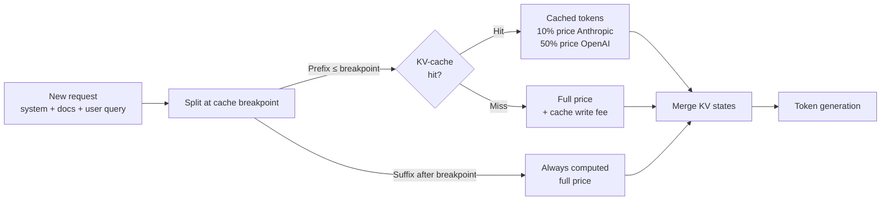

## Definition

**Prompt caching** is a server-side optimisation offered by LLM providers that avoids re-processing tokens that appear unchanged at the beginning of successive prompts. When a prompt shares a long common prefix across requests — such as a fixed system prompt, a large document, or a persistent tool list — the provider stores the KV-cache state for those tokens and reuses it on subsequent requests, charging a heavily discounted rate for cached tokens instead of the full input price.

As of May 2026, two providers offer production prompt caching:

- **Anthropic** — explicit "cache breakpoints" with `cache_control: {type: "ephemeral"}` markers; cached tokens cost 10% of standard input price (90% discount); cache TTL is 5 minutes (extended to 1 hour with a breakpoint hit within the window).
- **OpenAI** — automatic prefix caching enabled by default on GPT-4o and newer models; no API changes required; cached tokens cost 50% of standard input price.

Prompt caching delivers the greatest benefit when the same large prefix is reused across many requests: a 10 000-token system prompt reused on 1 000 requests per day saves approximately 9 million cached tokens per day at Anthropic rates.

## How it works

### Anthropic cache breakpoints

Cache breakpoints are explicit markers placed in the message array. Content before the last breakpoint is eligible for caching. Rules:

1. The minimum cacheable block is **1 024 tokens** (text) or **2 048 tokens** (tools list).
2. Breakpoints can be placed in `system`, `user`, and `tool_results` message blocks.
3. On a cache miss the provider charges a **cache write fee** of 25% of standard input price on top of the standard rate; subsequent hits are at 10%.
4. TTL refreshes on every hit, up to a maximum of 1 hour.

Optimal placement: place a breakpoint after the system prompt and any static documents; leave the dynamic user turn and recent history after the last breakpoint.

### OpenAI automatic caching

GPT-4o (and o1, o3 series) cache the longest matching prefix automatically with no API changes. The matched prefix must be a multiple of 128 tokens. Cache hits are reflected in the `usage.prompt_tokens_details.cached_tokens` field of the response. Because caching is automatic, the developer's responsibility is to **keep the prefix stable**: avoid inserting timestamps, request IDs, or dynamic content early in the prompt.

### Measuring cache effectiveness

Track `cache_read_input_tokens` (Anthropic) or `cached_tokens` (OpenAI) in response usage objects. A healthy production deployment with a long system prompt should achieve > 70% of input tokens served from cache after warm-up.

## When to use / When NOT to use

| Scenario | Use prompt caching | Skip |
|---|---|---|
| Fixed long system prompt (> 1 024 tokens) reused per user request | Yes — anchor cache at end of system prompt | No — short system prompts miss minimum size |
| Document Q&A: same document, many questions | Yes — cache the document content | No — single-question-per-document workloads |
| Tool list injected on every agent call | Yes — cache the tool definitions block | No — tool lists that change between calls |
| Dynamic prompts (personalised per user) | Partial — cache the static prefix only | No — fully dynamic prompts cannot be cached |
| Batch inference, low QPS | Low benefit — cache TTL may expire between batches | No — high-QPS real-time is the sweet spot |

## Savings estimation

| System prompt tokens | Requests/day | Anthropic cached price | Daily saving vs no cache |
|---|---|---|---|
| 2 000 | 500 | $0.003/1 k (vs $0.03) | ~$0.027 × 1 M tokens = $27 |
| 10 000 | 1 000 | $0.003/1 k | ~$0.027 × 10 M = $270 |
| 50 000 | 2 000 | $0.003/1 k | ~$0.027 × 100 M = $2 700 |

Prices illustrative based on Claude 3.5 Sonnet rates as of Q1 2026.

## Sources

- [Anthropic – prompt caching documentation](https://docs.anthropic.com/en/docs/build-with-claude/prompt-caching)
- [Prompt caching infrastructure — Introl](https://introl.com/blog/prompt-caching-infrastructure-llm-cost-latency-reduction-guide-2025)
- [Prompt caching: the optimization that cuts LLM costs by 90% — TianPan](https://tianpan.co/blog/2025-10-13-prompt-caching-cut-llm-costs)
- [Claude Code prompt caching guide](/docs/claude-code/prompt-caching)

## See also

- [Cost optimization](/docs/cost-optimization)
- [Token budgeting](/docs/cost-optimization/token-budgeting)
- [Model tiering](/docs/cost-optimization/model-tiering)
- [Claude Code — prompt caching](/docs/claude-code/prompt-caching)
- [LLMs](/docs/llms)
