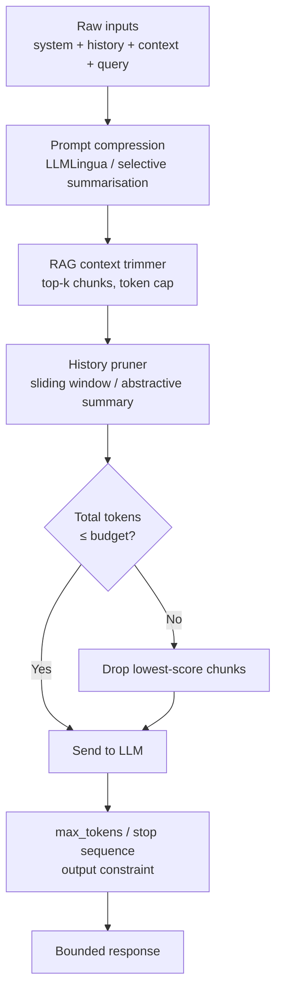

## Definition

**Token budgeting** is the discipline of limiting the number of tokens sent to and received from an LLM API in order to reduce cost and latency. Because most LLM APIs charge per input token and per output token, reducing token count is the most direct lever available. Unlike prompt caching or model routing, token budgeting applies to every request regardless of whether the provider offers caching or routing capabilities.

Input tokens comprise: the system prompt, conversation history, retrieved RAG context, and the user message. Output tokens comprise the model's generated reply. In document-heavy RAG applications, retrieved context alone can account for 60–80% of input tokens — making context trimming the highest-leverage input-side optimisation. On the output side, instructing the model to be concise or setting `max_tokens` prevents runaway generation on simple queries.

## How it works

### Input-side techniques

**Prompt compression** removes redundant tokens from the prompt while preserving meaning. LLMLingua (Microsoft, 2023–2025) achieves 2–4× compression with < 5% quality loss by selectively dropping tokens ranked low by a tiny perplexity model. Simpler rule-based approaches — stripping whitespace, removing boilerplate headers, shortening few-shot examples — achieve 10–30% reduction with zero quality risk.

**RAG context trimming** caps the number of retrieved chunks passed to the LLM. Ranking chunks by relevance score and hard-capping at N tokens (e.g. 2 000 tokens) rather than passing all top-k results can cut input tokens by more than half in long-document workloads. Chunk-level reranking (cross-encoder) ensures the most relevant material is retained when trimming.

**History pruning** limits conversation history to the last N turns, or replaces older turns with an abstractive summary generated by a cheap small model. A 3-turn sliding window reduces history tokens by 60–80% in long sessions with minimal quality degradation on most conversational tasks.

### Output-side techniques

**`max_tokens`** sets a hard ceiling on output length. For tasks with predictable output length (classification, short answers, JSON extraction) setting `max_tokens` to 2–3× the expected output length prevents over-generation and the per-token charges it incurs.

**Stop sequences** terminate generation at a known boundary (e.g. `"\n\n"` or `"###"`) before the model produces padding or commentary appended after the useful content.

**Structured output constraints** (JSON mode, function calling with `strict: true`) prevent the model from generating verbose preamble ("Sure! Here is the JSON you requested…") before the actual payload.

## When to use / When NOT to use

| Scenario | Apply token budgeting | Skip |
|---|---|---|
| RAG with long retrieved documents | Yes — trim context aggressively | No — short chunks already fit the budget |
| Long multi-turn chat sessions | Yes — history pruning prevents linear cost growth | No — sessions are short (< 5 turns) |
| Simple classification / extraction tasks | Yes — short system prompt + strict max_tokens | No — complex reasoning tasks need full context |
| Creative writing, open-ended generation | Partial — max_tokens only | No — compression hurts coherence |
| Streaming responses to users | max_tokens helps; stop sequences less useful | — |

## Practical targets

| Application type | Input token target | Output token target |
|---|---|---|
| FAQ / support bot | < 1 000 | < 200 |
| RAG Q&A | < 4 000 | < 500 |
| Document summarisation | < 16 000 | < 600 |
| Code generation | < 8 000 | < 2 000 |
| Multi-turn agent | < 6 000 (pruned) | < 1 000 per turn |

## Sources

- [LLMLingua: prompt compression for efficient LLMs — Microsoft Research](https://www.microsoft.com/en-us/research/project/llmlingua/)
- [LLM token optimization: cut costs and latency in 2026 — Redis](https://redis.io/blog/llm-token-optimization-speed-up-apps/)
- [LLM optimization guide: token budgets, latency, and cost — Medium / QuarkAndCode](https://medium.com/@QuarkAndCode/llm-optimization-guide-token-budgets-latency-and-cost-7ed701283ce5)
- [Token optimization 2026: saving up to 80% LLM costs — ObviousWorks](https://www.obviousworks.ch/en/token-optimization-saves-up-to-80-percent-llm-costs/)

## See also

- [Cost optimization](/docs/cost-optimization)
- [Prompt caching](/docs/cost-optimization/prompt-caching)
- [Model tiering](/docs/cost-optimization/model-tiering)
- [RAG architecture](/docs/rag/architecture)
- [Prompt engineering](/docs/prompt-engineering)
