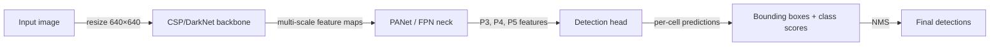
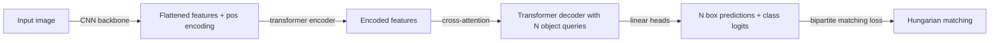

## Definition

Object detection is the CV task of predicting bounding boxes and class labels for all instances of objects in an image. Unlike image classification (one label per image), detection must simultaneously solve **where** (localization) and **what** (classification) for an arbitrary number of objects.

Architectures split into two main families:

- **Two-stage detectors** (Faster R-CNN, Mask R-CNN) first propose candidate regions (region proposals), then classify each proposal. Higher accuracy, slower inference.
- **One-stage detectors** (YOLO, SSD, RetinaNet) predict boxes and classes in a single forward pass over a dense grid. Faster, competitive accuracy. YOLO (You Only Look Once) has become the dominant real-time detector — YOLOv8 and YOLOv11 from Ultralytics are widely used in production.
- **Transformer-based detectors** (DETR and its variants — Deformable DETR, RT-DETR, DINO-DETR) use cross-attention between object queries and image features to predict a fixed set of boxes end-to-end without hand-crafted anchors or non-maximum suppression (NMS). DETR simplifies the pipeline at the cost of slower training convergence.

## How it works

### YOLO pipeline

YOLO divides the image into a grid; each cell predicts anchor-relative boxes and class probabilities. A feature pyramid network (FPN / PANet) fuses multi-scale features so small objects are detected on higher-resolution maps and large objects on lower-resolution maps. Non-maximum suppression removes duplicate predictions.

### DETR pipeline

DETR uses a fixed set of learned object queries that attend to encoder features. Training uses Hungarian matching — a bipartite assignment between predictions and ground-truth objects — which eliminates NMS. Deformable DETR adds deformable attention to speed up convergence; RT-DETR (Baidu, 2023) achieves real-time speeds comparable to YOLO.

### Key metrics

| Metric | Description |
|---|---|
| mAP@50 | Mean average precision at IoU threshold 0.5 |
| mAP@50-95 | Mean over IoU thresholds 0.5–0.95 (COCO standard) |
| FPS / Latency | Frames per second on target hardware |

## When to use / When NOT to use

| Scenario | Use | Avoid |
|---|---|---|
| Real-time detection on edge GPU / CPU | YOLOv8n or YOLOv11n — fastest inference | DETR — slower convergence, higher latency |
| Maximum accuracy, compute not constrained | DINO-DETR or YOLOv8x / YOLOv11x | Tiny models — accuracy ceiling |
| No hand-crafted anchors / NMS desired | DETR family — anchor-free, NMS-free | YOLO with anchor tuning |
| Dense small-object detection (satellite, drone) | Deformable DETR + high-res backbone | Single-scale YOLO grid — misses small objects |
| Custom domain with limited labeled data | YOLOv8 fine-tune (transfer from COCO weights) | Training from scratch — needs large annotated set |

## Sources

- [YOLOv8 — Ultralytics documentation](https://docs.ultralytics.com/)
- [DETR — End-to-End Object Detection with Transformers (Carion et al., 2020)](https://arxiv.org/abs/2005.12872)
- [Deformable DETR (Zhu et al., 2020)](https://arxiv.org/abs/2010.04159)
- [RT-DETR — Real-Time DETR (Zhao et al., 2023)](https://arxiv.org/abs/2304.08069)
- [COCO benchmark — Papers With Code](https://paperswithcode.com/sota/object-detection-on-coco)

## See also

- [Computer vision](/docs/cv)
- [Vision Transformers](/docs/cv/vision-transformers)
- [Segmentation](/docs/cv/segmentation)
- [Neural networks — CNN](/docs/neural-networks/cnn)
