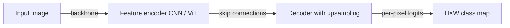
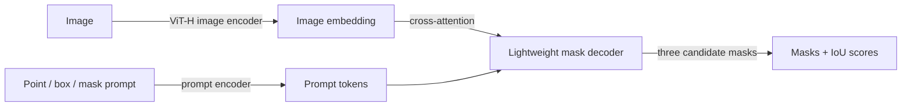

## Definition

Image segmentation assigns a label or identity to every pixel in an image. Three distinct tasks exist under this umbrella:

- **Semantic segmentation** — assigns a class label to each pixel (e.g., road, sky, person) without distinguishing individual instances. Used in autonomous driving, satellite imagery, and medical imaging.
- **Instance segmentation** — assigns each pixel both a class label and a unique instance ID, distinguishing between "person 1" and "person 2" in the same scene. Mask R-CNN is the canonical instance segmentation architecture.
- **Panoptic segmentation** — unifies semantic and instance segmentation: "stuff" classes (sky, road) receive semantic labels, "thing" classes (cars, people) receive instance-level masks.

**Segment Anything Model (SAM)**, released by Meta AI in 2023 and extended to SAM 2 (2024) for video, is a promptable segmentation foundation model. Given a point, box, or mask prompt, SAM generates a high-quality mask for the indicated object in zero shot — without task-specific fine-tuning. SAM 2 extends this to video by propagating masks across frames with a memory bank.

## How it works

### Semantic segmentation (encoder-decoder)

An encoder (ResNet, ViT, Swin) extracts hierarchical feature maps. A decoder (UNet-style skip connections, DPT, or ASPP) upsamples features back to the original resolution and produces a class score per pixel. Loss is per-pixel cross-entropy.

### Instance segmentation (Mask R-CNN)

Mask R-CNN extends Faster R-CNN by adding a parallel mask branch: after RoI Align crops the feature map to each detected region, a small FCN predicts a binary mask for each class within that region. This decouples mask prediction from classification and box regression.

### SAM architecture

SAM's heavy image encoder runs once per image; the lightweight mask decoder runs in milliseconds per prompt. SAM 2 adds a memory encoder and memory attention module so features from previous frames inform segmentation of the current frame in video.

### Key metrics

| Metric | Task | Description |
|---|---|---|
| mIoU | Semantic | Mean Intersection-over-Union across classes |
| AP@50-95 (mask) | Instance | COCO mask AP |
| PQ | Panoptic | Panoptic Quality = SQ × RQ |

## When to use / When NOT to use

| Scenario | Use | Avoid |
|---|---|---|
| Labeling arbitrary objects interactively (annotation tool) | SAM 2 — zero-shot promptable, no training | Fine-tuned model — requires labeled data |
| Autonomous driving real-time semantic segmentation | DDRNet or SegFormer-B0 — fast inference | SAM — not designed for real-time semantic segmentation |
| Medical image segmentation (specialized anatomy) | Fine-tuned MedSAM or nnUNet | Generic SAM — needs domain adaptation |
| Video object segmentation / tracking | SAM 2 — propagates masks across frames | Per-frame SAM — no temporal consistency |
| Panoptic perception in robotics | Mask2Former — state-of-the-art panoptic | Separate semantic + instance pipelines — error propagates |

## Sources

- [Segment Anything — Kirillov et al., Meta AI (2023)](https://arxiv.org/abs/2304.02643)
- [SAM 2 — Segment Anything in Images and Video (Meta AI, 2024)](https://arxiv.org/abs/2408.00714)
- [Mask R-CNN — He et al. (2017)](https://arxiv.org/abs/1703.06870)
- [Mask2Former — Cheng et al. (2021)](https://arxiv.org/abs/2112.01527)
- [SegFormer — Xie et al. (2021)](https://arxiv.org/abs/2105.15203)

## See also

- [Computer vision](/docs/cv)
- [Object detection](/docs/cv/object-detection)
- [Vision Transformers](/docs/cv/vision-transformers)
- [Neural networks — CNN](/docs/neural-networks/cnn)
