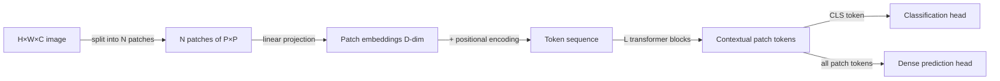

## Definition

Vision Transformers (ViT) adapt the standard transformer architecture to images by treating the image as a sequence of non-overlapping fixed-size patches (typically 16×16 or 32×32 pixels). Each patch is linearly projected into an embedding vector; a learnable `[CLS]` token is prepended; and standard transformer encoder blocks with multi-head self-attention process the sequence. Global self-attention across all patches allows ViT to model long-range spatial dependencies that CNNs approximate only with deep stacks of convolutions.

Introduced by Dosovitskiy et al. (2020), ViT matched or exceeded CNN performance on ImageNet when pretrained on JFT-300M (a large internal Google dataset), establishing that the inductive bias of convolutions (locality, translation equivariance) is not necessary at sufficient scale. Smaller ViT variants (ViT-S, ViT-B) require more data or regularization to match CNNs on small datasets.

**DINOv2** (Meta AI, 2023) is a family of ViT models trained with self-supervised distillation (no labels) on a curated 142M-image dataset. DINOv2 features (frozen, without fine-tuning) achieve competitive performance on depth estimation, semantic segmentation, classification, and instance retrieval — making it the go-to general-purpose visual backbone for 2024-2025 research and many production systems.

## How it works

### Patch embedding

An image of size H×W is divided into N = (H/P)×(W/P) patches. Each patch is flattened and projected with a learned linear layer to a D-dimensional embedding. Learnable 1D positional embeddings or 2D sine-cosine encodings are added. The transformer processes the full sequence with self-attention at every layer — every patch can attend to every other patch, unlike CNNs.

### DINOv2 training

DINOv2 uses a student-teacher self-distillation objective (DINO) combined with iBOT (masked image modeling) on curated, deduplicated web data. The teacher is an exponential moving average of the student. This combined objective produces features with both global semantic content and local spatial structure — enabling the same frozen backbone to excel at both image-level and pixel-level tasks.

### Adapting ViT for dense prediction

Dense tasks (segmentation, depth) require spatial feature maps. Strategies include:

- **DPT (Dense Prediction Transformer)** — reassembles multi-scale patch tokens into feature pyramids.
- **ViTDet** — adds window attention and global attention blocks for object detection.
- **Registers** (DINOv2 with registers) — adds global register tokens to clean up artifact noise in patch tokens.

## When to use / When NOT to use

| Scenario | Use ViT/DINOv2 | Avoid |
|---|---|---|
| Large-scale pretraining or fine-tuning (ImageNet-21k+) | ViT-B/L pretrained on large data — strong SOTA | ViT on small datasets without augmentation — CNNs win |
| General-purpose visual features (cross-task) | DINOv2 frozen backbone — no fine-tuning needed | Task-specific fine-tuned CNN — narrower but faster |
| Long-range spatial reasoning (scene understanding) | ViT — global self-attention at every layer | CNN — limited receptive field unless very deep |
| Edge / mobile deployment with strict compute budget | EfficientViT or MobileViT — ViT with local attention | Full ViT-L — too large for mobile |
| Video understanding | Video ViT (TimeSformer, VideoMAE) | 2D ViT applied frame-by-frame — no temporal modeling |

## Sources

- [An Image is Worth 16×16 Words — Dosovitskiy et al. (2020)](https://arxiv.org/abs/2010.11929)
- [DINOv2 — Learning Robust Visual Features without Supervision (Meta AI, 2023)](https://arxiv.org/abs/2304.07193)
- [Vision Transformer with Registers — Darcet et al. (2023)](https://arxiv.org/abs/2309.16588)
- [DPT — Dense Prediction with Transformers (Ranftl et al., 2021)](https://arxiv.org/abs/2103.13413)
- [Hugging Face ViT model hub](https://huggingface.co/models?other=vit)

## See also

- [Computer vision](/docs/cv)
- [Object detection](/docs/cv/object-detection)
- [Segmentation](/docs/cv/segmentation)
- [Multimodal AI](/docs/multimodal-ai)
- [Transformers](/docs/transformers)
