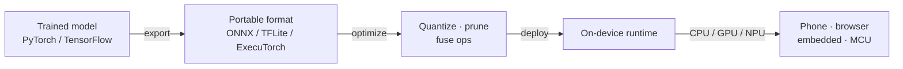

## Definition

**Edge AI** is the practice of running machine learning inference directly on the device that captures the data — a phone, browser, camera, vehicle, wearable, or microcontroller — instead of sending that data to a remote server. By keeping computation local, edge AI cuts network latency, works offline, reduces cloud costs, and keeps sensitive data on-device for privacy.

The trade-off is constraint: edge hardware has far less memory, compute, and power than a datacenter GPU. Edge AI is therefore as much about **model compression** — [quantization](/docs/quantization), pruning, and distillation — as it is about the runtimes that execute those compressed models efficiently on heterogeneous hardware (CPUs, mobile GPUs, NPUs, and DSPs).

## How it works

A typical edge pipeline takes a model trained with a full framework, exports it to a portable format, optimizes it for the target hardware, and runs it through a lightweight on-device runtime. Each runtime in this category targets a different slice of that landscape.

## Runtimes in this category

- [**ONNX Runtime**](/docs/edge-ai/onnx) — Cross-platform inference engine for ONNX models with CPU, GPU, and NPU execution providers.
- [**TensorFlow Lite**](/docs/edge-ai/tflite) — Lightweight runtime for on-device inference across Android, iOS, embedded systems, and microcontrollers.
- [**PyTorch Mobile**](/docs/edge-ai/pytorch-mobile) — Deploy PyTorch models on mobile and edge devices using TorchScript and the next-generation ExecuTorch runtime.

## See also

- [Quantization](/docs/quantization)
- [Inference optimization](/docs/inference-optimization)
- [Local inference](/docs/local-inference)
- [Frameworks](/docs/frameworks)
