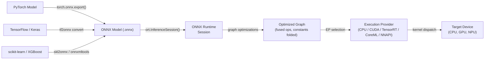

## Definition

ONNX Runtime (ORT) is an open-source, cross-platform inference and training acceleration library developed by Microsoft. Its primary purpose is to execute models in the **Open Neural Network Exchange (ONNX)** format — a framework-agnostic intermediate representation for machine learning models — with high performance across a wide range of hardware targets and operating systems. ORT is not tied to any single training framework: models from PyTorch, TensorFlow, scikit-learn, LightGBM, XGBoost, and others can all be exported to ONNX and executed through the same runtime API, making it one of the most interoperable inference solutions available.

At its core, ORT loads an ONNX graph, applies an extensive series of graph-level optimizations (constant folding, node fusion, layout transformation), and dispatches operations to the best-available execution provider for the current hardware. The **Execution Provider (EP)** abstraction allows ORT to route subgraphs to CPUs, NVIDIA GPUs via CUDA or TensorRT, AMD GPUs via ROCm, Intel hardware via OpenVINO, Apple Silicon via CoreML, Android via NNAPI, and Windows via DirectML — all through a unified API surface. This makes ORT suitable for a deployment spectrum ranging from cloud servers to Windows laptops to mobile devices.

ONNX Runtime is particularly valuable in enterprise and production settings where a single deployment pipeline must serve models trained in different frameworks. It is the inference backend powering Azure ML endpoints, Hugging Face's Optimum library, Windows ML, and many production recommendation and ranking systems. Its training extension (ORT Training) also enables accelerated fine-tuning of large transformer models, but inference is its primary use case.

## How it works



### ONNX Format and Model Interoperability

ONNX represents a model as a directed acyclic computation graph where nodes are standardized operators (e.g. `Conv`, `MatMul`, `LayerNormalization`) defined in the ONNX operator specification, and edges carry typed tensors. The format is versioned: each ONNX opset version (currently 21) defines the complete set of supported operators and their semantics. Exporters from each framework map framework-specific ops to their ONNX equivalents; when a direct mapping does not exist, `custom_op` extensions can be registered. The protobuf-serialized `.onnx` file includes the graph topology, operator names, tensor shapes, and constant weight values, making the format self-contained and portable.

### Graph Optimizations

When an `InferenceSession` is created, ORT applies three levels of graph optimization controlled by the `GraphOptimizationLevel` setting. Level 1 (basic) performs safe rewrites: constant folding, redundant node elimination, shape inference, and identity removal. Level 2 (extended) adds operation fusion: `Conv + BatchNorm`, `Conv + Relu`, `Transpose + MatMul`, and similar patterns are fused into single kernels to eliminate intermediate memory allocations and kernel launch overhead. Level 3 (layout optimization) restructures tensor memory layouts to match what execution providers prefer (e.g. NHWC for GPU convolutions). Optimized graphs can be serialized back to `.onnx` for inspection or to skip re-optimization on subsequent loads.

### Execution Providers

The Execution Provider mechanism is ORT's primary extensibility and performance lever. When a session is created with a specific EP, ORT queries which nodes the EP can handle, partitions the graph, and replaces claimed subgraphs with EP-specific `ComputeKernel` implementations. The **CPU EP** uses MLAS (Microsoft Linear Algebra Subprograms), a hand-vectorized BLAS implementation with AVX-512 and NEON support. The **CUDA EP** offloads convolutions and GEMMs to cuDNN and cuBLAS. The **TensorRT EP** applies TensorRT's layer-fusion and precision calibration for FP16 and INT8, yielding the highest throughput on NVIDIA GPUs. The **CoreML EP** delegates to Apple's Neural Engine on macOS and iOS. The **DirectML EP** supports hardware-accelerated inference on any DirectX 12-capable GPU on Windows, including AMD and Intel integrated graphics.

### Quantization in ONNX Runtime

ORT supports INT8 inference through the **QDQ (Quantize-Dequantize)** node pattern: the ONNX graph contains explicit `QuantizeLinear` and `DequantizeLinear` nodes that represent the precision boundaries. Static quantization requires a calibration dataset to compute input/output scales; the `onnxruntime.quantization` Python package provides `quantize_static` and `quantize_dynamic` functions. ORT also accepts QAT-exported models where Q/DQ nodes were inserted during training. Hardware INT8 acceleration is only activated when the execution provider supports it (CUDA EP requires CUDA 11+, TensorRT EP handles INT8 natively via calibration tables). The `ORTQuantizer` in Hugging Face Optimum provides a high-level interface for quantizing transformer models end-to-end.

### Mobile and Edge Deployment

ORT Mobile is a slimmed-down build of ONNX Runtime for Android and iOS that removes unused operators and EP libraries, reducing the binary size to ~1-3 MB compressed. The `onnxruntime-mobile` Python package prepares models for mobile by pre-packing weights and stripping training-time metadata. On Android, the NNAPI EP delegates to the hardware accelerator. On iOS and macOS, the CoreML EP uses the Apple Neural Engine. ORT also runs on Raspberry Pi (ARM Linux) via the CPU EP, and experimental support exists for WebAssembly targets. The `ort` npm package enables ORT in Node.js and browser contexts via WASM.

## When to use / When NOT to use

| Use when | Avoid when |
|---|---|
| You need framework-agnostic inference — serving models from PyTorch, TF, and scikit-learn through one runtime | Your deployment target is a microcontroller with &lt;256 KB RAM (TFLM covers this better) |
| You are building enterprise ML pipelines on Windows/Azure where Microsoft tooling is already in place | You need deep Android hardware delegation with mature tooling today (TFLite is more battle-tested for Android) |
| You need NVIDIA TensorRT acceleration without directly managing the TensorRT API | Your model uses custom ops that have no ONNX equivalent and are impractical to register |
| You want browser/WASM inference for the same model that runs server-side | Your team is PyTorch-native and wants the tightest possible loop from training to mobile (PyTorch Mobile / ExecuTorch may be simpler) |
| Cross-platform portability is a first-class concern (same model on Windows, Linux, macOS, Android, iOS) | You need real-time training or online learning at the edge (ORT Training exists but adds significant complexity) |

## Comparisons

Comparison of ONNX Runtime with TFLite and PyTorch Mobile for edge and cross-platform deployment.

| Criterion | ONNX Runtime | TensorFlow Lite | PyTorch Mobile |
|---|---|---|---|
| Platform support | Windows, Linux, macOS, Android, iOS, WASM, cloud — broadest coverage | Android, iOS, embedded Linux, microcontrollers (TFLM) | Android, iOS; ExecuTorch adds embedded and bare-metal |
| Model conversion | Any framework → ONNX export (most interoperable path, multiple converters) | TF/Keras → TFLite Converter (mature, TF-ecosystem only) | PyTorch → TorchScript or ExecuTorch (PyTorch-native, lower friction for PT users) |
| On-device performance | CPU EP with MLAS is competitive; TensorRT/CUDA EPs lead for GPU; CoreML/NNAPI EPs for mobile | Excellent on Android via NNAPI/GPU delegate; best-in-class for microcontrollers | XNNPACK on ARM CPUs; Vulkan GPU; ExecuTorch NPU delegation |
| Ecosystem | Framework-agnostic; Hugging Face Optimum; Windows ML; Azure ML; strong enterprise adoption | Mature: MediaPipe, TF Hub, Model Garden; largest mobile ML community | Strong in research; Hugging Face; growing ExecuTorch community |
| Quantization support | INT8 via QDQ nodes; dynamic and static PTQ; QAT; hardware INT8 via EP | Comprehensive: dynamic-range, INT8, FP16, QAT with full INT8 paths | PTQ (dynamic + static INT8) and QAT via torch.ao.quantization |

## Pros and cons

| Pros | Cons |
|---|---|
| Framework-agnostic: any ONNX-exportable model works with the same runtime | ONNX export can fail for models with unsupported or custom ops |
| Widest execution provider coverage: CPU, CUDA, TensorRT, DirectML, CoreML, NNAPI, OpenVINO | Debugging ONNX graphs is harder than native framework debugging |
| Strong Windows and Azure integration; first-class citizen in Microsoft ML stack | More operational complexity than TFLite for pure Android/iOS scenarios |
| Hugging Face Optimum provides high-level quantization and optimization for transformers | ONNX opset versioning can create compatibility friction between exporters and ORT versions |
| Competitive CPU performance via MLAS with AVX-512 and NEON vectorization | Mobile binary size is larger than TFLite when all EPs are included |

## Code examples

```python
import numpy as np
import torch
import torch.nn as nn
import onnxruntime as ort

# ── 1. Define a simple model in PyTorch ───────────────────────────────────────
class SimpleClassifier(nn.Module):
    """Minimal classifier for demonstration."""

    def __init__(self, input_dim: int = 784, num_classes: int = 10):
        super().__init__()
        self.net = nn.Sequential(
            nn.Linear(input_dim, 128),
            nn.ReLU(),
            nn.Linear(128, 64),
            nn.ReLU(),
            nn.Linear(64, num_classes),
        )

    def forward(self, x: torch.Tensor) -> torch.Tensor:
        return self.net(x)


model = SimpleClassifier()
# Switch to inference mode: disables dropout, BatchNorm uses running statistics
model.train(False)

# ── 2. Export PyTorch model to ONNX ──────────────────────────────────────────
dummy_input = torch.randn(1, 784)  # batch=1, flattened 28x28 image

torch.onnx.export(
    model,
    dummy_input,
    "model.onnx",
    opset_version=17,                         # target ONNX opset
    input_names=["input"],
    output_names=["logits"],
    dynamic_axes={
        "input":  {0: "batch_size"},          # allow variable batch size
        "logits": {0: "batch_size"},
    },
    do_constant_folding=True,                 # fold constant sub-expressions during export
)
print("Exported model.onnx")

# ── 3. Apply INT8 post-training dynamic quantization ─────────────────────────
from onnxruntime.quantization import quantize_dynamic, QuantType

quantize_dynamic(
    "model.onnx",
    "model_int8.onnx",
    weight_type=QuantType.QInt8,              # quantize weights to INT8
)
print("Quantized model saved as model_int8.onnx")

# ── 4. Run inference with ONNX Runtime ───────────────────────────────────────
# SessionOptions allow controlling graph optimization level and thread counts
sess_options = ort.SessionOptions()
sess_options.graph_optimization_level = ort.GraphOptimizationLevel.ORT_ENABLE_ALL

# Providers list is checked in order; falls back to CPU if GPU is unavailable
providers = ["CUDAExecutionProvider", "CPUExecutionProvider"]
session = ort.InferenceSession("model_int8.onnx", sess_options, providers=providers)

print(f"Active execution provider: {session.get_providers()[0]}")

# Prepare a batch of random inputs as float32 numpy arrays
batch = np.random.randn(4, 784).astype(np.float32)
input_name = session.get_inputs()[0].name
output_name = session.get_outputs()[0].name

outputs = session.run([output_name], {input_name: batch})
logits = outputs[0]                          # shape (4, 10)
predicted_classes = np.argmax(logits, axis=1)
print(f"Batch predictions: {predicted_classes}")
```

## Practical resources

- [ONNX Runtime documentation](https://onnxruntime.ai/docs/) — official reference covering installation, execution providers, graph optimization, quantization, and mobile deployment for all supported platforms.
- [ONNX Runtime Python API reference](https://onnxruntime.ai/docs/api/python/api_summary.html) — detailed API docs for `InferenceSession`, `SessionOptions`, execution providers, and the quantization sub-package.
- [Hugging Face Optimum](https://huggingface.co/docs/optimum/onnxruntime/overview) — high-level library that wraps ORT for transformer model optimization, providing `ORTModelForXxx` classes and `ORTQuantizer` for one-step model export and INT8 quantization.
- [ONNX Model Zoo](https://github.com/onnx/models) — curated repository of pre-trained ONNX models spanning computer vision, NLP, speech, and classical ML; useful for benchmarking ORT performance and as deployment templates.
- [ONNX Runtime mobile deployment guide](https://onnxruntime.ai/docs/tutorials/mobile/) — step-by-step tutorial for building a minimal ORT Android or iOS application, including model preparation and NNAPI/CoreML EP configuration.

## See also

- [TensorFlow Lite](/docs/edge-ai/tflite)
- [PyTorch Mobile](/docs/edge-ai/pytorch-mobile)
- [PyTorch](/docs/frameworks/pytorch)
- [TensorFlow](/docs/frameworks/tensorflow)
