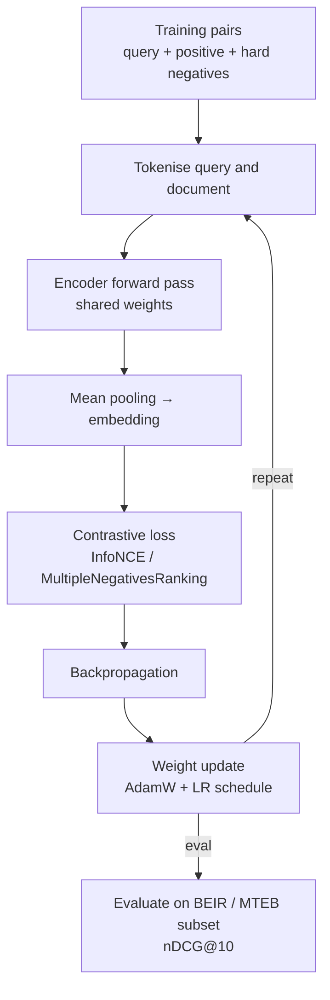

## Definition

**Fine-tuning an embedding model** adapts a pre-trained general-purpose encoder to a specific domain or task by continuing training on domain-relevant (query, document) pairs. Off-the-shelf models trained on general web text often underperform on specialised corpora (legal, biomedical, financial, code) because the vocabulary and semantic relationships differ from the training distribution. Fine-tuning can close this gap substantially: a domain-tuned BGE or Nomic model frequently matches or beats a larger general model on the target domain's retrieval benchmark.

The standard training objective is **contrastive loss** (InfoNCE / NT-Xent): for each anchor query, the model learns to assign a higher similarity score to the true positive document than to negative documents (random negatives or, more effectively, hard negatives that are semantically similar but not the correct answer).

## How it works

### Training data

Fine-tuning requires (query, positive_document) pairs. Sources:

| Source | Size needed | Notes |
|---|---|---|
| Human-labelled query-passage pairs | 1 000–10 000 | Highest quality; expensive to collect |
| BM25 mined positives from domain corpus | 10 000–100 000 | Fast; lower precision — filter noisy pairs |
| Synthetic (LLM-generated queries for each passage) | 5 000–50 000 | GPT-4o / Claude generates realistic queries per chunk |
| Existing public IR datasets (MS-MARCO, NQ) | N/A | General-domain; useful for warm-start |

Generating synthetic queries with an LLM per document chunk is the most practical approach for new domains: prompt the teacher model with the document and ask it to generate 3–5 plausible user queries.

### Hard negative mining

Random negatives (documents drawn uniformly from the corpus) are too easy — the model trivially learns to separate them. Hard negatives are documents that are topically similar to the query but not the true answer. They force the model to learn fine-grained distinctions.

Hard negatives can be mined by:
1. Running BM25 retrieval and using top-ranked non-relevant documents.
2. Running the current embedding model and using top-k results that are not the positive.
3. Using cross-encoder scores to identify high-similarity but non-relevant pairs.

### Matryoshka training

To produce MRL-compatible embeddings, add a Matryoshka loss term that computes contrastive loss at multiple truncated dimensions (e.g. 768, 512, 256, 128) simultaneously during training. The resulting model supports flexible truncation in production with minimal quality loss per dimension level. `sentence-transformers` (v3.3+) natively supports Matryoshka training via `MatryoshkaLoss`.

### Evaluation

Evaluate on a held-out retrieval set using nDCG@10 (Normalised Discounted Cumulative Gain). For domain-specific tasks, construct a small BEIR-style evaluation set (100–500 queries with annotated relevant documents) before and after fine-tuning to measure the improvement.

## When to use / When NOT to use

| Scenario | Fine-tune embeddings | Use off-the-shelf |
|---|---|---|
| Domain has specialised vocabulary (legal, biomedical, code) | Yes — general models underperform on OOD text | No — general web-text domain |
| RAG precision is below acceptable threshold | Yes — domain tuning improves retrieval recall | No — check chunking and reranking first |
| Have > 1 000 labelled or LLM-generated pairs | Yes — sufficient data for meaningful gains | No — very small datasets can overfit |
| Multilingual domain-specific retrieval | Yes — fine-tune from multilingual base (Qwen3, Jina v5) | No — if English-only |
| Time-to-production is < 1 week | No — use off-the-shelf; fine-tune later | Yes — off-the-shelf is fast |

## Sources

- [Sentence-Transformers: fine-tuning guide](https://www.sbert.net/docs/training/overview.html)
- [BEIR: a heterogeneous benchmark for zero-shot evaluation — arXiv 2104.08663](https://arxiv.org/abs/2104.08663)
- [Matryoshka representation learning — arXiv 2205.13147](https://arxiv.org/abs/2205.13147)
- [Best embedding models 2025: MTEB scores and leaderboard — Ailog RAG](https://app.ailog.fr/en/blog/guides/choosing-embedding-models)

## See also

- [Embeddings](/docs/embeddings)
- [Late interaction — ColBERT](/docs/embeddings/late-interaction-colbert)
- [RAG embeddings](/docs/rag/embeddings)
- [LLMs fine-tuning](/docs/llms/fine-tuning)
- [Semantic search](/docs/semantic-search)
