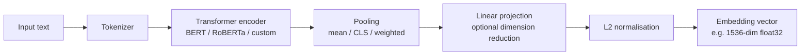

## Definition

An **embedding model** maps text (tokens, sentences, or documents) to a fixed-length dense vector in a high-dimensional space where semantically similar texts are geometrically close. These vectors are the foundation of semantic search, RAG retrieval, clustering, and classification — any task that requires comparing or organising text by meaning rather than exact keyword overlap.

The key properties of an embedding model are:

- **Dimensionality** — number of floats per vector; common values are 384, 768, 1 536, and 3 072. Higher dimensionality often but not always means better quality.
- **Max sequence length** — the context window the model can encode; models range from 512 tokens (BERT-era) to 32 000+ tokens (modern long-context embedders).
- **Normalisation** — most modern models output L2-normalised vectors, enabling cosine similarity to be computed as a dot product (faster at scale).
- **Multilingual support** — models vary from English-only to 100+ language support.

**Matryoshka Representation Learning (MRL)** is now the industry standard for flexible-size embeddings (2026): the first N dimensions of an MRL vector form a meaningful lower-dimensional embedding on their own, allowing storage and search at truncated dimensions (e.g. 256 instead of 3 072) with only 2–3% quality loss, cutting storage costs by 4×.

## How it works

**Tokenize:** text is split into subword tokens. **Encode:** a transformer processes all tokens in parallel, producing contextual token representations. **Pool:** token representations are aggregated into a single sentence vector (mean pooling is most common for sentence embeddings). **Project:** an optional linear layer reduces the dimension (e.g. 768→256 for MRL truncation). **Normalise:** L2 normalisation enables cosine similarity as a dot product.

## MTEB benchmark

The **Massive Text Embedding Benchmark (MTEB)** is the standard evaluation suite for embedding models, covering 56+ tasks across retrieval, clustering, classification, reranking, and semantic similarity in multiple languages. MTEB v2 (2026) extended coverage to 100+ languages and added multimodal tracks.

Top models on MTEB as of March 2026:

| Model | MTEB score | Dim | Max tokens | MRL | Cost |
|---|---|---|---|---|---|
| Qwen3-Embedding-8B | 70.6 | 4 096 | 32 768 | Yes | Open weight |
| Gemini Embedding 2 (preview) | 68.3 | 3 072 | 32 000 | Yes | API ($) |
| OpenAI text-embedding-3-large | 64.6 | 3 072 | 8 191 | Yes | API ($) |
| Cohere Embed v4 | ~64 | 1 536 | 512 | Yes | API ($) |
| Nomic Embed v1.5 | ~62 | 768 | 8 192 | Yes | Open weight |

**Key insight (2026):** open-weight models (Qwen3-Embedding-8B) now surpass closed API models on MTEB, a reversal from 2024 when OpenAI led.

## When to use / When NOT to use

| Scenario | Use dense embeddings | Avoid |
|---|---|---|
| Semantic search over a large corpus | Yes — embeddings capture meaning beyond keywords | No — keyword-only BM25 misses paraphrases |
| RAG retrieval | Yes — embed queries and chunks; retrieve by similarity | No — for exact-match lookup, use full-text search |
| Cross-lingual retrieval | Yes — multilingual models (Qwen3, Jina v5) | No — English-only models for non-English corpora |
| Short, structured data (SKUs, codes) | No — keyword search is faster and more precise | Yes — use BM25 or exact match instead |
| Very long documents (> 32 k tokens) | With chunking — no model encodes a book end-to-end | Late interaction models (ColBERT) handle longer docs |

## Sources

- [MTEB leaderboard — HuggingFace](https://huggingface.co/spaces/mteb/leaderboard)
- [Embedding model leaderboard: MTEB rankings March 2026 — AwesomeAgents](https://awesomeagents.ai/leaderboards/embedding-model-leaderboard-mteb-march-2026/)
- [Best embedding models 2026: MTEB benchmarks + pricing — PEC Collective](https://pecollective.com/tools/best-embedding-models/)
- [Which embedding model should you actually use in 2026? — DEV Community](https://dev.to/chen_zhang_bac430bc7f6b95/which-embedding-model-should-you-actually-use-in-2026-i-benchmarked-10-models-to-find-out-58bc)
- [Top embedding models on the MTEB leaderboard — Modal](https://modal.com/blog/mteb-leaderboard-article)

## See also

- [Fine-tuning embeddings](/docs/embeddings/fine-tuning-embeddings)
- [Late interaction — ColBERT](/docs/embeddings/late-interaction-colbert)
- [RAG embeddings](/docs/rag/embeddings)
- [Semantic search](/docs/semantic-search)
- [Vector databases](/docs/rag/vector-databases)
