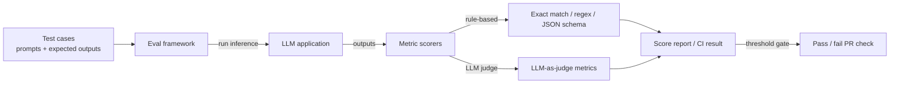

## Definition

**LLM eval frameworks** provide the tooling to define test cases, run metrics, collect results, and integrate evaluation into development workflows. They differ primarily in their target artifact (prompt, RAG pipeline, agent), their metric philosophy (rule-based vs. LLM-as-judge), and their deployment model (CLI, Python library, or SaaS platform).

Choosing the right framework depends on what you are evaluating: a prompt template, a retrieval pipeline, an agent, or a full application — and on whether you need offline batch evaluation, CI-gated regression testing, or online production monitoring.

## How it works

## Framework comparison

| Criterion | RAGAS | promptfoo | DeepEval | Braintrust |
|---|---|---|---|---|
| **Primary target** | RAG pipelines | Prompt testing & red-teaming | LLM apps & agents | Full-stack eval + observability |
| **Metric style** | Reference-free RAG metrics | Rule-based + LLM-as-judge | LLM-as-judge (G-Eval, DAG metric) | LLM-as-judge + custom Python |
| **Interface** | Python SDK | CLI (YAML/JSON config) | Python SDK (pytest-style) | Web UI + Python SDK |
| **CI/CD** | Via Python | First-class CLI integration | First-class (pytest output) | GitHub Actions integration |
| **Tracing** | Partial | No | No | Yes — built-in |
| **Human review** | No | No | No | Yes — annotation queue |
| **Deployment** | Open source | Open source | Open source + cloud | SaaS (free tier available) |
| **Highlights** | Faithfulness, answer relevancy, context recall | YAML-based declarative test specs, red-team plugins | 50+ metrics, agent DAG eval, 3M+ monthly downloads | Logs every call; compare score distributions across versions |

## RAGAS

RAGAS (Retrieval-Augmented Generation Assessment) provides reference-free metrics for RAG pipelines. Core metrics include:
- **Faithfulness**: Does the answer contain only claims supported by the retrieved context?
- **Answer relevancy**: Does the answer address the question asked?
- **Context recall**: Does the retrieved context contain the information needed to answer?
- **Context precision**: How much of the retrieved context is actually relevant?

RAGAS evaluates without requiring ground-truth answers, making it practical for production datasets where labeling is expensive.

## promptfoo

promptfoo is a CLI-first framework for prompt engineers and developers who want to test prompts like unit tests. Test specs are declarative YAML or JSON: define prompts, variables, providers, and assertions. Assertions include contains, regex, JSON schema, cost threshold, and LLM-judge plugins. It has strong red-teaming support (prompt injection, jailbreak probes) built in.

## DeepEval

DeepEval is Python-native and integrates with pytest, making it familiar to backend engineers. It ships 50+ metrics (as of 2025), including G-Eval, hallucination, answer relevancy, faithfulness, toxicity, and a DAG metric for evaluating agent decision trees. It targets unit-testing discipline: each metric has a threshold, and failing metrics fail the test.

## Braintrust

Braintrust bundles evaluation with tracing and human review in one platform. Every LLM call is logged as a trace, eval functions run over stored traces, and score distributions can be compared across prompt versions in a web UI. It is particularly useful for teams who want a single observability + eval tool rather than stitching multiple tools together.

## Sources

- [RAGAS documentation](https://docs.ragas.io/en/latest/) — reference-free RAG evaluation metrics
- [promptfoo documentation](https://www.promptfoo.dev/docs/intro) — CLI-based prompt testing and red-teaming
- [DeepEval GitHub](https://github.com/confident-ai/deepeval) — open-source LLM evaluation framework with pytest integration
- [Braintrust documentation](https://www.braintrust.dev/docs) — integrated eval, tracing, and human review platform
- [RAGAS vs TruLens vs DeepEval comparison — Atlan](https://atlan.com/know/llm-evaluation-frameworks-compared/) — side-by-side feature comparison updated 2026

## See also

- [Evals](/docs/evals)
- [LLM-as-judge](/docs/evals/llm-as-judge)
- [Benchmark contamination](/docs/evals/benchmark-contamination)
- [Observability](/docs/observability)
- [RAG](/docs/rag)
