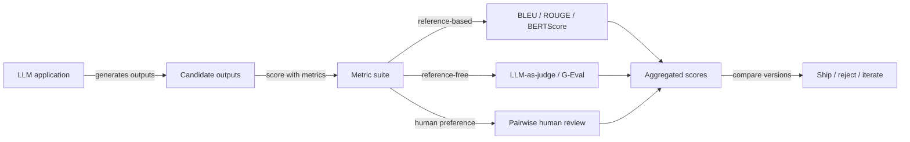

## Definition

**LLM evaluation** (evals) is the discipline of systematically measuring how well a language model or AI system performs on a defined task. Unlike traditional software tests with deterministic pass/fail criteria, LLM outputs are probabilistic, open-ended, and context-dependent — requiring purpose-built evaluation techniques.

Evals operate at two levels. **Offline evals** run against a curated dataset before deployment, catching regressions in accuracy, coherence, and safety. **Online evals** run in production, sampling live traffic to catch distribution shift and edge cases that escaped the test set. Both levels rely on a shared set of scoring methods: reference-based metrics (comparing against a gold answer), reference-free metrics (judging without a ground truth), and human preference signals.

Good evaluation practice starts with a clear **task specification**: what does "correct" mean for this use case? Only once that is defined can you choose the right metrics and frameworks. Evaluation is also iterative — as models and prompts change, eval suites must grow to prevent benchmark overfitting.

## How it works

An eval pipeline ingests **inputs** (user prompts or test cases), passes them through the application to obtain **outputs**, then scores those outputs through a **metric suite**. Results are aggregated into a scorecard that compares the candidate version against a baseline. If scores regress beyond a threshold, the change is blocked or flagged for review.

## When to use / When NOT to use

| Scenario | Use evals | Skip or defer |
|---|---|---|
| Deploying a model change to production | Yes — catch regressions before users do | No — skipping evals increases silent degradation risk |
| Comparing two prompt versions | Yes — use pairwise LLM-as-judge or A/B | No — eyeballing a handful of outputs is not reliable |
| Highly subjective creative tasks | Yes — with human preference scoring | No — automatic metrics poorly correlate with human taste |
| Research prototype / throwaway demo | Maybe — lightweight sanity checks only | Yes — full eval harness overhead is not worth it |
| Safety-critical applications | Yes — required, including adversarial red-teaming | No — never ship without safety evals |

## Evaluation metric taxonomy

| Category | Examples | Ground truth required | Strength |
|---|---|---|---|
| Lexical overlap | BLEU, ROUGE-L | Yes | Fast, cheap |
| Semantic similarity | BERTScore, cosine sim | Yes (or reference) | Language-aware |
| LLM-as-judge | G-Eval, pairwise, ArenaGEval | No | Flexible, human-aligned |
| Task-specific | EM, F1, code pass@k | Yes | High signal for narrow tasks |
| RAG-specific | Faithfulness, answer relevancy (RAGAS) | No | Covers retrieval + generation |

## Common pitfalls

- **Judge bias**: LLM judges inflate scores for verbose, well-formatted, or self-generated outputs. Always validate your judge on a labeled sample before trusting it at scale.
- **Benchmark contamination**: Models may have seen benchmark questions during pre-training, artificially inflating scores. See [benchmark contamination](/docs/evals/benchmark-contamination).
- **Metric-target misalignment**: Optimizing ROUGE does not improve user satisfaction. Choose metrics that correlate with your actual success criterion.
- **Static datasets**: A frozen eval set becomes gameable over time. Continuously add hard cases from production failures.

## Sources

- [DeepEval — LLM evaluation framework](https://github.com/confident-ai/deepeval) — open-source unit-testing library for LLM apps with 20M+ daily evaluations
- [RAGAS — RAG evaluation framework](https://docs.ragas.io/en/latest/) — reference-free evaluation for retrieval-augmented generation pipelines
- [Promptfoo — prompt testing CLI](https://www.promptfoo.dev/docs/intro) — declarative YAML-based prompt testing and red-teaming
- [Braintrust — AI evaluation platform](https://www.braintrust.dev/docs) — tracing, eval functions, and human review in one platform
- [G-Eval paper — NLG evaluation using GPT-4](https://arxiv.org/abs/2303.16634) — original G-Eval criteria-based LLM judge paper

## See also

- [LLM-as-judge](/docs/evals/llm-as-judge)
- [Eval frameworks](/docs/evals/eval-frameworks)
- [Benchmark contamination](/docs/evals/benchmark-contamination)
- [Evaluation metrics](/docs/evaluation-metrics)
- [RAG](/docs/rag)
